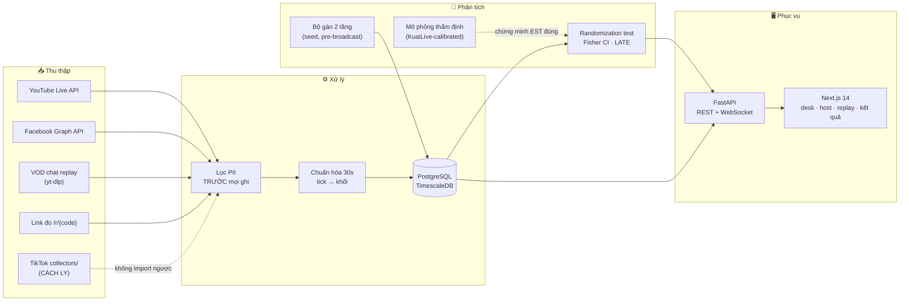

<div align="center">

# 📡 LiveLift

### Nền tảng thí nghiệm vận hành cho livestream thương mại

**Biến mỗi quyết định trong phiên live thành một thí nghiệm đo được** — phân biệt
hành động *tạo ra giá trị* với *sự trùng hợp thời điểm*.

*Causal experimentation infrastructure for live commerce operations.*

[](https://github.com/bminhnemhoi/AISC2026_LIVEFIT/actions/workflows/ci.yml)
[](LICENSE)
[](pyproject.toml)
[](tests/)
[](https://github.com/astral-sh/ruff)
[](web/)

[**Khởi động 5 phút**](#-khởi-động-trong-5-phút) ·
[**Kết quả đã kiểm chứng**](#-kết-quả-đã-kiểm-chứng) ·
[**Phương pháp**](#-phương-pháp-khoa-học) ·
[**Tổng kết & lộ trình**](docs/TONG-KET-DU-AN.md) ·
[**Đóng góp**](CONTRIBUTING.md)

Dự thi **AISC'26 — Data Driven Business** · Việt Nam · Chung kết 11/2026

</div>

---

## 💡 Vì sao LiveLift tồn tại

Phút 30, tổ vận hành ghim sản phẩm B. Phút 35, doanh thu tăng 40%. **Do ghim sản
phẩm? Do thuật toán vừa đẩy 500 người xem? Do host kể chuyện hay?** Không ai biết —
nên "kinh nghiệm" cả ngành tích lũy phần lớn là tương quan giả.

Các công cụ hiện có (Chanmama, Feigua, Kalodata, EchoTik…) chỉ *quan sát hồi cứu*
hoặc *cảnh báo theo ngưỡng cố định*. Theo khảo sát của nhóm, **chưa công cụ thương mại
nào chạy thí nghiệm ngẫu nhiên trong phiên hay ghi xác suất gán**. Đó là khoảng trống
LiveLift nhắm vào: không phải một dashboard đẹp hơn — một **moat phương pháp**.

## ✨ Điểm nổi bật

| | |
|---|---|
| 🎲 **Switchback hai tầng** | Khối thời gian gán ngẫu nhiên BẬT/TẮT theo thiết kế tối ưu (Bojinov et al. 2023); tầng trong chỉ khám phá khi mô hình *thật sự* không chắc, ghi propensity chính xác |
| 📏 **Suy diễn tự chứng minh** | Kiểm định ngẫu nhiên hóa vẽ lại bằng *chính hàm gán production*; A/A 200 lặp: bác bỏ 4.5% (danh nghĩa 5%), coverage 95.5% |
| 🛡️ **Liêm chính ở cấp kiến trúc** | Số dự báo *không thể* mang khoảng tin cậy (validator từ chối); màn hình host *không thể* rò nhánh thí nghiệm (model riêng 4 trường); lịch gán lưu **trước** phát sóng, seed tái lập |
| 🇻🇳 **Làm cho live commerce Việt** | Lọc PII tiếng Việt (SĐT viết chữ, teencode, 2 thế hệ đơn vị hành chính) recall ≥95% mỗi loại trên bộ gán nhãn 95 câu (riêng *tên người* ngưỡng ≥70% — trần của luật thuần quy tắc); phân loại ý định F1 **0,870 trên bộ biên soạn nhưng 0,271 trên chat bán hàng thật** — xem cảnh báo ở `docs/benchmarks/intent-classifier.md`; toàn bộ UI tiếng Việt thường |
| 🔬 **Hiệu chỉnh bằng dữ liệu thật** | Mô phỏng thẩm định hiệu chỉnh theo **KuaiLive** (1,16 triệu phòng shop thật); live-fire trên VOD thật **19.126 bình luận · 16 buổi live · 7 ngành hàng** (lô đo 10/09/2026) |
| 🚦 **Ma trận tín hiệu** | "Đo được gì từ nguồn này?" trả lời bằng ma trận 5 tín hiệu → 5 năng lực — thiếu tín hiệu là *tuyên bố*, không âm thầm ra số yếu |

## 🚀 Khởi động trong 5 phút

> Yêu cầu: [Docker Desktop](https://www.docker.com/products/docker-desktop/). Phát triển: thêm Python 3.11+, Node 20+.

```bash
git clone https://github.com/bminhnemhoi/AISC2026_LIVEFIT.git && cd AISC2026_LIVEFIT
cp .env.example .env        # sửa POSTGRES_PASSWORD
docker compose up -d        # caddy + db + redis + migrate + api + web + backup
```

Mọi truy cập đi qua **Caddy** (cổng 80/443) — cổng vào công khai duy nhất:

| Mở | Để làm gì |
|---|---|
| <http://localhost> | Trang chính — bấm **"🔬 Xem thử ngay (30 giây)"** |
| <http://localhost/chay-phien> | Chạy một phiên thí nghiệm thật — 4 bước, không cần gõ lệnh |
| <http://localhost/ket-qua> | Kết quả gộp: tác động, KTC 95%, p-value, bảng MDE |
| <http://localhost/docs> | Toàn bộ API (OpenAPI, thử trực tiếp; REST đi qua tiền tố `/api`) |

### 🧭 Chưa từng dùng? Đọc hướng dẫn từng nút bấm

**[docs/HUONG-DAN-SU-DUNG.md](docs/HUONG-DAN-SU-DUNG.md)** — hướng dẫn cho
**người dùng**, không cần biết kỹ thuật: LiveLift là web app mở bằng trình duyệt
(không phải app điện thoại), mỗi bước ghi rõ *bấm nút nào · ở góc nào của màn
hình · chuyện gì sẽ xảy ra · lỗi thì làm sao*, kèm **ảnh chụp thật từng bước**
của 4 luồng: xem thử 30 giây → phân tích một buổi live YouTube có sẵn → chạy một
phiên thí nghiệm thật (bàn điều khiển + màn hình host làm mù) → đọc kết quả.
Có riêng mục **ai dùng màn nào** và mục **giới hạn hiện tại** nói thẳng những gì
chưa làm được.

> **Lên môi trường thật:** đặt `DOMAIN=<tên-miền>` trong `.env` (kèm
> `NEXT_PUBLIC_API_URL=https://<tên-miền>/api`, rồi `docker compose build web`)
> — Caddy tự xin chứng chỉ HTTPS, người xem bấm được shortlink đo click
> `https://<tên-miền>/r/{code}`. **Cần cổng dev trực tiếp** (`:8000`/`:3000`)?
> Chạy thêm `-f docker-compose.dev-ports.yml`.

<details>
<summary><b>Phát triển ngoài Docker & chạy kiểm thử</b></summary>

```bash
python -m venv .venv && .venv\Scripts\activate      # Windows; Linux: source .venv/bin/activate
pip install -e ".[dev,server,ml]"

pytest -m "not slow"     # 1157 test nhanh (đếm 14/09/2026)
pytest -m slow           # gate thống kê Monte-Carlo (vài phút)
ruff check src tests     # lint

cd web && npm ci && npm run dev   # giao diện dev tại :3000
```

Hướng dẫn kiểm thử **từng khả năng** (mọi lệnh đã chạy thật, ghi sẵn kết quả đúng):
[docs/HUONG-DAN-TEST.md](docs/HUONG-DAN-TEST.md)

</details>

## 🔬 Phương pháp khoa học

```
PHIÊN LIVE (90 phút)
│
├── TẦNG NGOÀI — switchback theo khối thời gian
│   Khối 5', khối đầu/cuối nhân đôi (Bojinov–Simchi-Levi–Zhao 2023)
│   Bernoulli(0.5) i.i.d. + rerandomization (≥2 khối/nhánh/giai đoạn)
│   Jitter ±30s · KHÔNG washout — burn-in lúc phân tích (Hu–Wager 2022)
│   → BẬT: hệ thống điều khiển ghim · TẮT: vận hành như thường lệ
│   → Kết quả CHÍNH: hệ thống có tạo giá trị không?
│
└── TẦNG TRONG — khám phá có kiểm soát
    Chỉ trong khối BẬT, chỉ khi khoảng hậu nghiệm Gamma-Poisson CHỒNG LẤN
    → chọn đều, ghi propensity 1/k → dữ liệu off-policy sạch
```

**Biến kết quả chính:** lượt nhấp **HỢP LỆ** / 1000 giây·người xem theo khối, đo qua link
chuyển hướng tự phục vụ (`/r/{code}`) — định nghĩa vận hành nhóm kiểm soát hoàn toàn.
"Hợp lệ" theo 5 quy tắc kiểu IAB/GIVT-lite (`core/click_validity.py`, tiền đăng ký §4.1):
UA robot, header prefetch, chỉ-GET, refractory τ=10 giây, trần 5 lượt/fingerprint/khối.
Click vi phạm bị **gắn cờ chứ không xóa** (flag-don't-drop) và chuỗi raw luôn được báo
cáo song song; mọi quy tắc chỉ nhìn thuộc tính request — **mù với nhánh gán**.

<details>
<summary><b>Suy diễn thống kê — chi tiết</b></summary>

- **Kiểm định ngẫu nhiên hóa studentized** (Bojinov & Shephard 2019; Chung & Romano
  2013): phân bố tham chiếu vẽ lại bằng *hàm gán production* trên **toàn bộ lịch đã
  chạy** rồi áp mặt nạ loại trừ cố định — không phải một phép xáo trộn tùy tiện.
- **KTC Fisher** bằng nghịch đảo kiểm định trên hiệu ứng cộng tính; sàn p-value
  1/(draws+1) hiển thị trung thực (`p < 0.001`, không giả chính xác).
- **Hájek IPW** · **OLS FE-phiên + tương tác Lin (2013)**, SE cụm theo phiên ·
  **LATE** qua biến công cụ cho chế độ đề xuất / phòng đối tác.
- **Từ chối có kỷ luật:** một nhánh < 2 khối → `estimable=False` + lý do tiếng Việt.
  Lỗi "NaN → significance" từng làm 52% phiên null bị tuyên có ý nghĩa đã được kiểm
  toán đối kháng tìm ra và sửa tận gốc (xem `docs/incident-log.md`).
- **MDE gắn với lực thật:** biên độ 1.2 *đo được* bằng sweep 4 mức tác động × 60 lặp;
  CV trong-phiên (không phải CV gộp); `poisson_floor()` đo phần phương sai giảm được
  trước khi đầu tư bất kỳ mô hình giảm phương sai nào.

</details>

## 🏗️ Kiến trúc



## 📊 Kết quả đã kiểm chứng

> Mọi con số sinh lại được bằng lệnh trong repo — nguồn: `docs/benchmarks/`, gate
> trong `tests/`, sổ sự cố `docs/incident-log.md`.

| Hạng mục | Kết quả | Kiểm chứng bằng |
|---|---|---|
| **Hiệu chỉnh ước lượng viên (A/A)** | bác bỏ **4.5%** (danh nghĩa 5%), nhị thức chính xác p = 0.872 | 200 lặp Monte-Carlo, gate tự động |
| **Độ phủ KTC 95%** | **95.5%** | cùng gate |
| **Thu hồi tác động biết trước** | sai lệch **−0.3%** | `livelift-simulate` |
| **Dưới hiệu ứng lưu** 2ph/3ph | lệch −20%/−30% *về phía 0* (bảo thủ), coverage 84%/60% | đo & ghi trung thực — lý do tuần 3 đo t_mix |
| **Dưới phân cụm phiên (ICC≈0,05)** | A/A và độ phủ giữ nguyên ngưỡng cũ — switchback không phải trả giá ICC vì redraw diễn ra **trong** phiên | 2 gate slow mới; knob `session_click_sigma` |
| **Ánh xạ knob → ICC (400 phiên)** | σ=0 → **+0,008**; σ=0,06 → **+0,048**; σ=0,3 → **+0,535**. Frailty có tác dụng phụ ICC (cv=2 → **+0,083**) và *chỉ* nó làm tăng phương sai trong-phiên — cột phân biệt hai cơ chế | `python analysis/calibration/bang_icc_mo_phong.py` → `docs/benchmarks/sim-icc-map.md` |
| **Lưới SBC (bộ khung)** | 4/4 ô XANH; **cổng có răng**: lỗi tiêm vào làm ô ĐỎ đúng như phải thế | `python -m livelift.sim.cli --grid` → `docs/benchmarks/sim-validation-report.md` |
| **MDE khớp lực thật** | 20.1% (công thức cũ sai: 30.1%) | sweep tác động × 60 lặp |
| **Ý định tiếng Việt** | macro-F1 **0,870** trên bộ biên soạn (320 câu, 5-fold) vs baseline 0,653 — **NHƯNG 0,271 trên chat bán hàng thật** (200 câu gán nhãn tay), precision gộp 11%: trên chat kiểu này radar ý định gần như là nhiễu | `python -m livelift.nlp.train_intent` · `docs/benchmarks/intent-classifier.md` |
| **Lọc PII** | recall ≥ 95%/loại | gate `test_pii_filter.py` |
| **Hiệu chỉnh KuaiLive** | 1,16M phòng shop; đơn vị ms **chứng minh bằng ràng buộc vật lý** | `analysis/calibration/` |
| **Live-fire VOD thật** | **19.126 bình luận · 16 buổi live · 7 ngành hàng** chạy trọn qua API (lô 10/09/2026 thay lô 06/09 cũ 14.903) | `docs/benchmarks/live-fire-da-nguon.md` |
| **Kiểm toán đối kháng** | 16/16 phát hiện xử lý (2 FATAL) · đợt 2 (06/09): 5 nhóm lỗi chặn phiên-thật đã sửa | **47 sự cố** đủ root cause + gate (đếm 15/09/2026) |

## 📁 Cấu trúc kho mã

<details>
<summary><b>Mở cây thư mục có chú giải</b></summary>

```
├── src/livelift/
│   ├── core/
│   │   ├── assigner/        # bộ gán 2 tầng — TRÁI TIM KHOA HỌC (outer.py, inner.py)
│   │   ├── features.py      # sự kiện → tick 30s → outcome theo khối
│   │   ├── quality.py       # QC sau phiên (6 kiểm tra)
│   │   └── signals.py       # ma trận tín hiệu → năng lực
│   ├── analysis/
│   │   ├── estimators.py    # randomization test · Fisher CI · Hájek · OLS-Lin · LATE
│   │   └── power.py         # MDE + hiệu chỉnh ĐO ĐƯỢC · within_session_cv · poisson_floor
│   ├── sim/                 # mô phỏng KuaiLive-calibrated + harness bias/coverage/A-A
│   ├── ingest/              # YouTube/Facebook chính thức · VOD replay · pii/ (BẮT BUỘC)
│   ├── nlp/                 # ý định tiếng Việt (đã train) + dataset + trainer
│   ├── api/                 # FastAPI: sessions/schedule/actions/reports/replays/signals
│   └── migrations/          # SQL up/down
├── web/                     # Next.js 14 — desk 3 vùng · host làm mù · replay · kết quả
├── collectors/tiktok_public # CÁCH LY — CI chặn import ngược vào lõi
├── analysis/                # notebook + script hiệu chỉnh
├── ops/                     # runbook phiên live, mẫu nhật ký, thư đối tác
├── docs/
│   ├── TONG-KET-DU-AN.md    # ĐÃ ĐẠT · CẦN LÀM · TẦM NHÌN   ← đọc thứ hai
│   ├── HUONG-DAN-SU-DUNG.md # hướng dẫn bấm từng nút cho người dùng (có ảnh)
│   ├── HUONG-DAN-TEST.md    # kiểm thử từng khả năng
│   ├── img/                 # ảnh chụp màn hình thật dùng trong hướng dẫn
│   ├── luu-tru-du-lieu.md   # ba chế độ kho + cách bật Postgres  ← ĐỌC TRƯỚC KHI LIVE THẬT
│   ├── nen-tang-ho-tro.md   # "test buổi live X thì làm sao" — bảng khả năng 8 nền tảng
│   ├── huong-dan-facebook-token.md  # lấy Page token (~25 phút, không cần App Review)
│   ├── benchmarks/          # số sinh lại được (intent, KuaiLive)
│   ├── research/            # 7 báo cáo nghiên cứu đa nguồn
│   └── incident-log.md      # 47 sự cố: root cause + gate chặn tái diễn
├── PREREGISTRATION.md       # tiền đăng ký — KHÓA trước chuỗi khẳng định
├── HARNESS.md               # quy trình phát triển & quality gates   ← đọc thứ ba
├── CONTRIBUTING.md · CITATION.cff · LICENSE (AGPL-3.0)
└── docker-compose.yml
```

</details>

## 🎯 Mục tiêu & tầm nhìn

**Mùa thi (11/2026):** một con số có bảo chứng giữa slide chung kết — *tác động của
chiến lược ghim lên tỷ lệ nhấp, KTC 95%, từ ≥18 phiên thật, đúng tiền đăng ký đã
khóa* — kèm MDE thật và câu trả lời thẳng biến nào đủ lực. Kết quả không có ý nghĩa
thống kê **vẫn là kết quả hợp lệ**: giá trị nằm ở hạ tầng đo lường tự chứng minh được.

**Sau mùa thi:** "Grammarly cho vận hành livestream" → gói Performance định giá bằng
chính khoa học (holdback ngẫu nhiên 10% khối, nhà bán tự kiểm chứng trong tài khoản)
→ lớp đo lường chuẩn cho live commerce Việt Nam.

Chi tiết thành tựu, việc còn lại (P0/P1/P2), nợ kỹ thuật không giấu:
**[docs/TONG-KET-DU-AN.md](docs/TONG-KET-DU-AN.md)**

## 🧑‍💻 Quy trình & đóng góp

Vòng lặp: *hiểu → nghiên cứu (có trích dẫn) → thiết kế test trước → code thuần ở lõi
→ gate tự động → root cause mọi lỗi → sổ sự cố*. Quality gates: 1157 test nhanh · gate
thống kê Monte-Carlo · recall PII · cân bằng gán 1000 lịch · **contract test web↔API**
· cách ly collectors · ruff.

Bắt đầu đóng góp: **[CONTRIBUTING.md](CONTRIBUTING.md)** — kèm lộ trình 90 phút nắm
toàn dự án cho thành viên mới.

## ⚖️ Pháp lý, quyền riêng tư & đạo đức

Tuân thủ **Luật 91/2025/QH15** và **NĐ 356/2025/NĐ-CP**: khử nhận dạng tại ingest —
bình luận thô không bao giờ chạm đĩa; không lưu chuỗi hành vi theo cá nhân; salt xoay
theo phiên. Ba nguồn dữ liệu hợp lệ: API chính thức có ủy quyền · dữ liệu công khai
(chỉ phân tích *quan sát*) · dữ liệu nhóm tự tạo. Không bình luận giả, không khan hiếm
giả, không thổi người xem.

## 📚 Trích dẫn & tài liệu tham khảo

Dùng LiveLift trong nghiên cứu? Xem **[CITATION.cff](CITATION.cff)**.

Nền tảng phương pháp: Bojinov, Simchi-Levi & Zhao (2023) *Mgmt Sci* · Hu & Wager
(2022) arXiv:2209.00197 · Bojinov & Shephard (2019) *JASA* · Lin (2013) *Ann. Appl.
Stat.* · Zhao & Ding (2021) *J. Econometrics* · KuaiLive (SIGIR 2026) · ViSoBERT
(EMNLP 2023). Danh mục đầy đủ kèm ghi chú áp dụng/loại bỏ: [`docs/research/`](docs/research/).

## 📄 License

Phát hành theo **[AGPL-3.0](LICENSE)** — mã nguồn mở, mọi bản triển khai dịch vụ dựa
trên mã này phải mở mã phần sửa đổi; nhóm tác giả giữ quyền cấp phép thương mại riêng
(dual-licensing) cho đối tác. Liên hệ team để thảo luận giấy phép thương mại.

---

<div align="center">

*Một đội tự nêu giới hạn của mình bằng số được tin hơn một đội khẳng định mọi thứ đều tốt.*

**LiveLift — AISC'26**

</div>
