# Hướng dẫn sử dụng LiveLift — tự tay bấm thử từ đầu đến cuối

*Viết cho người dùng, không phải cho lập trình viên. Mọi bước dưới đây đã được
bấm thật trên hệ thống đang chạy ngày 11/09/2026 và chụp lại đúng màn hình bạn
sẽ thấy. Nếu bạn bấm ra khác, đó là lỗi — báo lại để sửa.*

---

## 0. Trả lời thẳng trước khi bắt đầu

**LiveLift là một WEB APP — chạy trong trình duyệt.**

- **Không phải app điện thoại.** Không có trên CH Play hay App Store, không cài
  gì cả.
- Bạn mở nó như mở Facebook: gõ địa chỉ vào thanh địa chỉ của Chrome/Edge.
- Địa chỉ để mở: **http://localhost:3000**

Hệ thống có **hai phần** cùng chạy trên máy bạn:

| Phần | Là gì | Cổng | Bạn có mở trực tiếp không? |
|---|---|---|---|
| **Máy chủ (API)** | Nơi giữ dữ liệu, bốc thăm lịch, tính kết quả | `8000` | Không. Nó chạy ngầm. |
| **Giao diện web** | Những màn hình bạn nhìn và bấm | `3000` | **Có** — đây là thứ bạn mở |

Nếu máy chủ tắt, giao diện web vẫn mở được nhưng chỉ xem được dữ liệu mô phỏng;
thẻ "Phân tích một video live có sẵn" sẽ bị mờ đi và có dòng chữ cam *"Chưa kết
nối được máy chủ"*.

### Máy nào cần gì

| Người | Thiết bị | Mở màn hình nào |
|---|---|---|
| **Chủ shop / người trợ live** | Laptop hoặc máy bàn, màn ≥ 1366×768 | `http://localhost:3000/desk` |
| **Người dẫn (host)** | Màn hình phụ / TV đặt trước mặt người dẫn | `http://localhost:3000/host` |
| **Người xem** | Điện thoại của họ | Chỉ bấm **link đo** bạn dán vào bình luận ghim |

> **Chưa có đăng nhập.** Ai mở được địa chỉ này là vào thẳng. Vì vậy hiện chỉ
> nên chạy trên **máy cá nhân** hoặc **mạng nội bộ (Wi-Fi nhà/văn phòng)**, chưa
> được đưa lên Internet công khai. Xem mục 8.

---

## 1. Bật hệ thống lên (chỉ làm 1 lần mỗi ngày)

Mở **hai cửa sổ dòng lệnh**, mỗi cửa sổ chạy một lệnh rồi **để yên đó** (đóng
cửa sổ là tắt hệ thống).

**Cửa sổ 1 — máy chủ:**

```
cd D:\AISC2026\livelift
.venv\Scripts\python -m uvicorn livelift.api.main:app --port 8000
```

**Cửa sổ 2 — giao diện web:**

```
cd D:\AISC2026\livelift\web
npm run dev
```

> **Cách khác, một lệnh duy nhất (nếu máy đã cài Docker Desktop):**
> `cd D:\AISC2026\livelift` rồi `docker compose up -d`. Khi đó mở bằng địa chỉ
> **http://localhost** (không có `:3000`), và dữ liệu được lưu vào cơ sở dữ liệu
> thật nên **không mất khi tắt máy** — đây là cách nên dùng trước buổi trình bày.
> Mọi bước bấm nút dưới đây giống hệt nhau ở cả hai cách.

### Kiểm tra đã chạy chưa — không cần gõ lệnh

Mở **http://localhost:3000**. Bạn phải thấy đúng màn hình này:

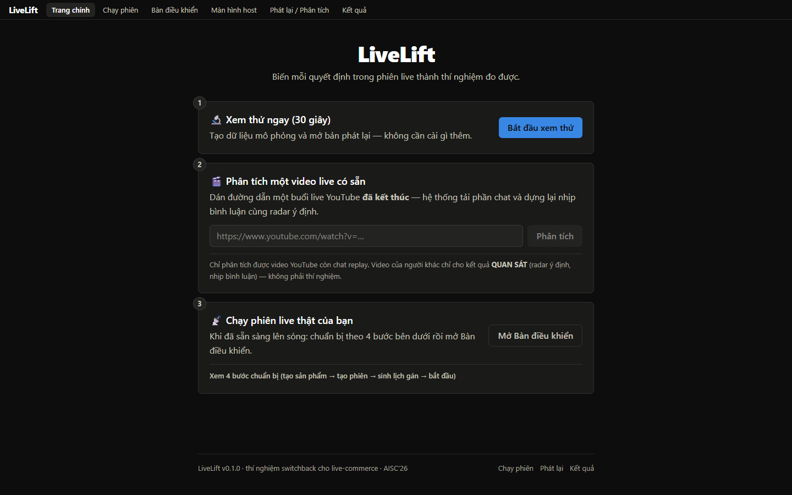

Dấu hiệu **máy chủ đã chạy**: ở thẻ số **2**, ô nhập link YouTube và nút **Phân
tích** đều **sáng** (bấm được).

Trang chủ hỏi máy chủ đúng một câu (`/health`) và cho **ba câu trả lời khác
nhau** — đọc câu nào thì làm việc đó:

| Trang hiện gì | Nghĩa là | Việc cần làm |
|---|---|---|
| Không có dải cảnh báo nào, hai ô ở thẻ **2** sáng | **SỐNG** — máy chủ chạy, kho dữ liệu bình thường | dùng bình thường |
| Dải **cam**: *"Máy chủ SỐNG, kho dữ liệu SUY GIẢM"* (kèm nguyên văn lý do máy chủ nói) và chip **KHO SUY GIẢM** ở góc phải thanh trên | **SUY GIẢM** — máy chủ vẫn trả lời nhưng dữ liệu mới có thể không lưu được | xem được, **đừng lên sóng thật**; bật lại cơ sở dữ liệu rồi tải lại trang |
| Dải **đỏ**: *"Chưa kết nối được máy chủ — bạn vẫn xem thử được bằng dữ liệu mô phỏng"* và chip **MẤT KẾT NỐI** | **CHẾT** — gọi hai lần, 4 giây mỗi lần, đều không ai trả lời | cửa sổ 1 chưa chạy — bật lại nó |

Dòng cam *"Máy chủ đang chạy bình thường nhưng trả lời chậm"* là trạng thái
**SỐNG**, chỉ là máy chậm — không phải mất kết nối, không cần làm gì.

> ⚠️ **Quan trọng:** dữ liệu hiện đang lưu trong bộ nhớ tạm. **Đóng cửa sổ 1 là
> mất sạch các phiên đã tạo.** Đây là giới hạn thật, xem mục 8.

---

## 2. Bản đồ màn hình — thanh trên cùng

Mọi màn hình đều có thanh điều hướng ở trên cùng bên trái. Sáu chữ, bấm vào là
chuyển màn:

| Bấm | Mở màn hình gì | Dành cho ai |
|---|---|---|
| **Bắt đầu** | Màn hình bắt đầu, các cửa vào | Người mới |
| **Chuẩn bị phiên** | Wizard 4 bước chuẩn bị một buổi live thí nghiệm | Chủ shop |
| **Bàn trợ live** | Màn hình vận hành khi đang lên sóng | Người trợ live |
| **Xem lại phiên** | Tua lại một buổi đã xong | Ai cũng được |
| **Kết quả & chiến lược** | Con số khoa học tổng hợp | Chủ shop, giám khảo |

Màn hình cỡ lớn cho **người dẫn** không nằm trên thanh trên cùng nữa (để người
vận hành khỏi mở nhầm màn bị làm mù): mở nó bằng nút **"Mở màn hình người
dẫn"** ở bước 4 của wizard Chuẩn bị phiên.

---

## 3. LUỒNG 1 — Xem thử 30 giây (làm cái này trước tiên)

Mục đích: thấy hệ thống chạy ra sao mà chưa cần lên sóng thật.

### Bước 1.1 — Mở trang chính

**Bấm gì:** gõ `localhost:3000` vào thanh địa chỉ, Enter.
**Chuyện gì xảy ra:** hiện 3 thẻ đánh số 1–2–3 (ảnh ở mục 1).

### Bước 1.2 — Bấm nút "Bắt đầu xem thử"

**Bấm gì:** nút xanh **"Bắt đầu xem thử"**.
**Ở đâu:** góc **phải** của thẻ số **1** (🔬 Xem thử ngay (30 giây)).

**Chuyện gì xảy ra:** nút đổi chữ thành **"Đang tạo dữ liệu…"** và bị mờ đi —
đó là dấu hiệu hệ thống đang làm việc, đừng bấm lại.

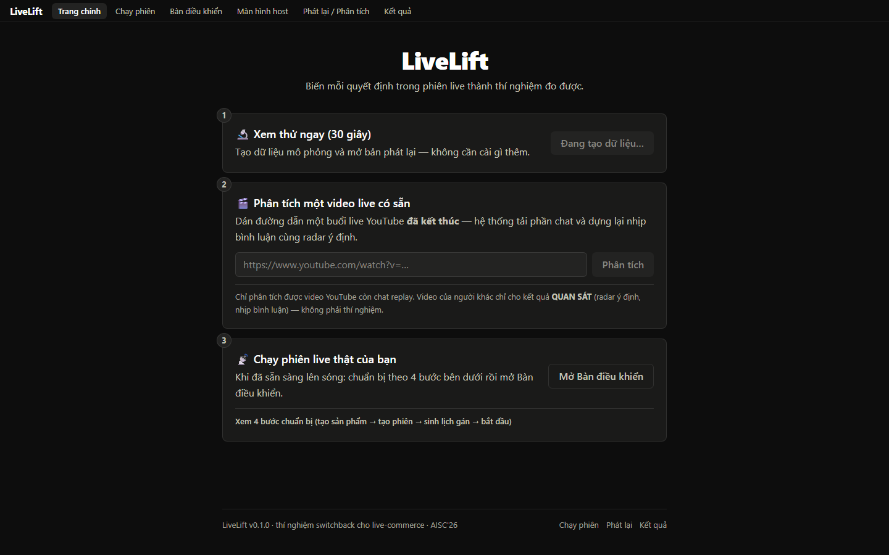

**Nếu lỗi:** hiện dòng đỏ *"Không tạo được dữ liệu mô phỏng — kiểm tra máy chủ
rồi thử lại"* ⇒ cửa sổ 1 (máy chủ) đã tắt. Bật lại rồi tải lại trang.

### Bước 1.3 — Trang tự chuyển sang màn Phát lại

Sau khoảng 5–10 giây trang **tự nhảy** sang màn *phát lại phiên*. Bạn không phải
bấm gì.

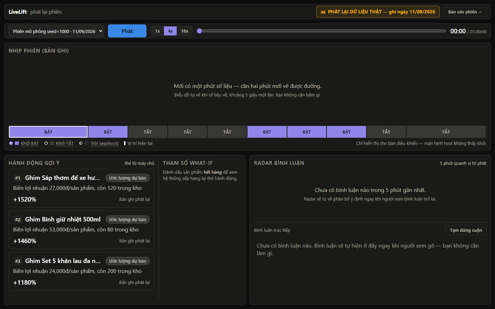

Lúc này thanh thời gian đang ở `00:00` nên **các khung còn trống** — đó là đúng,
chưa tua thì chưa có số liệu nào để vẽ.

### Bước 1.4 — Bấm "Phát" để xem nó chạy

**Bấm gì:** nút **16x** (cho nhanh), rồi nút xanh **"Phát"**.
**Ở đâu:** hàng điều khiển ngay dưới thanh tiêu đề, bên trái.

**Chuyện gì xảy ra:** đồng hồ chạy, biểu đồ **NHỊP PHIÊN** bắt đầu vẽ đường, và
ô trắng nhỏ trên dải **BẬT/TẮT** trượt dần sang phải theo thời gian.

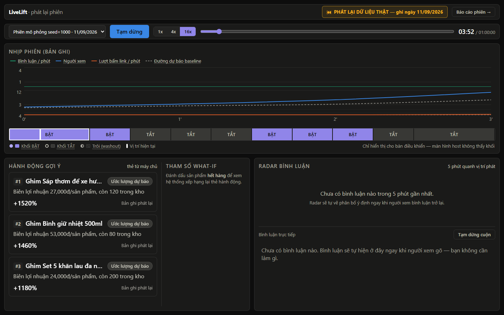

**Đọc màn này thế nào:**

- **Dải BẬT/TẮT** (dải ô tím/xám): mỗi ô là một *khối* khoảng 5 phút. Tím = khối
  **BẬT** (hệ thống được phép điều khiển việc ghim sản phẩm); xám = khối **TẮT**
  (đội vận hành làm như thường lệ). Chính việc bốc thăm tím/xám này biến buổi
  live thành thí nghiệm.
- **HÀNH ĐỘNG GỢI Ý**: các thẻ đề xuất "nên ghim sản phẩm nào". Ở màn phát lại
  chúng chỉ để xem (ghi chú *"Bản ghi phát lại"*), không bấm được.
- **THAM SỐ WHAT-IF**: tick vào một sản phẩm là coi như nó **hết hàng**, hệ
  thống xếp hạng lại thẻ ngay. Ở phiên mô phỏng này danh sách trống vì buổi live
  không gắn sản phẩm nào.
- **RADAR BÌNH LUẬN**: phân loại bình luận theo ý định (hỏi giá, chốt đơn…).
  Phiên mô phỏng không có bình luận nên nó báo *"Chưa có bình luận nào"*. Muốn
  thấy radar có dữ liệu thật, làm Luồng 2.

> **Chữ ở góc phải trên** luôn hiện để bạn không nhầm bản ghi với buổi đang
> phát trực tiếp — và nó nói đúng loại dữ liệu đang xem: *"PHÁT LẠI DỮ LIỆU
> THẬT — ghi ngày …"* khi đọc được bản ghi từ máy chủ, *"PHÁT LẠI DỮ LIỆU MÔ
> PHỎNG — không phải buổi live thật"* khi máy chủ không gọi được và trang đang
> chạy bản ghi mẫu ngoại tuyến.

---

## 4. LUỒNG 2 — Phân tích một buổi live YouTube có sẵn

Mục đích: đưa một buổi live **của bất kỳ ai** (đã kết thúc, còn chat replay) vào
hệ thống để xem nhịp bình luận và radar ý định trên **dữ liệu thật**.

> Kết quả luồng này luôn được dán nhãn **QUAN SÁT** — mô tả buổi đó, **không**
> có con số nhân quả. Lý do: không ai can thiệp ngược thời gian vào một video đã
> quay xong được, nên không có nhánh đối chứng để so.

### Bước 2.1 — Dán đường dẫn

**Bấm gì:** bấm vào ô nhập của thẻ số **2**, dán link YouTube.
**Ở đâu:** thẻ **🎬 Phân tích một video live có sẵn**, ô có chữ mờ
`https://www.youtube.com/watch?v=…`.

Ví dụ đã thử thật: `https://www.youtube.com/watch?v=ZU_0QJzsR6w`

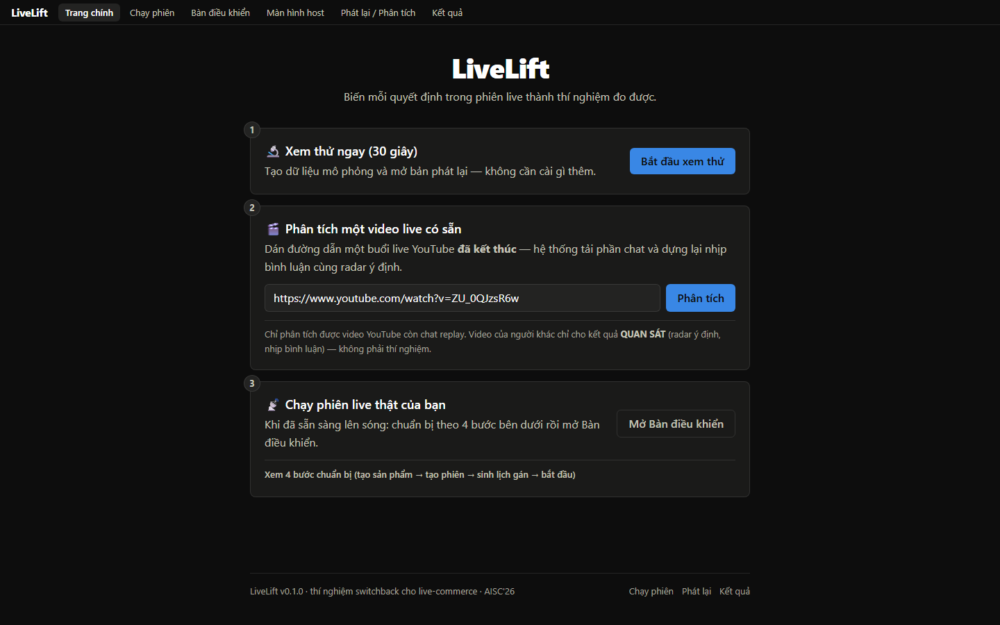

### Bước 2.2 — Bấm "Phân tích"

**Bấm gì:** nút **"Phân tích"** ngay bên phải ô nhập.

**Chuyện gì xảy ra:** nút đổi thành **"Đang xử lý…"**, và ngay dưới ô nhập hiện
một dòng trạng thái có chấm nhấp nháy chạy lần lượt qua các chặng:
*Đang xếp hàng… → **Đang tải chat…** → Đang phân tích… → Xong*.

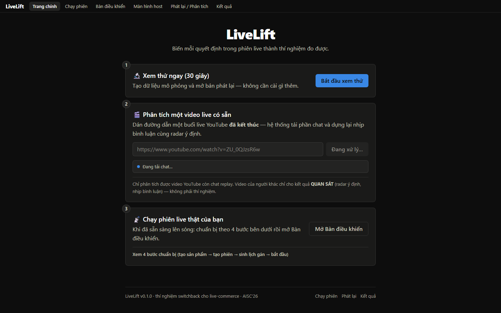

**Chờ bao lâu:** buổi live nhiều bình luận thì lâu hơn. Buổi trong ảnh
(6.586 bình luận / 117 phút) mất khoảng **một phút**. Cứ để yên trang.

**Nếu lỗi:**

| Dòng chữ bạn thấy | Nghĩa là | Làm gì |
|---|---|---|
| *"Không gửi được yêu cầu…"* | Link sai, hoặc máy chủ tắt | Kiểm tra link, kiểm tra cửa sổ 1 |
| Dòng đỏ có chữ *không có chat* | Video không có chat replay | Chọn video khác |
| *"YouTube yêu cầu xác minh không phải bot"* | YouTube chặn | Xem `docs/HUONG-DAN-TEST.md` mục 4 |

### Bước 2.3 — ⚠️ Trang tự nhảy sang Phát lại, NHƯNG chọn sai buổi

Khi xong, trang tự chuyển sang màn *phát lại*. **Nhưng nó sẽ mở buổi đầu tiên
trong danh sách, không phải buổi bạn vừa phân tích.**

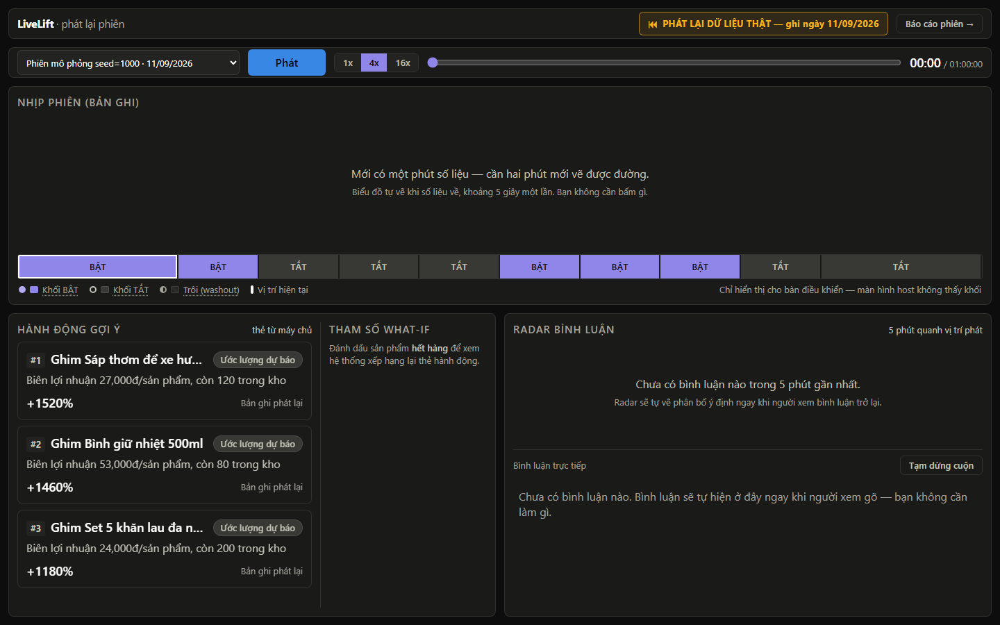

Trong ảnh: địa chỉ trên thanh URL đã trỏ đúng buổi vừa phân tích, nhưng ô chọn
buổi ở góc trái vẫn ghi *"Phiên mô phỏng seed=1000"*. **Đây là lỗi đã biết**
(xem mục 8) — không phải bạn bấm sai.

### Bước 2.4 — Tự chọn đúng buổi trong ô thả xuống

**Bấm gì:** ô thả xuống ở **góc trái**, ngay bên trái nút "Phát".
**Chọn dòng:** dòng bắt đầu bằng **"Phân tích: …"** kèm tên buổi live.

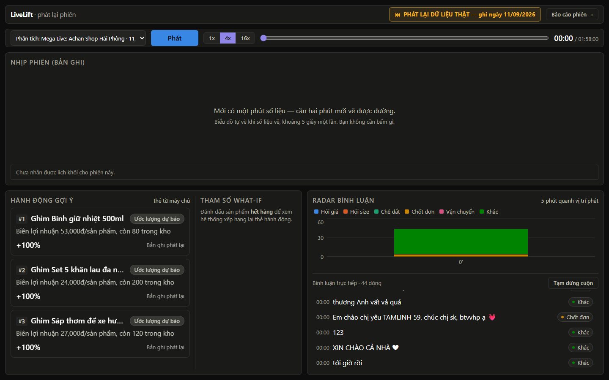

Đúng buổi rồi thì: tổng thời lượng bên phải đổi (ví dụ `01:58:00`), và khung
**Bình luận trực tiếp** bắt đầu có bình luận tiếng Việt thật.

### Bước 2.5 — Kéo thanh thời gian tới phút đông khách

**Bấm gì:** kéo **thanh trượt dài** ở giữa hàng điều khiển sang phải; hoặc bấm
**"Phát"** rồi để nó chạy.

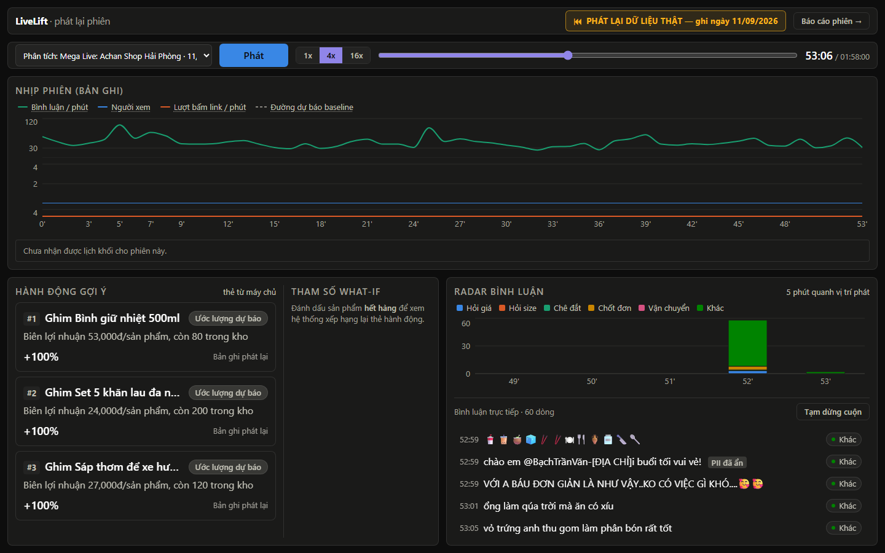

Giờ bạn thấy đủ:

- **NHỊP PHIÊN**: đường xanh lá = số bình luận mỗi phút. Chỗ nhô cao là lúc
  khách sôi nổi nhất.
- **RADAR BÌNH LUẬN**: cột màu chồng, mỗi màu một ý định (Hỏi giá / Hỏi size /
  Chê đắt / Chốt đơn / Vận chuyển / Khác).
- **Bình luận trực tiếp**: từng dòng chat thật, mỗi dòng có nhãn ý định bên
  phải. Dòng nào có huy hiệu **"PII đã ẩn"** nghĩa là hệ thống đã **che số điện
  thoại / địa chỉ / tên riêng** trước khi lưu — bản gốc không bao giờ chạm ổ
  cứng.
- Nút **"Tạm dừng cuộn"** ở góc phải khung chat: bấm để giữ màn hình đứng yên
  khi bạn đang đọc.

> **Hai đường "Người xem" và "Lượt bấm link" nằm phẳng ở đáy biểu đồ** vì buổi
> live của người khác không cho biết số người xem, và bạn không có link đo trong
> buổi đó. Đây là *thiếu nguồn*, không phải bằng 0 — xem mục Ma trận tín hiệu ở
> Luồng 4.

### Bước 2.6 — Mở báo cáo của đúng buổi đó

**Bấm gì:** nút **"Báo cáo phiên →"** ở **góc phải trên cùng**.
Chi tiết cách đọc báo cáo ở **Luồng 4**.

---

## 5. LUỒNG 3 — Chạy một phiên thí nghiệm thật của bạn

Đây là phần chính của sản phẩm. Từ 09/2026 trang này là **wizard từng-bước-một**:
màn hình chỉ hiện MỘT bước mỗi lúc, có dải 4 chấm tiến độ ở trên (bước xong bấm
lại được để sửa). Bốn bước **phải theo đúng thứ tự** — vì lịch bốc thăm BẬT/TẮT
bắt buộc phải sinh **trước khi** lên sóng thì kết quả mới kiểm chứng được. Mỗi
bước có dòng **"Vì sao cần bước này?"** bấm vào là ra giải thích ngắn. Lỡ tắt
tab giữa chừng cũng không mất: mở lại trang là wizard tự nhảy về đúng bước của
phiên đang chuẩn bị.

> Ảnh chụp trong mục này thuộc giao diện bản trước (4 thẻ trải dọc) — bố cục đã
> đổi thành từng-bước-một nhưng **tên các nút giữ nguyên**, bấm theo tên nút là
> đúng.

**Bấm gì để vào:** chữ **"Chuẩn bị phiên"** trên thanh trên cùng.

### Bước 3.1 — Khai báo sản phẩm sẽ bán

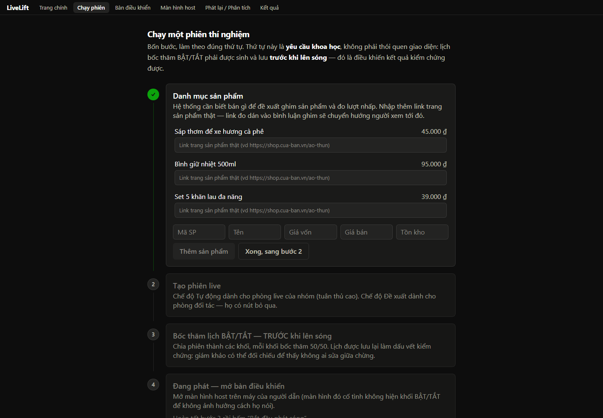

**Ở đâu:** bước **1/4 — Sản phẩm**.

Nếu bạn đã bấm "Xem thử" ở Luồng 1 thì đã có sẵn vài sản phẩm mẫu. Thêm sản phẩm
của bạn (mọi ô đều có nhãn; **không còn ô "Mã SP"** — mã hệ thống tự sinh từ
tên, ví dụ "Áo khoác dù 2 lớp" → `ao-khoac-du-2-lop`):

**Bấm gì:** điền form "Thêm sản phẩm mới" rồi bấm **"Thêm sản phẩm"**. Chưa có
gì để điền thì bấm **"Dùng sản phẩm mẫu"** — form tự điền một sản phẩm demo.

| Ô | Điền gì | Ví dụ |
|---|---|---|
| Tên sản phẩm * | tên hiển thị, có dấu | `Áo thun cotton 100%` |
| Giá bán (đ) | số, không dấu chấm | `199000` |
| Link trang sản phẩm thật | trang Shopee/website của bạn | `https://shopee.vn/ao-thun` |
| Giá vốn, Tồn kho | trong mục "Thêm chi tiết — tuỳ chọn" | `80000`, `50` |

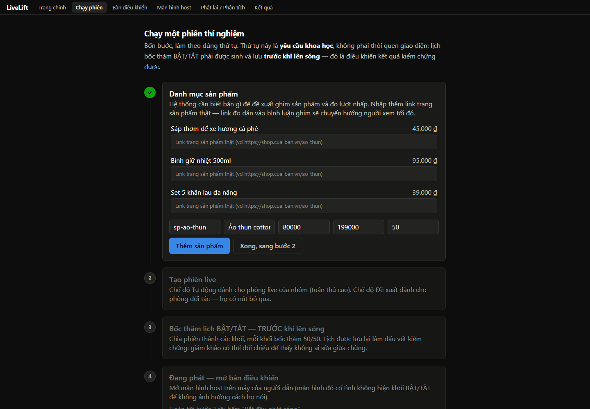

### Bước 3.2 — Dán link trang sản phẩm thật (bước hay bị bỏ quên)

Sau khi thêm, sản phẩm hiện thành một dòng kèm chip trạng thái: **"✓ link đo
sẵn sàng"** (xanh) hoặc **"⚠ chưa có link"** (vàng, kèm câu *"sản phẩm này sẽ
không đo được lượt nhấp"*) — thiếu link là biết NGAY LÚC NHẬP, không đợi tới
lúc lên sóng. Bên dưới mỗi dòng có một ô nhập dài.

**Bấm gì:** bấm vào ô đó, dán **địa chỉ trang bán sản phẩm thật** của bạn
(Shopee / TikTok Shop / website riêng). Phải bắt đầu bằng `http://` hoặc
`https://`.

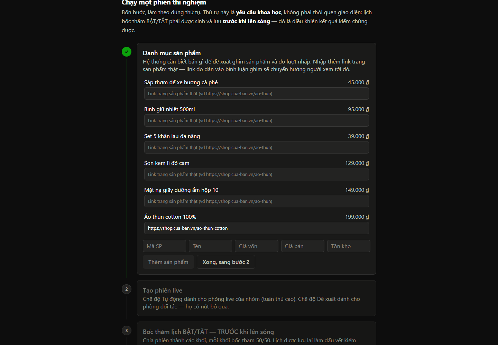

**Vì sao bắt buộc:** hệ thống sẽ sinh một **link đo** riêng cho từng sản phẩm.
Bạn dán link đo (không phải link gốc) vào bình luận ghim; mỗi lượt khách bấm
được ghi lại và quy về đúng khối BẬT/TẮT đang chạy. **Đó chính là con số quyết
định kết quả thí nghiệm.** Sản phẩm không có link ⇒ không đo được gì.

**Nếu lỗi:** ô viền đỏ + dòng *"Link không hợp lệ — cần URL đầy đủ bắt đầu bằng
http:// hoặc https://"* ⇒ bạn quên phần `https://` ở đầu.

**Xong bước 1:** bấm **"Xong, sang bước 2"**.

### Bước 3.3 — Thông tin buổi live (tạo phiên)

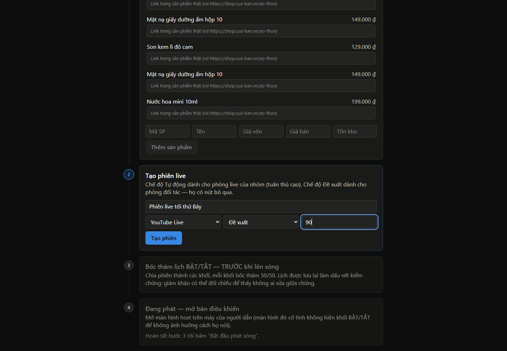

Ở bước **2/4 — Buổi live**, ba lựa chọn đều là **thẻ bấm** (không còn dropdown),
xong bấm **"Tạo phiên"**:

| Mục | Chọn/điền gì |
|---|---|
| Tên buổi live | tuỳ chọn, ví dụ `Phiên live tối thứ Bảy` |
| Nền tảng | thẻ `YouTube Live` hoặc `Facebook Live` |
| Thời lượng | nút `30/60/90/120 phút` — **90 phút gắn nhãn "khuyên dùng"** |
| Chế độ | thẻ **Tự ghim** (khuyên dùng) hoặc **Chỉ gợi ý** |

> **Hai chế độ nghĩa là gì (giải thích ngay trên thẻ):**
> - **Tự ghim** — hệ thống tự ghim sản phẩm tốt nhất khi đến lượt khối BẬT
>   (bộ thực thi tự động phía máy chủ, có từ 12/09); bạn chỉ theo dõi. Ở chế độ
>   này nút *Thực hiện* trên thẻ gợi ý bị khoá — vì máy đã bấm thay bạn:
>
> 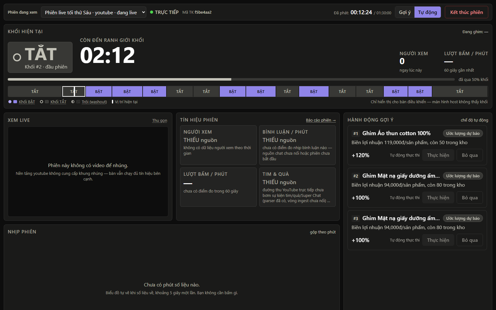
>
> - **Chỉ gợi ý** — hệ thống chỉ đề xuất, sản phẩm chỉ được ghim khi bạn bấm
>   *Thực hiện* trên bàn trợ live. Dùng khi live nhờ phòng đối tác.
>
> Chế độ **không đổi được sau khi đã tạo phiên** — muốn đổi thì bấm "Huỷ phiên
> nháp, sửa lại" (chỉ được trước khi lên sóng).

> **Vì sao nên ≥ 90 phút:** phiên càng ngắn càng ít khối, kết quả càng yếu.
> Chọn dưới 90 phút, wizard cảnh báo **ngay lúc chọn**, và khi bốc thăm máy chủ
> sẽ nói thẳng mức đảm bảo thật của lịch:
>
> 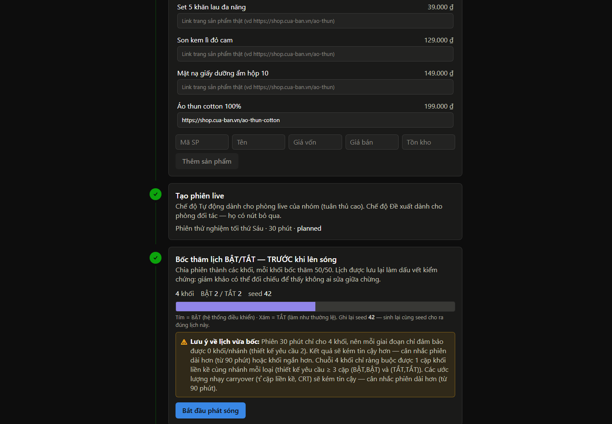

### Bước 3.4 — Bốc thăm lịch BẬT/TẮT (trước khi lên sóng)

**Ở đâu:** bước **3/4 — Bốc thăm**.

**Bấm gì:** đúng MỘT nút **"Bốc thăm lịch"** (tên đầy đủ: *Bốc thăm lịch
BẬT/TẮT*). Muốn chỉnh **Độ dài khối (phút)** hay **Mã bốc thăm (seed)** thì mở
mục **"Tuỳ chọn nâng cao — mặc định là đủ"** trước khi bốc (điền seed `42` nếu
muốn lịch lặp lại được y hệt cho lần sau).

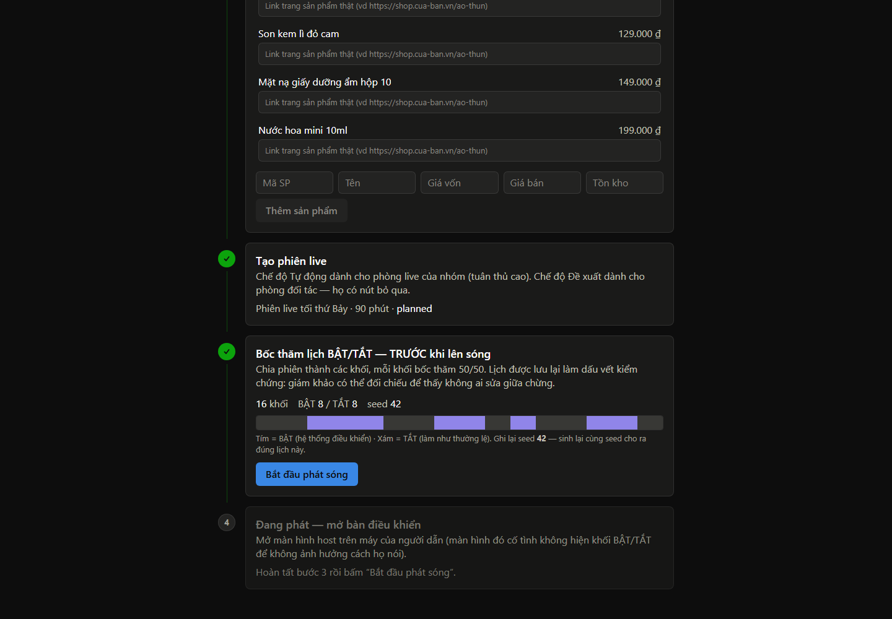

**Chuyện gì xảy ra:** hiện dòng tóm tắt `16 khối, phần lớn ~5 phút · BẬT 8 /
TẮT 8`, dải
khối tím/xám — toàn bộ kịch bản BẬT/TẮT của buổi live, **đã khoá** — và một
khung **"Mã bằng chứng"**: dấu kiểm chứng của lịch, chốt TRƯỚC giờ phát; ai
cũng có thể sinh lại lịch và đối chiếu mã này — khớp nghĩa là **không ai sửa
lịch giữa chừng** (đây là bằng chứng giám khảo sẽ hỏi). Dòng mờ bên dưới ghi
*mã kiểm chứng lịch (seed)*.

**Nếu thấy khung cam "Máy chủ lưu ý về lịch vừa bốc":** hệ thống đang nói thật
rằng lịch này quá ngắn để đảm bảo cân bằng, kèm gợi ý sửa (phiên dài hơn hoặc
khối ngắn hơn). Bấm "Bốc lại lịch khác" sau khi chỉnh, hoặc chấp nhận và đi
tiếp.

### Bước 3.5 — Checklist trước giờ G & Bắt đầu phát sóng

Ở bước **4/4 — Lên sóng**, wizard soát hộ bạn một checklist trước giờ G:

- **Sản phẩm & link trang sản phẩm** — bao nhiêu sản phẩm đã có link hợp lệ;
- **Lịch đã bốc và niêm phong** — kèm mã bằng chứng;
- **Link đo** — tạo sẵn cho mọi sản phẩm có link, mỗi dòng kèm nút
  **"Chép link"** (bấm xong đổi thành *"Đã chép ✓"*), và một ô tự đánh dấu
  "tôi đã dán link vào bình luận ghim";
- **Màn hình người dẫn** — nút **"Mở màn hình người dẫn"** kèm hướng dẫn kéo
  sang màn phụ/TV, bấm F11;
- **Nguồn dữ liệu (ma trận tín hiệu)** — trạng thái thật của từng nguồn, ô nào
  THIẾU kèm lý do của máy chủ (trước giờ phát, nguồn người xem/bình luận chưa
  chảy là bình thường).

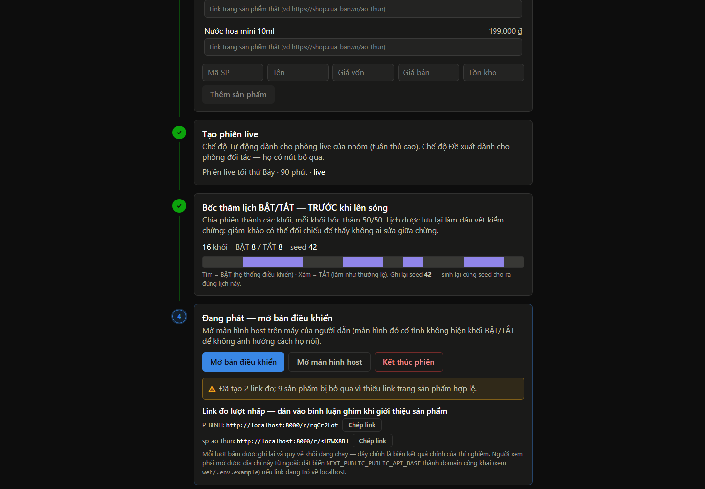

**Bấm gì:** nút **"Bắt đầu phát sóng"**. Trang tự chuyển sang **bàn trợ live**
đúng phiên vừa tạo — không phải tìm phiên trong danh sách.

> **Khung cam "Đã tạo 2 link đo; 9 sản phẩm bị bỏ qua…"** là bình thường: chỉ
> những sản phẩm bạn đã dán link ở bước 3.2 mới có link đo.

> ⚠️ **Link đang là `http://localhost:8000/r/…`** — địa chỉ này **chỉ mở được
> trên chính máy bạn**. Khách xem live ở nhà họ bấm sẽ không vào được. Muốn đo
> thật, cần đặt một địa chỉ công khai (xem mục 8) — wizard cũng tự cảnh báo
> điều này ngay cạnh danh sách link.

**Kết thúc phiên ở đâu?** Trên bàn trợ live (nút "Kết thúc phiên" ở thanh trạng
thái — bước 3.9). Mở lại trang Chuẩn bị phiên khi đang phát sẽ thấy hai nút
**"Mở bàn trợ live"** và **"Mở màn hình người dẫn"**.

### Bước 3.6 — Mở Bàn trợ live

**Bấm gì:** wizard đã tự chuyển bạn sang đây sau khi bấm "Bắt đầu phát sóng";
nếu lỡ đóng, bấm nút **"Mở bàn trợ live"** ở bước 4 của wizard (hoặc chữ **"Bàn
trợ live"** trên thanh trên cùng).

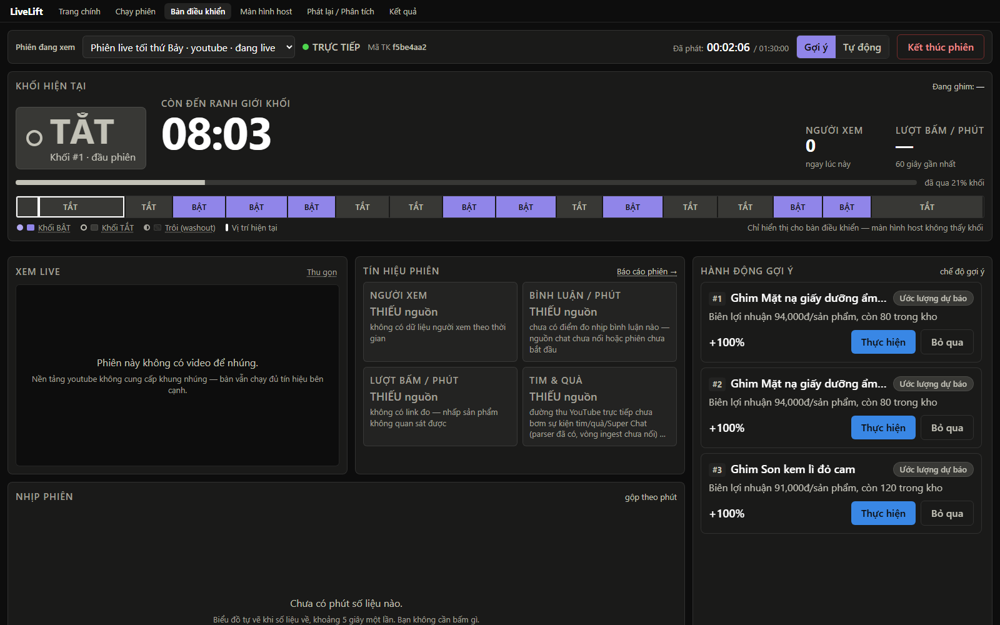

**Đọc từ trên xuống:**

**a) Thanh trạng thái (trên cùng)**
- **"Phiên đang xem"** + ô chọn phiên — nếu bàn mở nhầm buổi khác, đổi ở đây.
- Chấm xanh **"TRỰC TIẾP"** = đang nối được máy chủ.
- **"Mã TK f5be4aa2"** = dấu vân tay của bản thiết kế thí nghiệm (để đối chiếu).
- **"Đã phát: 00:02:06 / 01:30:00"** = đồng hồ cả buổi.
- **"Gợi ý / Tự động"** = chế độ (đọc thôi, không đổi được khi đang live).
- Nút đỏ **"Kết thúc phiên"**.

**b) KHỐI HIỆN TẠI — thứ bạn phải liếc thường xuyên nhất**
- Ô lớn bên trái ghi **TẮT** hoặc **BẬT** (kèm hình tròn rỗng/đặc để người mù
  màu vẫn phân biệt được) và *"Khối #1 · đầu phiên"*.
- Số cực lớn **"CÒN ĐẾN RANH GIỚI KHỐI · 08:03"** = còn bao lâu nữa đổi khối.
  Khi còn **≤ 30 giây**, số chuyển màu hổ phách và hiện chip
  **"⚠ Sắp đổi khối — chuẩn bị thao tác"**.
- **NGƯỜI XEM** và **LƯỢT BẤM / PHÚT** ở bên phải.
- Dải ô tím/xám bên dưới = toàn bộ lịch, ô viền trắng là vị trí hiện tại.

**c) TÍN HIỆU PHIÊN (giữa)** — 4 ô nói thật hệ thống đang đo được gì. Ô nào
không có nguồn thì ghi **"THIẾU nguồn"** kèm lý do, **chứ không in số 0 giả**.
Ở ảnh trên cả 4 ô đều THIẾU vì buổi live này chưa nối nguồn thu bình luận và
chưa ai bấm link đo — đúng như thực tế.

> ⚠️ **Một chỗ đang tự mâu thuẫn:** ô **NGƯỜI XEM** trên đồng hồ khối in số
> **0**, trong khi thẻ *NGƯỜI XEM* ngay bên dưới ghi **"THIẾU nguồn — không có
> dữ liệu người xem theo thời gian"**. **Tin thẻ THIẾU nguồn**: chưa có nguồn
> đếm người xem thì con số 0 kia là chỗ trống, không phải phép đo. (Xem mục 8,
> giới hạn #7.)

**d) HÀNH ĐỘNG GỢI Ý (cột phải)** — các thẻ `#1 #2 #3` đề xuất ghim sản phẩm
nào, kèm nút **"Thực hiện"** và **"Bỏ qua"**.

### Bước 3.7 — Bấm "Thực hiện" để ghim sản phẩm

**Bấm gì:** nút xanh **"Thực hiện"** trên thẻ bạn muốn.
**Ở đâu:** góc phải dưới của mỗi thẻ, cột **HÀNH ĐỘNG GỢI Ý**.

**Nếu đang ở khối BẬT (ô lớn ghi BẬT):** thẻ mờ đi, hai nút biến mất và thay
bằng chữ xanh **"✓ Đã thực hiện"**; dòng **"Đang ghim:"** ở góc phải khung
*KHỐI HIỆN TẠI* hiện tên sản phẩm, và **màn hình host đổi ngay**.

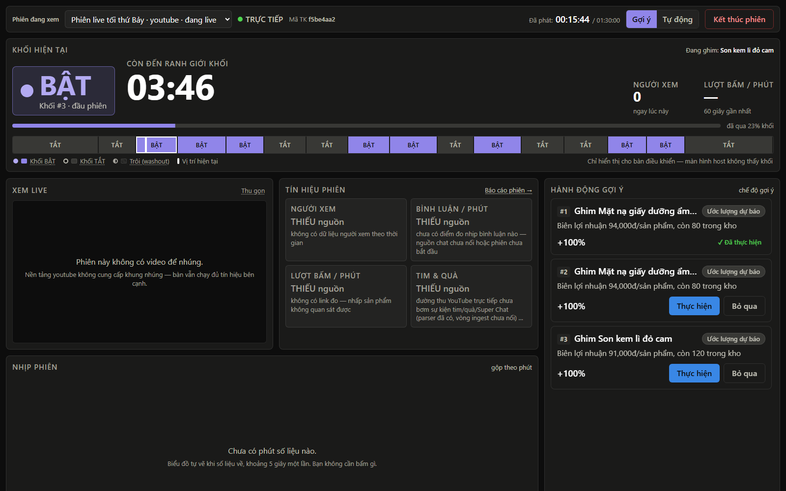

> **Có thể hệ thống ghim một sản phẩm khác với thẻ bạn bấm** (trong ảnh: bấm thẻ
> #1 *Mặt nạ giấy*, hệ thống ghim *Son kem lì đỏ cam*). Đây **không phải lỗi**:
> khi hai sản phẩm chưa phân biệt được về mặt thống kê, hệ thống bốc thăm giữa
> chúng và **ghi lại xác suất bốc** — đó là phần "khám phá có kiểm soát" giúp dữ
> liệu về sau vẫn phân tích được. **Cứ đọc tên ở dòng "Đang ghim:"** — đó là sản
> phẩm thật sự đang lên màn hình host.

**Nếu đang ở khối TẮT:** hệ thống **từ chối, và đó là đúng** — khối TẮT là nhánh
đối chứng, hệ thống không được can thiệp, nếu không thí nghiệm mất giá trị.

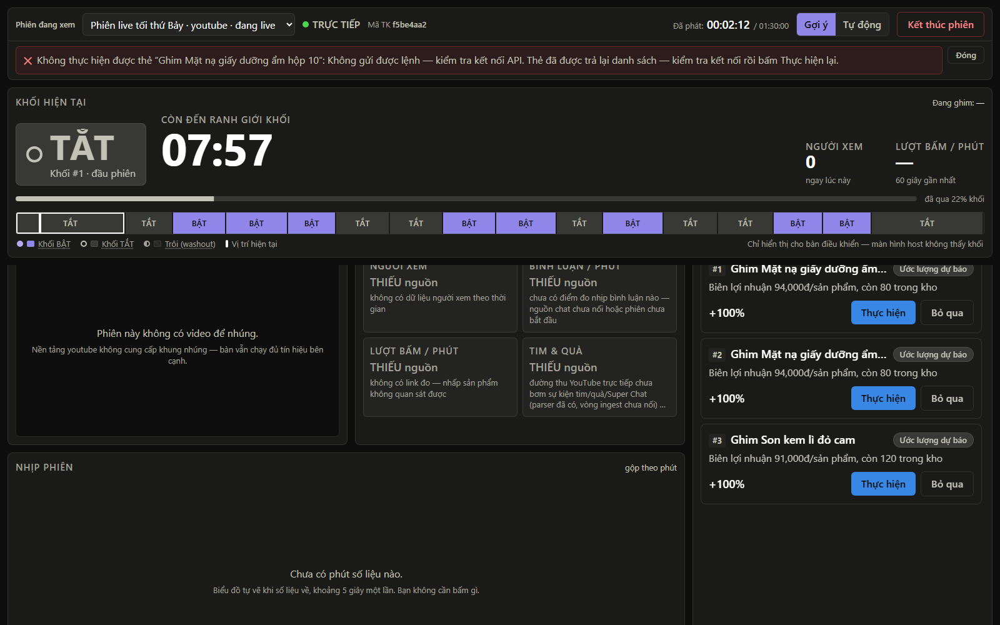

> ⚠️ **Thông báo lỗi hiện đang ghi sai.** Nó viết *"Không gửi được lệnh — kiểm
> tra kết nối API"*, làm bạn tưởng mạng hỏng. Thật ra máy chủ trả lời rất rõ:
> *"Khối TẮT: đội vận hành làm theo cách thường lệ — hệ thống không can thiệp để
> bảo toàn nhánh đối chứng"*, nhưng giao diện chưa hiển thị câu đó. **Nếu ô lớn
> đang ghi TẮT thì cứ yên tâm, không phải lỗi mạng** — chờ tới khối BẬT rồi bấm
> lại. Xem mục 8.

**Khi nào thì tới khối BẬT?** Nhìn dải ô: ô tím đầu tiên nằm ở đâu. Đồng hồ
*"CÒN ĐẾN RANH GIỚI KHỐI"* đếm ngược tới lần đổi kế tiếp.

### Bước 3.8 — Mở màn hình người dẫn trên máy người dẫn

**Bấm gì:** nút **"Mở màn hình người dẫn"** ở bước 4 của wizard Chuẩn bị phiên
(hoặc mở thẳng `http://localhost:3000/host` trên máy/màn hình đặt trước mặt
người dẫn) — kéo cửa sổ sang màn phụ/TV, bấm F11 để toàn màn hình.

Khi chưa ghim gì, màn này chỉ có đồng hồ và dòng chữ **"Chưa ghim sản phẩm"** —
đúng như thiết kế, không phải màn hình lỗi:

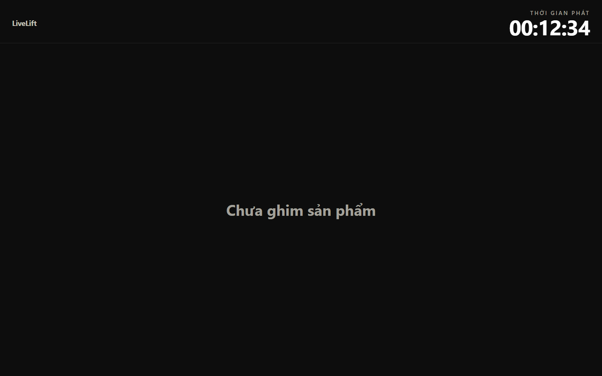

Sau khi bạn bấm "Thực hiện" ở bàn điều khiển, màn này hiện **đúng 4 thứ, cỡ rất
lớn** để người dẫn liếc từ xa 2 mét vẫn đọc được: *Sản phẩm đang ghim* · *Giá* ·
*Tồn kho* · *Thời gian phát*.

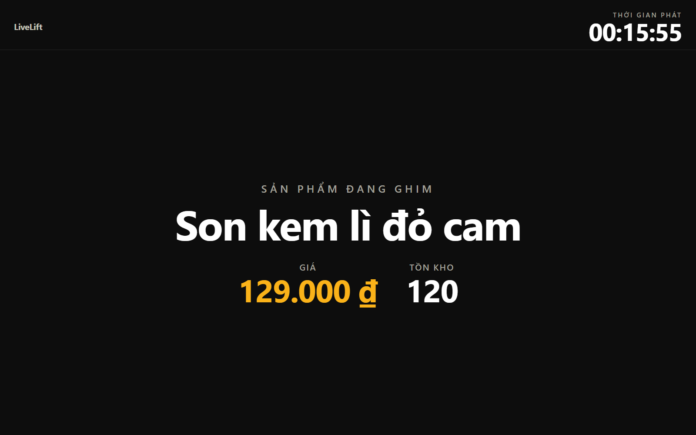

> **Màn host cố tình "thiếu" thông tin — đây là thiết kế, không phải bug.** Nó
> **không bao giờ** hiện khối BẬT/TẮT. Nếu người dẫn biết mình đang ở nhánh nào,
> họ sẽ vô thức nói năng khác đi, và thí nghiệm sẽ đo cả tâm lý người dẫn thay
> vì đo tác động của hệ thống. Xem mục 7.

### Bước 3.9 — Kết thúc phiên

**Bấm gì:** nút đỏ **"Kết thúc phiên"** ở góc phải thanh trạng thái của *Bàn
trợ live*.

**Chuyện gì xảy ra:** trình duyệt hỏi lại một câu:
*"Kết thúc phiên ngay bây giờ? Các khối chưa chạy sẽ không được tính vào kết
quả."* → bấm **OK**.

Sau đó trạng thái phiên đổi thành **"đã kết thúc"**, nút đỏ biến mất, và phiên
xuất hiện trong danh sách *Báo cáo từng phiên* ở trang **Kết quả**.

Nếu không còn phiên nào đang live, bàn điều khiển chuyển sang màn hình trống có
hướng dẫn — **đây là trạng thái đúng, không phải hỏng**:

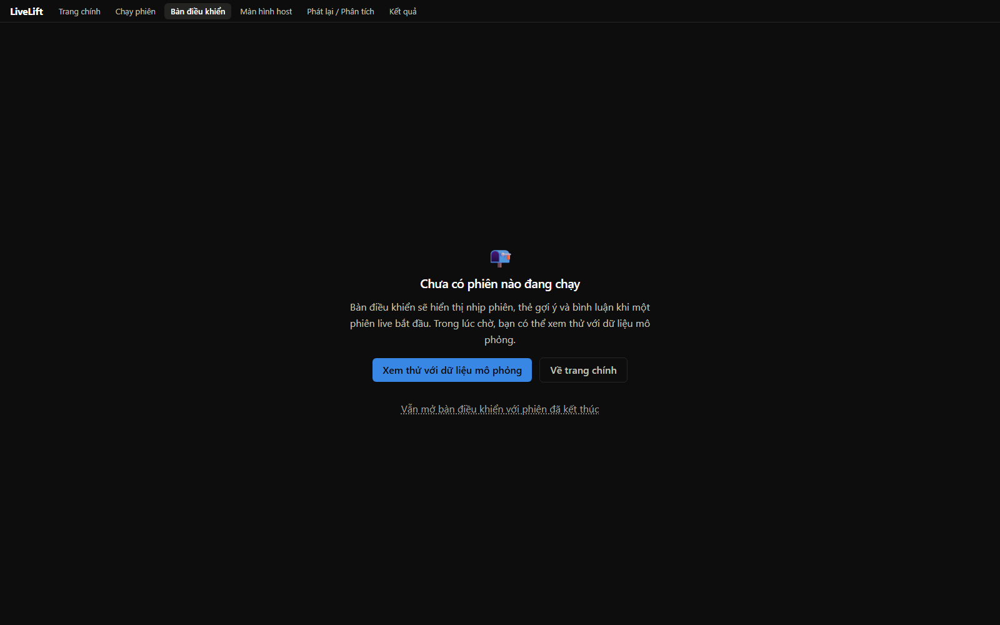

Ba đường đi tiếp từ đây: **"Xem thử với dữ liệu mô phỏng"** · **"Về trang
chính"** · dòng gạch chân **"Vẫn mở bàn điều khiển với phiên đã kết thúc"** (mở
lại bàn trên một buổi cũ để xem lại).

---

## 6. LUỒNG 4 — Đọc kết quả

### 6.1 — Trang "Kết quả" (tổng hợp mọi phiên)

**Bấm gì:** chữ **"Kết quả"** trên thanh trên cùng.

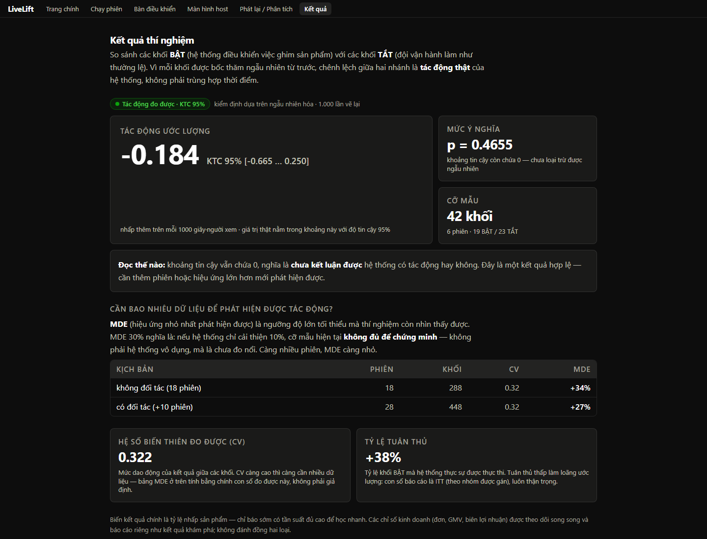

Đọc theo thứ tự này:

| Ô | Nghĩa là gì (nói đơn giản) |
|---|---|
| **TÁC ĐỘNG ƯỚC LƯỢNG** `-0.184` | Khối BẬT tạo thêm (hay bớt) bao nhiêu lượt nhấp so với khối TẮT |
| **KTC 95% [-0.665 … 0.250]** | Khoảng mà giá trị thật gần như chắc chắn nằm trong |
| **MỨC Ý NGHĨA** `p = 0.4655` | Khả năng chênh lệch này chỉ là may rủi |
| **CỠ MẪU** `42 khối` | Đã gom được bao nhiêu dữ liệu |

**Câu quan trọng nhất nằm ở khung "Đọc thế nào:".** Ở ảnh trên nó viết: *khoảng
tin cậy vẫn chứa 0, nghĩa là **chưa kết luận được**.* Nghĩa là: **chưa đủ dữ
liệu để nói hệ thống có tác dụng hay không** — đây là một kết quả **hợp lệ**, hệ
thống không bịa ra con số đẹp.

- **Bảng MDE** bên dưới trả lời "cần chạy bao nhiêu phiên nữa thì mới đo nổi".
- **TỶ LỆ TUÂN THỦ** = trong các khối BẬT, bao nhiêu phần trăm thực sự được bấm
  *Thực hiện*. Thấp thì kết quả bị loãng.

> **Nếu trang báo "Chưa đủ dữ liệu để kết luận"**: bình thường khi bạn mới chạy
> vài phiên. Chạy thêm phiên thật.

### 6.2 — Mở báo cáo của một buổi cụ thể

**Bấm gì:** cuộn xuống cuối trang Kết quả tới mục **"BÁO CÁO TỪNG PHIÊN"**, bấm
nút **"Báo cáo phiên"** ở dòng bạn muốn.

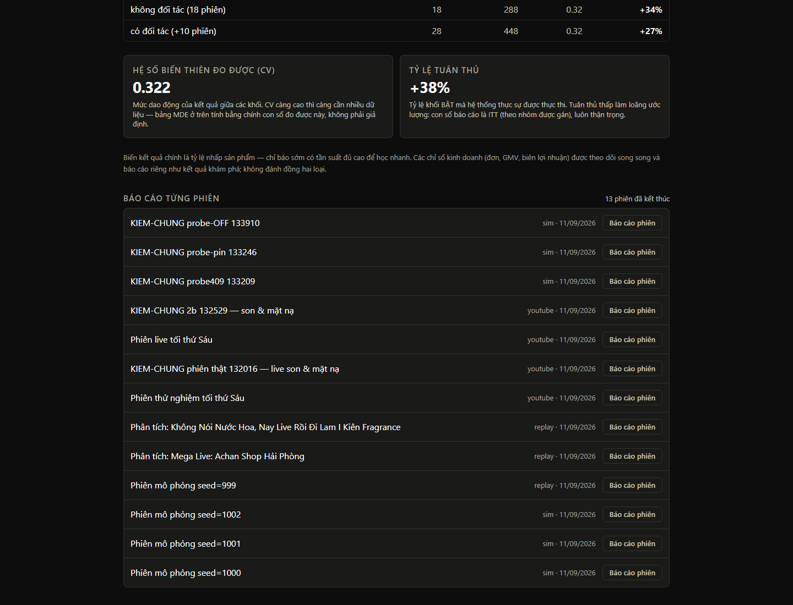

### 6.3 — Đọc báo cáo sau phiên

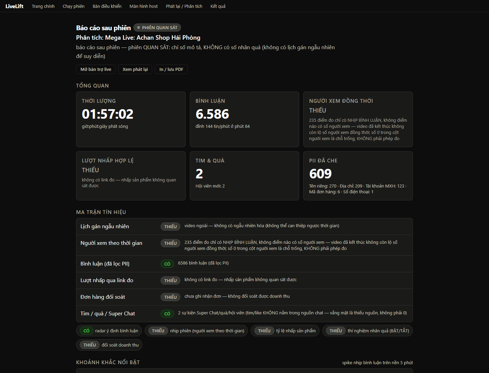

**Huy hiệu cạnh tiêu đề** cho biết loại buổi:
- **PHIÊN QUAN SÁT** (xám) = buổi live của người khác nạp vào ⇒ **không có số
  nhân quả**, chỉ mô tả.
- **PHIÊN THÍ NGHIỆM** (xanh) = buổi bạn tự chạy có bốc thăm lịch ⇒ có mục kết
  quả nhân quả.

**TỔNG QUAN** — 6 ô. Ô nào không đo được thì ghi **"THIẾU"** kèm lý do bằng
tiếng Việt, **không bao giờ in số 0**. Ví dụ trong ảnh: *Người xem đồng thời →
THIẾU, vì video đã kết thúc không còn lộ số người xem*.

**MA TRẬN TÍN HIỆU** — bảng "buổi này đo được gì": mỗi dòng là một nguồn dữ liệu
với nhãn **CÓ / SUY GIẢM / THIẾU** và lý do. Đây là chỗ trả lời câu "sao chỗ này
trống?".

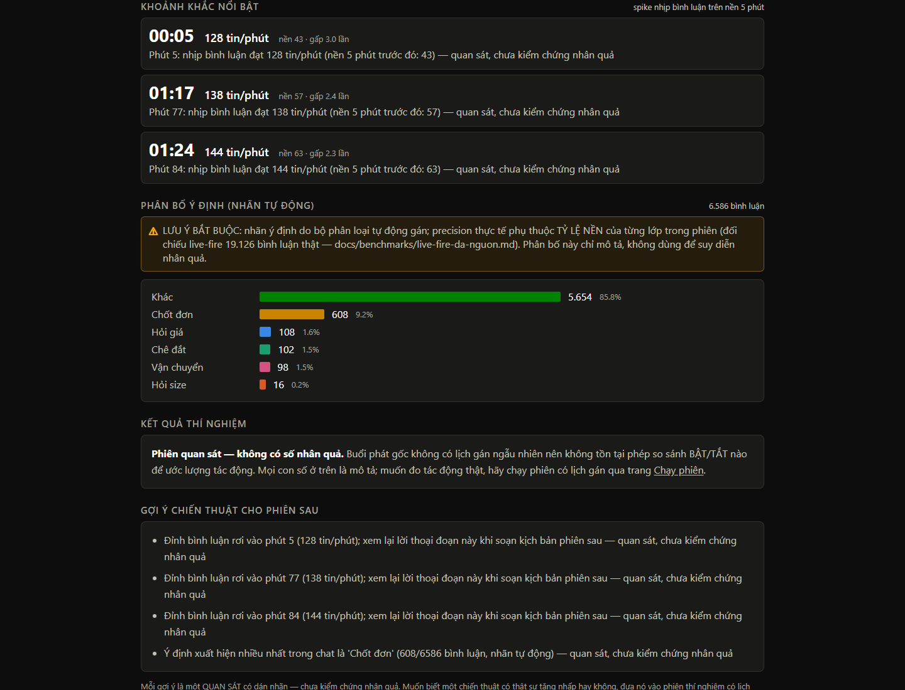

**KHOẢNH KHẮC NỔI BẬT** — các phút mà nhịp bình luận vọt lên so với nền. Dùng để
xem lại băng đoạn đó. Mỗi dòng đều kết thúc bằng *"quan sát, chưa kiểm chứng
nhân quả"* — đúng như nó là.

**PHÂN BỐ Ý ĐỊNH** — chat được chia theo ý định. **Đọc kèm khung cam phía trên**:
độ chính xác của nhãn phụ thuộc nặng vào từng buổi, đã đo thật trên 19.126 bình
luận và chênh nhau tới 50 lần giữa các buổi. Đừng dùng con số này để ra quyết
định lớn.

**KẾT QUẢ THÍ NGHIỆM** — với phiên quan sát, mục này chỉ ghi *"Phiên quan sát —
không có số nhân quả"*. Với phiên bạn tự chạy, nó hiện tác động + khoảng tin cậy.

**GỢI Ý CHIẾN THUẬT CHO PHIÊN SAU** — vài câu rút ra từ buổi đó.

**Nút "In / lưu PDF"** ở đầu trang để lưu báo cáo gửi cho người khác.

---

## 7. Ai dùng màn nào — và vì sao màn host bị "làm mù"

| | **Bàn điều khiển** (`/desk`) | **Màn hình host** (`/host`) | **Người xem** |
|---|---|---|---|
| Ai nhìn | Chủ shop / người trợ live | Người dẫn đang nói trước máy quay | Khách xem live |
| Đặt ở đâu | Laptop ngồi cạnh, ngoài khung hình | Màn phụ / TV trước mặt người dẫn | Điện thoại của khách |
| Thấy khối BẬT/TẮT | **Có** | **KHÔNG BAO GIỜ** | Không |
| Thấy đồng hồ đếm ngược khối | Có | Không | Không |
| Thấy thẻ gợi ý, nút Thực hiện | Có | Không | Không |
| Thấy gì | Toàn bộ | Đúng 4 thứ: sản phẩm đang ghim · giá · tồn kho · thời gian phát | Chỉ link đo trong bình luận ghim |

### Vì sao phải làm mù người dẫn

Thí nghiệm so **khối BẬT** với **khối TẮT**. Nếu người dẫn biết "đang BẬT", họ
sẽ tự nhiên nói hăng hơn, nhắc sản phẩm nhiều hơn. Khi đó chênh lệch đo được
không còn là tác động của **hệ thống** nữa mà lẫn cả **phản ứng tâm lý của người
dẫn** — và con số mất giá trị.

Việc làm mù này được ép ở tầng kiến trúc, không phải "nhớ đừng hiện": màn host
dùng một luồng dữ liệu riêng chỉ chứa đúng 4 trường, nên **kể cả lập trình viên
muốn cũng không hiện khối lên đó được**. Bạn kiểm chứng bằng mắt: mở `/host`,
không có dải tím/xám ở bất kỳ đâu.

Dòng chữ nhỏ ngay dưới dải khối trên bàn điều khiển nhắc lại điều này: *"Chỉ
hiển thị cho bàn điều khiển — màn hình host không thấy khối"*.

---

## 8. Giới hạn hiện tại — nói thật

| # | Giới hạn | Ảnh hưởng tới bạn | Cách sống chung |
|---|---|---|---|
| 1 | **Chưa có đăng nhập, chưa có mật khẩu** | Ai vào được địa chỉ là dùng được toàn quyền | Chỉ chạy trên **máy cá nhân** hoặc **Wi-Fi nội bộ**. Chưa đưa lên Internet công khai |
| 2 | **Dữ liệu nằm trong bộ nhớ tạm** | Đóng cửa sổ máy chủ (cửa sổ 1) là **mất hết phiên đã tạo** | Đừng đóng khi còn đang dùng. Buổi live YouTube thì nạp lại được (Luồng 2) |
| 3 | **Chế độ "Tự ghim" cần máy chủ chạy đúng 1 tiến trình** | Trước 12/09 chế độ này chưa có bộ thực thi (không gì được ghim); nay bộ thực thi tự động chạy phía máy chủ, nhưng tắt được bằng biến môi trường và chỉ an toàn với 1 worker | Nếu bàn trợ live báo **"Bộ thực thi tự động ĐANG TẮT"** hoặc phiên auto im lặng quá 5 phút thì ghim tay ngay theo cảnh báo trên bàn |
| 4 | **Điện thoại chưa dùng được cho Bàn điều khiển** | Màn `/desk` thiết kế cho ≥ 1366×768; trên điện thoại các khung chồng lên nhau, khó bấm | Dùng laptop cho `/desk`. Màn `/host` và trang báo cáo thì xem tạm được trên màn nhỏ |
| 5 | **Địa chỉ trên thanh URL không chọn được buổi ở màn Phát lại** | Sau khi phân tích xong, trang mở **nhầm buổi** (bước 2.3) | Chọn tay trong ô thả xuống góc trái |
| 6 | **Báo lỗi sai khi bấm Thực hiện trong khối TẮT** | Hiện *"kiểm tra kết nối API"* trong khi thật ra là *"đang ở khối TẮT"* | Nhìn ô lớn KHỐI HIỆN TẠI trước khi nghi ngờ mạng |
| 7 | **Ô "Người xem" trên đồng hồ khối in số 0** khi chưa có nguồn đo | Mâu thuẫn với ô *"NGƯỜI XEM — THIẾU nguồn"* ngay bên dưới | **Tin ô THIẾU nguồn**, đừng tin số 0 |
| 8 | **Ô "Lượt bấm" ghi "không có link đo"** ngay cả khi đã tạo link | Dễ tưởng link chưa được tạo | Link vẫn có, chỉ là **chưa ai bấm**. Kiểm tra lại danh sách link ở bước 4 của wizard *Chuẩn bị phiên* |
| 9 | **Link đo trỏ về `localhost`** | Khách xem live **không mở được** | Cần một địa chỉ công khai (tên miền thật hoặc tunnel) đặt vào `NEXT_PUBLIC_PUBLIC_API_BASE` — nhờ người kỹ thuật làm 1 lần |
| 10 | **Nguồn thu bình luận trực tiếp chưa nối sẵn** | Phiên bạn tự chạy sẽ hiện *THIẾU nguồn* ở Bình luận, Người xem, Tim & quà | Bình thường. Muốn thấy radar/feed có dữ liệu thật, dùng Luồng 2 (nạp buổi YouTube đã xong) |
| 11 | **Chưa có nhập đơn hàng / doanh thu** | Báo cáo luôn ghi *"chưa ghi nhận đơn"* | Chỉ tiêu chính hiện là **lượt nhấp**, không phải doanh thu |
| 12 | **Một số việc vẫn phải gõ lệnh** | Chấm chất lượng dữ liệu (`livelift-qc`), mô phỏng kiểm định | Xem `docs/HUONG-DAN-TEST.md` |

---

## 9. Gặp lỗi thì làm gì

| Bạn thấy | Nguyên nhân hay gặp nhất | Làm gì |
|---|---|---|
| Trang trắng / không mở được `localhost:3000` | Cửa sổ 2 (`npm run dev`) chưa chạy | Bật lại cửa sổ 2, chờ dòng `Ready` |
| Thẻ số 2 ở trang chính bị mờ | Máy chủ (cửa sổ 1) chưa chạy | Bật lại cửa sổ 1 |
| Bàn điều khiển hiện *"Chưa có phiên nào đang chạy"* | Không có phiên nào ở trạng thái *đang live* | Bấm **"Xem thử với dữ liệu mô phỏng"**, hoặc **"Vẫn mở bàn điều khiển với phiên đã kết thúc"**, hoặc chạy Luồng 3 |
| Bàn hiện **sai buổi** | Bàn tự chọn buổi *đang live* đầu tiên | Đổi ở ô **"Phiên đang xem"** góc trái |
| Khung cam *"Dữ liệu suy giảm"* trên bàn | Một nguồn dữ liệu tạm hỏng | Bàn vẫn chạy với nguồn còn lại; nếu kéo dài thì xem cửa sổ 1 |
| Radar / feed trống trên buổi có hàng nghìn bình luận | Vừa đổi buổi, chưa poll xong | Chờ ~5 giây; nếu vẫn trống, tải lại trang (Ctrl+R) |
| Bấm *Thực hiện* báo lỗi | Đang ở khối **TẮT** (xem giới hạn #6) | Nhìn ô KHỐI HIỆN TẠI; chờ khối BẬT |
| Số liệu cũ, không nhúc nhích | Trình duyệt cache | `Ctrl + Shift + R` |
| Phân tích YouTube báo lỗi | Video không có chat replay, hoặc YouTube chặn | Đổi video; hoặc xem `docs/HUONG-DAN-TEST.md` mục 4 |

Mọi lỗi từng gặp và cách sửa tận gốc: [`docs/incident-log.md`](incident-log.md).
Hướng dẫn kiểm thử bằng lệnh cho người kỹ thuật:
[`docs/HUONG-DAN-TEST.md`](HUONG-DAN-TEST.md).
