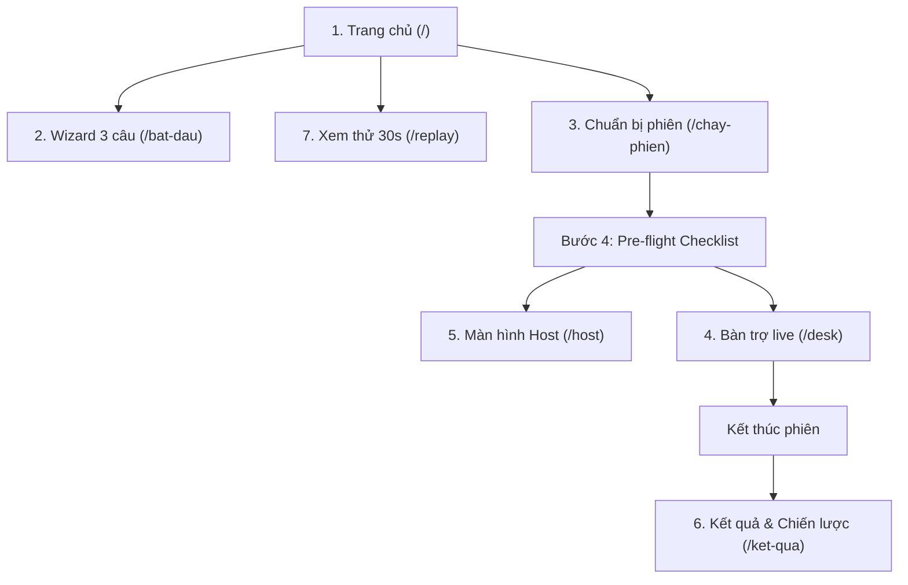

# BÁO CÁO KIỂM TOÁN DỰ ÁN LIVELIFT — CHUẨN BỊ AISC 2026 VÒNG 2

> **Mã tài liệu:** `AISC-R2-AUDIT-20260921`
> **Thời điểm kiểm toán:** 21/09/2026
> **Nhánh git:** `tien/aisc-round2`
> **Trạng thái kiểm toán:** CHỈ ĐỌC & ĐÁNH GIÁ (READ-ONLY AUDIT) — Không sửa mã nguồn, không commit, không đổi nhánh.

---

## MỤC LỤC

1. [TỔNG QUAN VÀ BỐI CẢNH KIỂM TOÁN](#1-tổng-quan-và-bối-cảnh-kiểm-toán)
2. [RANH GIỚI BẮT BUỘC: AISC 2026 VS SÁNG TẠO TRẺ AI](#2-ranh-giới-bắt-buộc-aisc-2026-vs-sáng-tạo-trẻ-ai)
3. [ĐÁNH GIÁ THEO 5 GÓC NHÌN CHUYÊN GIA](#3-đánh-giá-theo-5-góc-nhìn-chuyên-gia)
   - 3.1. Giám khảo AISC chưa từng biết LiveLift
   - 3.2. Người dùng lần đầu sử dụng sản phẩm
   - 3.3. QA Engineer kiểm tra kịch bản demo sân khấu
   - 3.4. Product Reviewer kiểm tra tính ứng dụng thực tế
   - 3.5. Reviewer đối kháng kiểm tra overclaim, số liệu cũ & mâu thuẫn
4. [KIỂM TOÁN CHI TIẾT 7 LUỒNG TRẢI NGHIỆM](#4-kiểm-toán-chi-tiết-7-luồng-trải-nghiệm)
   - Luồng 1: `/` (Trang chủ & Cửa vào)
   - Luồng 2: `/bat-dau` (Wizard 3 câu hỏi)
   - Luồng 3: `/chay-phien` (Wizard 4 bước chuẩn bị phiên)
   - Luồng 4: `/desk` (Bàn trợ live - Operator Desk)
   - Luồng 5: `/host` (Màn hình người dẫn - Blinded Host Screen)
   - Luồng 6: `/ket-qua` (Trang kết quả & Tuyên bố nhân quả)
   - Luồng 7: `/replay` (Replay Engine & What-if)
5. [ĐỐI CHIẾU MÃ NGUỒN VÀ TÀI LIỆU (GAP ANALYSIS)](#5-đối-chiếu-mã-nguồn-và-tài-liệu-gap-analysis)
   - 5.1. Feature có trong docs nhưng không có/chưa hoàn thiện trong code
   - 5.2. Code đã có nhưng docs vẫn bảo chưa có
   - 5.3. Bảng đối chiếu số liệu mâu thuẫn toàn diện
6. [PHÂN LOẠI HÀNH ĐỘNG CHO AISC VÒNG 2](#6-phân-loại-hành-động-cho-aisc-vòng-2)
   - BLOCKER (Chặn đứng bài thi / Rủi ro trượt trực tiếp)
   - P0 (Phải xử lý ngay trước ngày thi / demo)
   - P1 (Cải thiện chất lượng & tính nhất quán)
   - P2 (Tối ưu hóa sau Vòng 2)
   - DO NOT DO BEFORE ROUND 2 (Tuyệt đối không làm trước Vòng 2)
7. [CHECKLIST CHUẨN BỊ CHO NGÀY THI AISC VÒNG 2](#7-checklist-chuẩn-bị-cho-ngày-thi-aisc-vòng-2)

---

## 1. TỔNG QUAN VÀ BỐI CẢNH KIỂM TOÁN

LiveLift là một dự án có nền tảng phương pháp luận khoa học rất hiếm thấy ở các cuộc thi sinh viên: thiết kế switchback hai tầng, kiểm định ngẫu nhiên hóa studentized vẽ lại bằng chính hàm gán production, làm mù người dẫn ở cấp kiểu dữ liệu, lọc PII tiếng Việt nghiêm ngặt và tinh thần "dám tự bác bỏ số của chính mình" (công bố F1 intent tụt từ 0.870 xuống 0.271 trên chat thật). Kho mã sở hữu hệ thống kiểm thử đồ sộ (trên 1.580 test, 17 cổng Monte-Carlo, 60 sự cố có root-cause).

Tuy nhiên, khi bước vào **AISC 2026 Vòng 2 (Track Data-Driven Business)**, dự án đang bộc lộ những rủi ro cốt tử:
- **Tình trạng "0 phiên live ngẫu nhiên thật":** Toàn bộ số liệu nhân quả đến từ mô phỏng; dữ liệu thật duy nhất là 19.126 bình luận từ 16 VOD YouTube hồi cứu (chỉ quan sát).
- **Trộn lẫn roadmap với cuộc thi Sáng Tạo Trẻ AI:** Tài liệu điều hành công việc (`docs/VIEC-CAN-LAM.md`) bị cuốn hoàn toàn theo thể lệ của cuộc thi Sáng Tạo Trẻ (Bảng C, hackathon 48h), làm lu mờ mục tiêu kinh doanh và sản phẩm của AISC.
- **Rào cản áp dụng thực tế:** Nền tảng lớn nhất (TikTok Shop) không hỗ trợ ghim hay thu bình luận realtime qua API; biến kết quả chính (lượt nhấp link `/r/{code}`) xa lạ với thói quen bấm giỏ hàng trong app của người mua live commerce.
- **Mâu thuẫn số liệu giữa các tài liệu:** Các con số cốt lõi (số test, số sự cố, số bình luận, số hiệu chuẩn A/A) phân mảnh nghiêm trọng giữa README, FACT-SHEET, Thuyết minh và Sổ sự cố.

---

## 2. RANH GIỚI BẮT BUỘC: AISC 2026 VS SÁNG TẠO TRẺ AI

> ⚠️ **CẢNH BÁO QUAN TRỌNG:** Kiểm toán phát hiện file `docs/VIEC-CAN-LAM.md` (cập nhật ngày 18/09/2026) đang theo dõi lịch trình và đầu việc của cuộc thi **Sáng tạo trẻ Quốc gia trong lĩnh vực AI 2026 (TW Đoàn)** chứ KHÔNG PHẢI của **AISC 2026**.

Hai cuộc thi này có mục tiêu, rubric chấm điểm và hình thức thi hoàn toàn khác biệt. Không được phép trộn lẫn:

| Tiêu chí | AISC 2026 (AI Student Contest) | Sáng tạo trẻ AI 2026 (TW Đoàn) |
|---|---|---|
| **Chủ đề / Track** | **Data Driven Business** · Đổi mới sáng tạo kinh doanh dựa trên dữ liệu | **Bảng C** · Sinh viên ĐH Tôn Đức Thắng cử · AI vì cộng đồng/kinh tế |
| **Bản chất Vòng 2** | Thuyết trình, bảo vệ giải pháp kinh doanh, chứng minh sản phẩm vận hành và khả thi kinh tế | **Hackathon trực tiếp 2 ngày (10–11/10/2026)** trên 01 bộ dữ liệu thô lạ do BTC cấp tại chỗ (chiếm 60% điểm) |
| **Trọng tâm đánh giá** | Giá trị kinh doanh, tính ứng dụng thực tế cho nhà bán, moat công nghệ, tính khả thi tài chính | Rubric 8 tiêu chí: AI metrics, baseline/ablation, đạo đức AI, làm chủ mã nguồn, Prompt Log |
| **Yêu cầu sản phẩm** | Sản phẩm giải quyết bài toán vận hành live commerce Việt Nam | Giải bài toán hackathon trong 48h + duy trì demo online 48h |
| **Nguy cơ nếu trộn lẫn** | Giám khảo AISC thấy đội chuẩn bị đi thi hackathon dữ liệu lạ thay vì hoàn thiện bài toán kinh doanh livestream | Đội phí thời gian làm những việc không phục vụ bài thi AISC Vòng 2 |

### Các nội dung trong repo thuộc về "Sáng tạo trẻ AI" PHẢI TÁCH RỜI KHỎI AISC:
1. `docs/competition/sang-tao-tre-2026/*` (Toàn bộ thư mục này).
2. Kế hoạch luyện hackathon 8 tiếng, dựng bộ đồ nghề tabular/time-series (`VIEC-CAN-LAM.md` mục 23, 70-75).
3. Thủ tục hành chính: xin giấy xác nhận sinh viên, nộp Prompt Log hội thoại Claude Code lên Google Drive.
4. Kê khai Luật Trí tuệ nhân tạo 134/2025/QH15 và Mẫu 3 của TW Đoàn.

---

## 3. ĐÁNH GIÁ THEO 5 GÓC NHÌN CHUYÊN GIA

### 3.1. Giám khảo AISC chưa từng biết LiveLift (Track Data-Driven Business)
- **Điểm sáng:** Câu chuyện đặt vấn đề xuất sắc ("Phút 30 ghim B, phút 35 doanh thu tăng 40% — do ghim hay do trùng hợp?"). Moat phương pháp switchback hai tầng giải quyết bài toán "đi thuê sân" mà không cần SDK nền tảng. Tinh thần liêm chính khoa học gây ấn tượng mạnh.
- **Rào cản nhận thức:**
  - *Quá tải học thuật:* Giám khảo kinh doanh sẽ bị "ngộp" trước hàng chục thuật ngữ thống kê cao cấp (Studentized permutation test, Fisher inversion, Lin 2013 FE, Gamma-Poisson posterior, LATE Wald, geometric mixing). Họ cần biết: **Sản phẩm giúp nhà bán tăng bao nhiêu tiền? Chi phí sử dụng bao nhiêu?**
  - *Lỗ hổng kiểm chứng thương mại:* Toàn bộ giá gói (Free -> Pro 990k -> Agency 3.9M -> Performance holdback) là **giả thuyết thuần túy**. FACT-SHEET ghi rõ: *chưa thực hiện bất kỳ cuộc phỏng vấn mức độ sẵn sàng chi trả (WTP) nào*.
  - *Điểm yếu "0 phiên thật":* Giám khảo vòng Data-Driven Business sẽ đặt câu hỏi hóc búa: *"Nếu chưa có khách hàng thật nào dùng thử và bấm link, làm sao chứng minh đây là một doanh nghiệp khả thi thay vì một đồ án tốt nghiệp lý thuyết?"*

### 3.2. Người dùng lần đầu sử dụng sản phẩm (Chủ shop / Trợ live / KOL)
- **Điểm sáng:**
  - `/bat-dau` với 3 câu hỏi dạng thẻ bấm cực kỳ trực quan.
  - Trang `/` có 3 cửa vào phân định rõ ràng; trạng thái máy chủ (SỐNG / SUY GIẢM / CHẾT) được giải thích bằng tiếng Việt dễ hiểu kèm hướng xử lý.
- **Điểm gây hoang mang & bỏ cuộc:**
  - *Thất vọng nền tảng:* Nếu chủ shop live trên TikTok Shop (kênh chiếm >80% thị phần live commerce trẻ hiện nay), khi vào `/bat-dau` chọn "TikTok -> Đang phát", hệ thống dội một gáo nước lạnh: **"Hôm nay: không làm được"**, và trần cũng là "Không có đường lên". Người dùng sẽ rời bỏ ngay lập tức.
  - *Nghịch lý khối TẮT trên `/desk`:* Trong khối TẮT, hệ thống cố tình im lặng (ActionCard ghi "Khối TẮT — vận hành như thường lệ. Hệ thống không gợi ý ghim"). Người dùng mới sẽ tưởng phần mềm bị treo hoặc lỗi kết nối.
  - *Rào cản link đo:* Khách hàng livestream quen bấm giỏ hàng màu vàng trong app. Bắt chủ shop phải copy link `/r/{code}` đi spam vào comment hoặc ghim lên video là đi ngược lại hành vi người dùng tự nhiên.
  - *Cảnh báo dọa nạt:* Tạo phiên dưới 90 phút ở bước 2 thì hệ thống hiện cảnh báo màu vàng về việc vi phạm bảo đảm thiết kế thống kê. Hầu hết các shop nhỏ chỉ live thử 30-45 phút, cảnh báo này làm họ sợ không dám bấm tiếp.

### 3.3. QA Engineer kiểm tra kịch bản demo sân khấu (Live 7-Minute Pitch)
- **Điểm sáng:** Kịch bản demo 7 phút (`docs/competition/kich-ban-demo-7-phut.md`) được viết rất công phu, chuẩn bị cả kịch bản "hỏng thì làm gì". Bộ "Demo Vàng" chuẩn bị sẵn 6 phiên phủ cả 3 trạng thái (Dương rõ, Null, Chưa đủ điều kiện).
- **Các điểm "dễ chết" trên sân khấu (Demo Fragility Points):**
  - 💥 **Lỗi "NGOÀI KHỐI" của phiên live cũ:** Nếu mở tab `/desk` với phiên demo đã gieo từ hôm trước, đồng hồ sẽ vượt quá thời lượng (ví dụ `04:33:44 / 01:00:00`) và hiển thị `NGOÀI KHỐI`. Khi đó không có khối BẬT/TẮT, thẻ gợi ý bị khóa. QA phải đảm bảo script seed mới chạy trước giờ demo đúng 5 phút.
  - 💥 **Xung đột cổng Caddy vs Dev Server:** `README.md` bảo mở `http://localhost`, nhưng `kich-ban-demo-7-phut.md` bảo mở `http://127.0.0.1:3000`. Nếu chạy Docker Compose thì cổng 3000 không mở ra ngoài (chỉ mở cổng 80 qua Caddy). Nếu gõ nhầm `:3000` khi chạy Docker, trình duyệt báo lỗi `ERR_CONNECTION_REFUSED`.
  - 💥 **Trang `/ket-qua` mặc định hiển thị "CHƯA ĐỦ ĐIỀU KIỆN":** Mở `/ket-qua` mà không truyền tham số `?phien=<id>` thì API gọi `/experiment/summary` của phiên THẬT. Vì có 0 phiên thật, trang sẽ hiện toàn bộ bảng xám xịt "CHƯA ĐỦ ĐIỀU KIỆN / 0 phiên". Nếu presenter lúng túng không kịp kéo xuống mục Demo Vàng để chọn phiên mẫu, khán giả sẽ tưởng phần mềm bị crash.
  - 💥 **Bấm nhầm nút "Kết thúc phiên" trên `/desk`:** Dù có confirm dialog, nếu presenter bấm nhầm và xác nhận, phiên lập tức chuyển sang `ended` và KHÔNG THỂ kích hoạt lại. Bàn trợ live lập tức biến thành màn hình tĩnh.
  - 💥 **Trình chiếu trên màn hình nhỏ (Laptop 1366x768):** Dù đã tối ưu ở gói v3, nếu zoom trình duyệt ở mức 100%, nút "Ghim ngay" ở cột phải có thể bị tụt xuống dưới nếp gấp màn hình (fold), buộc phải cuộn chuột.

### 3.4. Product Reviewer kiểm tra tính ứng dụng thực tế
- **Điểm sáng:** Kiến trúc PII filter xử lý dữ liệu trước khi chạm đĩa tuân thủ chặt chẽ Luật Bảo vệ dữ liệu cá nhân; shortlink có cơ chế lọc bot GIVT-lite 5 quy tắc (UA, prefetch, non-GET, refractory 10s, volume cap 5 click).
- **Khoảng cách thực tế lớn (Product Gaps):**
  - *Điểm nghẽn kênh đo lường (Measurement Bottleneck):* Live commerce Việt Nam chốt đơn qua 2 kênh: (1) Giỏ hàng sàn (TikTok Shop, Shopee); (2) Phần mềm quét cú pháp comment (Pancake, TPos, UPOS). LiveLift lại chọn đo qua link redirect tự host `/r/{code}`. Trên TikTok, việc dẫn link ra ngoài app bị bóp tương tác nặng nề; trên Facebook, comment chứa link dễ bị đánh dấu spam.
  - *Độ trễ và phụ thuộc API:* Để hệ thống vận hành tự động ghim, sàn phải hỗ trợ API ghim (chỉ Shopee có API `update_show_item`). YouTube và Facebook không có API ghim sản phẩm trong livestream. Do đó, lời hứa "Autopilot tự ghim" thực chất vẫn phụ thuộc vào việc người trợ live nhìn màn hình rồi bấm tay trên điện thoại phát live.
  - *Mô hình ý định mua (Intent Radar) bị vỡ trận:* Độ chính xác thực tế F1 = 0.271, precision gộp 11% trên chat bán hàng thật (nghiên cứu Achan Shop). Bình luận "EM CHAO CA NHA" bị đoán thành `chot_don` (độ tự tin 0.974); "Xoài rẻ quá ạ" bị đoán thành `che_dat`. Radar ý định hiện tại chỉ mang tính tham khảo thứ cấp, chưa thể dùng làm tín hiệu điều khiển ghim.

### 3.5. Reviewer đối kháng kiểm tra overclaim, số liệu cũ & mâu thuẫn
- **Điểm sáng:** Tác giả có tính tự giác rất cao khi lập `docs/incident-log.md` ghi nhận 60 sự cố kèm root cause và gate ngăn chặn.
- **Những điểm overclaim và mâu thuẫn cần dọn dẹp ngay:**
  - ⚠️ *Mâu thuẫn số test tự động:* README ghi `1803 nhanh + 17 Monte-Carlo`. FACT-SHEET ghi `1.555 nhanh + 17 Monte-Carlo + 10 browser = 1.582`. `noi-dung.json` ghi `1.009 kiểm thử`. `E6-01` ghi `157+ test`. Một giám khảo kỹ tính chỉ cần đối chiếu giữa slide và tài liệu là bắt được ngay.
  - ⚠️ *Mâu thuẫn số lượng sự cố:* README và FACT-SHEET ghi `60 sự cố`. Kịch bản demo 7 phút ghi `41 sự cố`. Thuyết minh `noi-dung.json` ghi `41 sự cố`. Tổng kết dự án ghi `24 sự cố`. File Sáng tạo trẻ ghi `47 sự cố` và `58 sự cố`.
  - ⚠️ *Số hiệu chuẩn A/A cũ không tái lập được vẫn nằm trong Thuyết minh:* `FACT-SHEET.md` đã cảnh báo rõ: *"Số cũ 4,5%/0,872 là đo 30/08, KHÔNG tái lập được; số mới đo 14/09 là 3,50% / p=0,4168 / coverage 96,50% / bias -0,84%"*. Thế nhưng file `docs/competition/thuyet-minh/noi-dung.json` (mục 5.2, 5.3, 6.5, 8.2) vẫn đang dẫn số cũ `4,5%` và `0,872`!
  - ⚠️ *Số bình luận live-fire lệch pha:* README ghi `19.126 bình luận (lô 10/09)`. Thuyết minh khung `E6-01` vẫn ghi `14.903 bình luận VOD 262 phút (lô 06/09)`. `TONG-KET-DU-AN.md` vừa ghi 14.903 vừa ghi 19.126 vừa ghi 34.029.
  - ⚠️ *Hạn nộp và ngân sách bị bỏ trống:* `FACT-SHEET.md` mục 1 vẫn còn các ô trống `⬜` về hạn nộp (14 vs 15/09), ngân sách (17,2M vs 15,2M), số phiên mục tiêu (31 vs 30).
  - ⚠️ *CI Badge trong README không phản ánh thực tế:* README gắn badge `CI passing`, nhưng `VIEC-CAN-LAM.md` dòng 44 thừa nhận: *"CI chưa từng chạy được bước nào... Kiểm tra thanh toán/giới hạn ở Settings -> Billing"*.

---

## 4. KIỂM TOÁN CHI TIẾT 7 LUỒNG TRẢI NGHIỆM



### Luồng 1: `/` (Trang chủ & Cửa vào)
- **Mục tiêu:** Định vị sản phẩm, hiển thị 3 cửa vào (Bento grid), kiểm tra tình trạng máy chủ.
- **Trải nghiệm thực tế:**
  - Bố cục Bento 3 cửa (01: Tôi có buổi live -> `/bat-dau`; 02: Xem thử 30 giây -> Demo; 03: Phân tích video có sẵn) rất mạch lạc.
  - Hàng số bằng chứng: `19.126 bình luận thật`, `16 buổi live thật`, `1.803 kiểm thử`. (Lưu ý: số 1.803 là số đếm kiểm thử, không mang ý nghĩa kinh doanh cho nhà bán).
  - Chip trạng thái kho (KHO: DỮ LIỆU MẪU / DỮ LIỆU THẬT / KHO SUY GIẢM) ở thanh điều hướng giúp minh bạch dữ liệu.
- **Vấn đề phát hiện:**
  - *Quá tải thông tin khi có cảnh báo:* Khi máy chủ ở trạng thái `degraded` (Postgres tắt, chạy RAM), dải cảnh báo màu cam chiếm diện tích lớn ở phần trên cùng màn hình. Dù đã có `<details>`, người dùng phổ thông vẫn thấy sợ hãi khi thấy cụm từ "Kho dữ liệu đang trục trặc".
  - *Nút "Bắt đầu xem thử" ở Cửa 02:* Phụ thuộc vào việc API sinh dữ liệu mẫu (`seedDemo(3)`). Nếu máy chủ đang bận hoặc tiến trình chậm, nút bị mờ khá lâu kèm chữ "Đang tạo dữ liệu...". Nếu người dùng mất kiên nhẫn bấm F5, tiến trình seed có thể bị gọi lặp.

### Luồng 2: `/bat-dau` (Wizard 3 câu hỏi)
- **Mục tiêu:** Định hướng người dùng biết buổi live của mình dùng được những tính năng gì.
- **Trải nghiệm thực tế:**
  - Ba câu hỏi: (1) Của ai? (2) Nền tảng nào? (3) Đang phát hay đã xong?
  - Hệ thống map chính xác vào ma trận 5 × 2 × 2 = 20 tổ hợp.
  - Kết quả trả về rất sòng phẳng: Đạt hôm nay, Trần sau khi chuẩn bị, Làm được gì ngay, Cần gì để lên mức cao hơn, và Không làm được gì kèm lý do.
- **Vấn đề phát hiện:**
  - *UX gây hụt hẫng:* Các lựa chọn phổ biến nhất của thị trường Việt Nam (TikTok, Facebook cá nhân) đều trả về kết quả "Không làm được" hoặc chỉ dừng ở mức "Quan sát". Cần bổ sung gợi ý giải pháp thay thế tích cực hơn (ví dụ: "Bạn có thể phát song song (multistream) lên YouTube để LiveLift đo lường").
  - *Bảng ma trận ở chân trang:* Bảng 5 nền tảng × 4 trạng thái quá rộng (min-width 46rem), trên màn hình nhỏ phải cuộn ngang và chứa rất nhiều ký hiệu mũi tên khiến trang trông giống tài liệu kỹ thuật hơn là app thương mại.

### Luồng 3: `/chay-phien` (Wizard 4 bước chuẩn bị phiên)
- **Mục tiêu:** Dẫn dắt người vận hành thiết lập một phiên thí nghiệm hợp lệ qua 4 bước: (1) Sản phẩm -> (2) Buổi live -> (3) Bốc thăm -> (4) Lên sóng.
- **Trải nghiệm thực tế:**
  - Bước 1 tự động sinh slug cho sản phẩm (ví dụ "Áo khoác dù" -> `ao-khoac-du`), không bắt người bán nhập ID kỹ thuật. Có nút "Điền link mẫu" để test nhanh.
  - Bước 3 bốc thăm sinh lịch khối trực quan, hiển thị dải BlockStrip màu sắc rõ ràng (khối xanh BẬT, khối xám TẮT).
- **Vấn đề phát hiện:**
  - ⚠️ *Bước 4 - Khâu chuẩn bị quá phức tạp (High Friction):* Tại bước 4, người bán phải làm đồng thời 4 việc:
    1. Copy từng link đo `/r/{code}` dán sẵn vào bảng ghi chú để chuẩn bị comment ghim.
    2. Bấm nút mở màn hình Host trên màn hình phụ.
    3. Bật bộ thu bình luận (IngestPanel).
    4. Bấm "Bắt đầu phát sóng".
    Người vận hành đơn lẻ (solo streamer) hoàn toàn không thể kham nổi khối lượng thao tác này trước giờ lên sóng.
  - ⚠️ *Nguy cơ quên bật Bộ thu bình luận:* Nút "Bắt đầu phát sóng" không khóa khi Bộ thu bình luận chưa bật. Người dùng có thể bấm phát sóng mà không biết bộ thu đang tắt, dẫn đến phiên live trôi qua mà không có bình luận nào được ghi nhận.

### Luồng 4: `/desk` (Bàn trợ live - Operator Desk)
- **Mục tiêu:** Trung tâm chỉ huy trong suốt phiên live: theo dõi đồng hồ khối, nhịp tương tác, bình luận realtime và nhận gợi ý hành động.
- **Trải nghiệm thực tế:**
  - Giao diện 3 cột chuẩn phòng điều khiển: KPI bên trái, Biểu đồ nhịp & Chat ở giữa, Thẻ hành động gợi ý bên phải.
  - Hero BlockClock thể hiện rõ ràng: Đang ở khối BẬT hay TẮT, đếm ngược thời gian chuyển khối, dải tiến độ toàn phiên.
- **Vấn đề phát hiện:**
  - ⚠️ *Thẻ hành động khối TẮT dễ gây hiểu nhầm:* Khi bước vào khối TẮT, thẻ gợi ý bên phải hiển thị trạng thái vô hiệu hóa. Người vận hành thiếu kinh nghiệm sẽ hoảng hốt tưởng phần mềm mất kết nối hoặc bị lỗi model. Cần hiển thị dòng chữ trấn an: *"Khối TẮT (Đối chứng): Vận hành bình thường để đo lường mức nền"*.
  - ⚠️ *Nút "Kết thúc phiên" nằm ở vị trí nhạy cảm:* Nằm trên thanh StatusBar góc trên bên phải. Trong lúc thao tác khẩn cấp, người dùng rất dễ bấm nhầm.
  - *Quá nhiều ô báo "THIẾU":* Ô "TIM & QUÀ" báo "THIẾU nguồn"; ô "LƯỢT BẤM/PHÚT" báo "chưa có link đo hoặc chưa ai bấm". Quá nhiều nhãn "THIẾU" màu vàng/xám làm giảm tính thẩm mỹ và độ tin cậy của màn hình live.

### Luồng 5: `/host` (Màn hình người dẫn - Blinded Host Screen)
- **Mục tiêu:** Màn hình làm mù tuyệt đối dành riêng cho MC/Streamer, chỉ hiển thị thông tin sản phẩm đang bán.
- **Trải nghiệm thực tế:**
  - Thiết kế tối giản: chỉ gồm Tên sản phẩm, Giá bán, Tồn kho, và Tổng thời gian phát.
  - Kiến trúc kiểu dữ liệu độc lập (`HostState`), tuyệt đối không rò rỉ thông tin khối BẬT/TẮT hay thời gian còn lại của khối.
- **Vấn đề phát hiện:**
  - *Phụ thuộc vào tham số URL:* Bắt buộc phải mở kèm `?session=<id>`. Nếu mở `/host` trơn, hệ thống cố gắng tìm phiên đang live. Nếu không có phiên nào đang live, màn hình báo rỗng.
  - *Thiếu tương tác báo nhận:* Khi người trợ live ghim sản phẩm mới từ bàn điều khiển, màn hình Host cập nhật sản phẩm mới nhưng không có hiệu ứng rung/nhấp nháy nhẹ (visual chime) để thu hút ánh nhìn của MC khi họ đang mải nói chuyện với camera.

### Luồng 6: `/ket-qua` (Trang kết quả & Tuyên bố nhân quả)
- **Mục tiêu:** Công bố kết luận khoa học: tác động can thiệp (lift), khoảng tin cậy 95%, p-value, và phân tích lực thống kê (MDE).
- **Trải nghiệm thực tế:**
  - Thiết kế Verdict-first rất chuẩn mực: DƯƠNG RÕ (xanh lá), NULL (xám), CHƯA ĐỦ ĐIỀU KIỆN (cam/đỏ).
  - Có sẵn "Tóm tắt 3 câu" tất định, không dùng LLM chém gió.
- **Vấn đề phát hiện:**
  - 💥 **Default State gây thất vọng tột cùng:** Khi mở `/ket-qua` mặc định (không kèm URL param), trang gọi `/experiment/summary` của dữ liệu thật. Vì repo có 0 phiên thật, trang lập tức đập vào mắt người xem: **"CHƯA ĐỦ ĐIỀU KIỆN — Cần ít nhất 1 phiên đã hoàn thành, hiện có 0 phiên"**. Toàn bộ các chỉ số đều là gạch ngang `—`. Nếu giám khảo tự vào link này, họ sẽ nghĩ sản phẩm chưa hoàn thiện.
  - *Khu vực Demo Vàng bị chìm ở đáy trang:* Để xem được 3 trạng thái kết quả mẫu, người dùng phải cuộn chuột xuống tít cuối trang mới thấy phần "Xem các kịch bản mẫu (Demo Vàng)". Cần đưa bộ chuyển đổi (toggle) Demo Vàng lên ngay đầu trang!

### Luồng 7: `/replay` (Replay Engine & What-if)
- **Mục tiêu:** Tua lại toàn bộ diễn biến của một phiên live đã kết thúc theo đúng tốc độ thời gian thực hoặc tua nhanh, kèm tính năng "What-if" (nếu sản phẩm hết hàng thì hệ thống sẽ gợi ý gì).
- **Trải nghiệm thực tế:**
  - Bộ điều khiển phát lại (Play/Pause, tua thời gian, tốc độ 1x/2x/4x/8x) mượt mà.
  - Dải băng nguồn dữ liệu ghi rõ: "PHÁT LẠI DỮ LIỆU MẪU" hoặc "PHÁT LẠI DỮ LIỆU THẬT", ngăn chặn tuyệt đối việc lừa dối người xem.
  - Tính năng What-if cho phép toggle "Hết hàng" của từng sản phẩm để xem thẻ gợi ý thay đổi realtime.
- **Vấn đề phát hiện:**
  - *Phiên replay không có số người xem:* Đối với các phiên VOD YouTube nạp qua yt-dlp, YouTube không lưu lịch sử biến động người xem đồng thời (concurrent viewers), do đó đồ thị người xem bị phẳng ở mức 0 hoặc bị đánh dấu thiếu. Người xem không hiểu kỹ thuật sẽ tưởng biểu đồ bị lỗi.

---

## 5. ĐỐI CHIẾU MÃ NGUỒN VÀ TÀI LIỆU (GAP ANALYSIS)

### 5.1. Feature có trong docs nhưng không có / chưa hoàn thiện trong code
1. **API Ghim sản phẩm tự động (Autopilot Pinning):**
   - *Tài liệu mô tả:* Hệ thống tự động ghim sản phẩm trong khối BẬT (chế độ `auto`).
   - *Thực tế code:* Code mới chỉ gọi nội bộ qua `autopilot.py` (tạo ra bản ghi `exposure_event`), nhưng **chưa hề có webhook hay API adapter nào bắn lệnh ghim thật sang TikTok Shop hay YouTube**. Duy nhất adapter Shopee có hàm `update_show_item` nhưng chưa được nối tự động vào scheduler.
2. **Đo lường đơn hàng thực tế (Order Ingestion):**
   - *Tài liệu mô tả:* Đo lường phễu click -> đơn hàng -> doanh thu.
   - *Thực tế code:* Đã có route `POST /sessions/{id}/orders/import` (nhập CSV), nhưng trong toàn bộ repo **chưa có bất kỳ file CSV đơn hàng thật nào** từ đối tác. Mọi tính toán MDE đơn hàng vẫn thuần túy là công thức mô phỏng trên giấy.
3. **Phân loại ý định bình luận đa lớp (Intent Classifier v2):**
   - *Tài liệu mô tả:* Mô hình v2 hỗ trợ 11 lớp (`chao_hoi`, `cam_on_khen`, `hoi_sanpham`, `hoi_daily`, `bao_gia_shop`...), F1 = 0.565.
   - *Thực tế code:* Artifact phục vụ mặc định của API vẫn là **v1 (6 lớp)**. Muốn bật v2 phải cấu hình thủ công biến môi trường `LIVELIFT_INTENT_MODEL=v2`.

### 5.2. Code đã có nhưng docs vẫn bảo chưa có
1. **API Ghi đơn hàng:**
   - Trong `docs/competition/thuyet-minh/noi-dung.json` dòng 160 vẫn viết: *"Hôm nay cũng chưa có đường ghi đơn hàng: bảng order_event có trong mã nhưng không dòng nào gọi nó..."*.
   - *Thực tế code:* Ngày 17/09/2026, đội đã hoàn thiện cả 2 endpoint: `POST /sessions/{session_id}/orders` (ghi từng đơn) và `POST /sessions/{session_id}/orders/import` (nhập CSV chống trùng lặp), cùng giao diện `OrdersPanel` tại trang Báo cáo phiên!
2. **Bộ thu bình luận chạy nền (Background Ingest Manager):**
   - Một số tài liệu cũ vẫn ghi phải mở terminal chạy lệnh python riêng để thu bình luận.
   - *Thực tế code:* Code đã có `IngestManager` tích hợp sẵn trong tiến trình API, có thể bật/tắt trực tiếp từ giao diện web (`IngestPanel`).
3. **Ảnh chụp bền vững cho kho Memory (Snapshot Manager):**
   - Tài liệu `06-KHO-MA-VA-MINH-CHUNG.md` có chỗ vẫn nói chế độ memory "mất sạch dữ liệu khi khởi động lại".
   - *Thực tế code:* Code đã có `SnapshotManager` tự động lưu trạng thái ra file JSON mỗi 30 giây, khi khởi động lại tự nạp lại 100%.

### 5.3. Bảng đối chiếu số liệu mâu thuẫn toàn diện

| Chỉ số | README.md | FACT-SHEET.md | Thuyết minh (noi-dung.json) | Khung E6-01 | Demo 7 phút | TỔNG KẾT DỰ ÁN | VIỆC CẦN LÀM |
|---|---|---|---|---|---|---|---|
| **Số test tự động** | 1.803 nhanh + 17 MC | 1.555 + 17 MC + 10 browser = 1.582 | 1.009 test | 157+ test | — | 611 test (10/09) | 1.555 + 17 MC + 10 browser |
| **Số sự cố có root-cause** | 60 sự cố | 60 sự cố | 41 sự cố | 13 sự cố | 41 sự cố | 24 sự cố | 58 sự cố |
| **Bình luận live-fire thật** | 19.126 (16 buổi) | 19.126 (16 buổi) | 19.126 (16 buổi) | 14.903 (VOD) | 19.126 (16 buổi) | 14.903 & 19.126 & 34.029 | — |
| **Tỷ lệ A/A bác bỏ** | 3,50% (p=0,4168) | 3,50% (p=0,4168) | **4,5% (p=0,872)** ⚠️ | 3,50% | 3,50% | 3,50% | — |
| **Độ phủ KTC 95%** | 96,50% | 96,50% | **95,5%** ⚠️ | 96,50% | 96,50% | 96,50% | — |
| **Sai lệch thu hồi tác động** | -0,84% | -0,84% | **-0,3%** ⚠️ | — | -0,84% | -0,84% | — |
| **Macro-F1 Intent (biên soạn)** | 0,870 | 0,870 | 0,870 | 0,870 | 0,870 | 0,870 | — |
| **Macro-F1 Intent (chat thật)** | 0,271 | 0,271 / 0,211 / 0,565 | 0,271 | — | 0,271 | 0,271 | — |
| **Số phiên live THẬT** | 0 | 0 | 0 | 0 | 0 | 0 | 0 |

> 🔴 **CỰC KỲ NGUY HIỂM:** File Thuyết minh chính thức nộp hội đồng (`docs/competition/thuyet-minh/noi-dung.json`) đang chứa toàn bộ số hiệu chuẩn cũ (4,5% / 95,5% / -0,3%) — những con số mà FACT-SHEET đã chính thức đính chính là **không tái lập được** từ ngày 14/09/2026!

---

## 6. PHÂN LOẠI HÀNH ĐỘNG CHO AISC VÒNG 2

```mermaid
quadrantChart
    title Ma trận ưu tiên hành động trước AISC Vòng 2
    x-axis Độ phức tạp kỹ thuật: Thấp --> Cao
    y-axis Tác động tới bài thi: Thấp --> Cực kỳ quan trọng
    quadrant-1 BLOCKER & P0 (Làm ngay lập tức)
    quadrant-2 P1 (Cải thiện có chọn lọc)
    quadrant-3 P2 (Làm sau Vòng 2)
    quadrant-4 DO NOT DO (Cấm làm - Lãng phí sức)
    "Tách tài liệu AISC vs Sáng tạo trẻ": [0.15, 0.95]
    "Đồng bộ số liệu trong Thuyết minh noi-dung.json": [0.2, 0.90]
    "Fix Default State trang /ket-qua": [0.25, 0.85]
    "Xử lý kịch bản phiên Demo hết hạn ở /desk": [0.3, 0.80]
    "Tập dượt kịch bản tự khai giới hạn (0 phiên thật)": [0.1, 0.75]
    "Giấu bớt thuật ngữ thống kê trên UI": [0.4, 0.60]
    "Bật model Intent v2 làm mặc định": [0.35, 0.50]
    "Chạy 1 phiên live thật có khán giả": [0.8, 0.85]
    "Luyện Hackathon 48h cho Sáng tạo trẻ": [0.9, 0.10]
    "Viết scraper TikTok Live / vượt WAF": [0.95, 0.05]
    "Refactor hệ thống Multi-tenancy": [0.85, 0.20]
```

### BLOCKER (Phải giải quyết ngay — Rủi ro bị đánh trượt trực tiếp)
1. **Tách biệt hoàn toàn tài liệu AISC Vòng 2:**
   - Tạo kế hoạch riêng cho AISC Vòng 2. Tuyệt đối không nộp nhầm hoặc dẫn link tài liệu `VIEC-CAN-LAM.md` đang chứa kế hoạch thi Hackathon Sáng tạo trẻ AI.
2. **Đồng bộ hóa khẩn cấp `docs/competition/thuyet-minh/noi-dung.json`:**
   - Cập nhật số hiệu chuẩn chuẩn xác (A/A 3,50%, độ phủ 96,50%, bias -0,84%).
   - Cập nhật số test lên 1.582 (hoặc 1.803), số sự cố lên 60, số bình luận lên 19.126.
   - Xóa bỏ câu *"chưa có đường ghi đơn hàng"* vì code đã có.
3. **Chiến lược phản biện cho điểm yếu "0 phiên live ngẫu nhiên thật":**
   - Giám khảo chắc chắn sẽ chất vấn điều này. Nhóm phải định vị nhất quán: *"LiveLift mang đến AISC một hạ tầng đo lường tự chứng minh được và đã hiệu chuẩn thống kê chặt chẽ trên 1,16 triệu phòng shop KuaiLive. Đo lường đúng trước khi lên sóng thật bảo đảm kết quả đầu tiên thu được là đáng tin cậy."*

### P0 (Xử lý ngay để bảo đảm demo sân khấu 100% không gãy)
1. **Khắc phục màn hình mặc định tại `/ket-qua`:**
   - Khi không có query param, cần có banner nổi bật hoặc nút bấm to: *"Xem kết quả 6 kịch bản Demo Vàng (Dương rõ · Null · Chưa đủ điều kiện)"* thay vì để giám khảo nhìn thấy màn hình xám xịt "CHƯA ĐỦ ĐIỀU KIỆN / 0 phiên".
2. **Bảo hiểm phiên demo tại `/desk`:**
   - Trong script chuẩn bị trước demo, phải chạy lệnh seed phiên mới để đồng hồ luôn nằm trong thời lượng phát (`KHỐI HIỆN TẠI`), tránh hoàn toàn lỗi `NGOÀI KHỐI`.
3. **Huấn luyện kịch bản nói về mô hình NLP Intent:**
   - Khi giám khảo hỏi về radar ý định, presenter phải chủ động nói thẳng: *"Mô hình đạt 0.870 trên bộ biên soạn nhưng rơi xuống 0.271 trên chat bán hàng thật. Chúng em không giấu con số này mà xếp radar xuống biến thứ cấp và đưa vào bài học thực tế."*

### P1 (Cải thiện trải nghiệm và tài liệu thuyết trình)
1. **Giải thích trực quan cho khối TẮT trên `/desk`:**
   - Thêm chú thích rõ ràng khi ActionCard bị vô hiệu hóa trong khối TẮT để người xem hiểu đây là chủ ý khoa học (đo mức nền), không phải lỗi app.
2. **Đưa mô hình Intent v2 lên làm mặc định:**
   - Đổi cấu hình mặc định trong code sang `intent_clf_v2` (11 lớp, macro-F1 0.565) để các dự đoán trên giao diện bớt ngô nghê hơn bản v1.
3. **Chụp lại ảnh giao diện mới cho hướng dẫn sử dụng:**
   - File `docs/HUONG-DAN-SU-DUNG.md` thừa nhận ảnh chụp từ ngày 11/09 đã cũ so với giao diện v3 hiện tại.

### P2 (Làm sau Vòng 2 hoặc chuẩn bị cho Chung kết)
1. Xây dựng cơ chế đăng nhập và tách dữ liệu theo shop (Multi-tenant).
2. Tích hợp webhook đơn hàng tự động từ các phần mềm chốt đơn (Pancake, UPOS).
3. Đăng ký tài khoản Shopee Open Platform chính thức để ghim sản phẩm qua API.

### DO NOT DO BEFORE ROUND 2 (TUYỆT ĐỐI KHÔNG LÀM TRƯỚC VÒNG 2)
1. ❌ **KHÔNG luyện thi Hackathon 48h:** Đây là yêu cầu của cuộc thi Sáng Tạo Trẻ AI, không liên quan đến bài thi kinh doanh AISC Vòng 2.
2. ❌ **KHÔNG cố gắng cào dữ liệu TikTok Live / vượt Cloudflare WAF:** Đã đo thất bại 10/10 lần, vi phạm pháp lý và ToS.
3. ❌ **KHÔNG đập đi viết lại hệ thống đăng nhập / OAuth:** Rủi ro gây lỗi toàn bộ hệ thống API trước ngày thuyết trình.
4. ❌ **KHÔNG cố nâng biến đơn hàng / doanh thu lên thành biến chính:** Toán học đã chứng minh MDE đơn hàng ở phòng nhỏ là ~79%, cố đo sẽ dẫn tới kết luận sai lệch.
5. ❌ **KHÔNG ngụy tạo hay bịa đặt số liệu phiên thật:** Giữ vững sự trung thực khoa học — đây là moat lớn nhất của LiveLift trước hội đồng giám khảo.

---

## 7. CHECKLIST CHUẨN BỊ CHO NGÀY THI AISC VÒNG 2

In trang này ra và kiểm tra trước giờ lên sân khấu:

- [ ] **Môi trường chạy:** Khởi động sạch bằng Docker Compose hoặc script `chay_local.py --force --tach`.
- [ ] **Kiểm tra sức khỏe hệ thống:** Mở `/health` đảm bảo `status: "ok"` (hoặc `degraded` có giải thích).
- [ ] **Gieo dữ liệu demo:**
  ```bash
  curl -X POST http://127.0.0.1:8000/demo/seed-vang
  curl -X POST http://127.0.0.1:8000/demo/seed -H "Content-Type: application/json" -d '{"n_sessions":1,"duration_min":60}'
  ```
- [ ] **Mở sẵn 3 tab trình duyệt cố định:**
  - Tab 1: `http://localhost:3000/` (Trang chủ)
  - Tab 2: `http://localhost:3000/desk` (Bàn trợ live - kiểm tra đồng hồ không bị `NGOÀI KHỐI`)
  - Tab 3: `http://localhost:3000/ket-qua?phien=160b0bd3-924b-445a-93b6-10938038cc35` (Mở sẵn phiên Demo Vàng Dương rõ)
- [ ] **Màn hình phụ (nếu có 2 màn):** Mở sẵn `/host?session=...` để trình diễn tính năng làm mù người dẫn.
- [ ] **Tài liệu slide:** Kiểm tra toàn bộ số liệu trên slide phải khớp 100% với `FACT-SHEET.md`:
  - 1.582 (hoặc 1.803) tests xanh
  - 60 sự cố có root-cause
  - 19.126 bình luận live-fire
  - A/A 3,50% · coverage 96,50% · bias -0,84%
  - Intent F1: 0,870 (biên soạn) / 0,271 (chat thật)
  - 0 phiên ngẫu nhiên thật (thừa nhận thẳng thắn)

---
*Báo cáo được thực hiện độc lập bởi AI Agent Antigravity — Bảo vệ tính liêm chính và sự sẵn sàng cao nhất cho AISC 2026 Vòng 2.*

