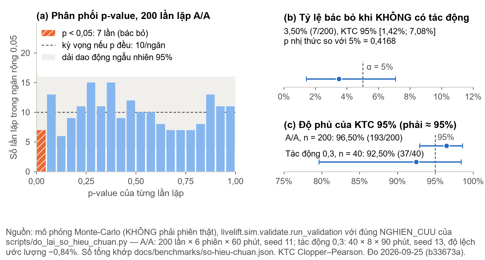
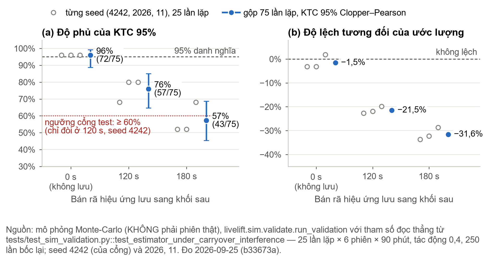
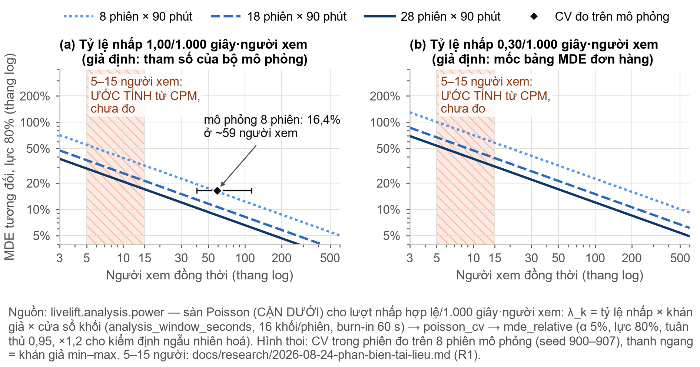
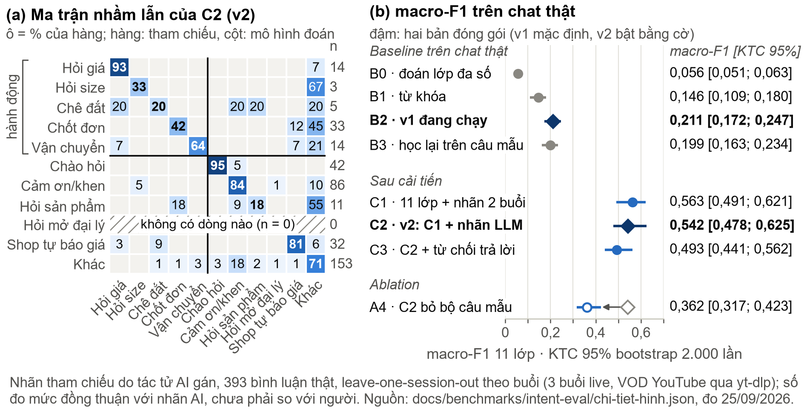
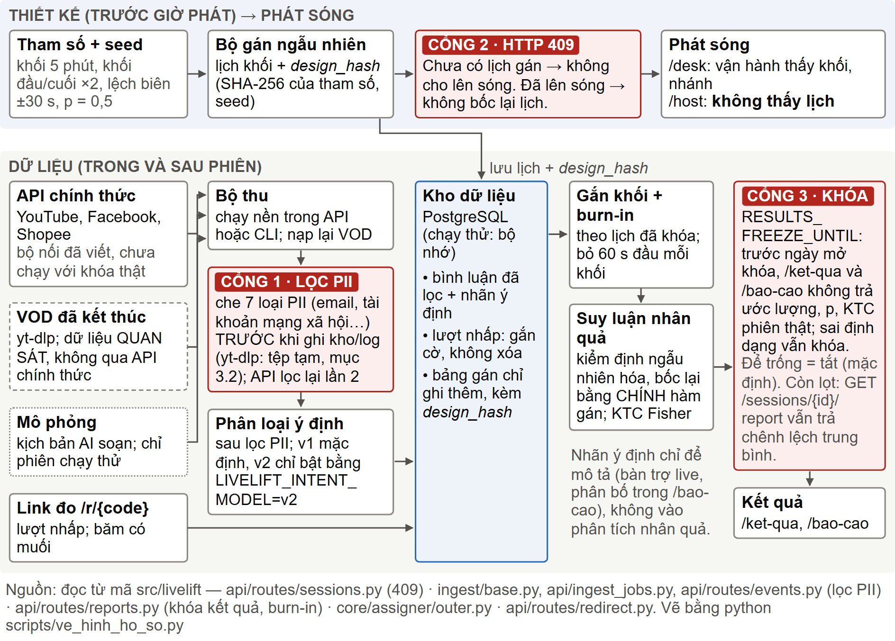
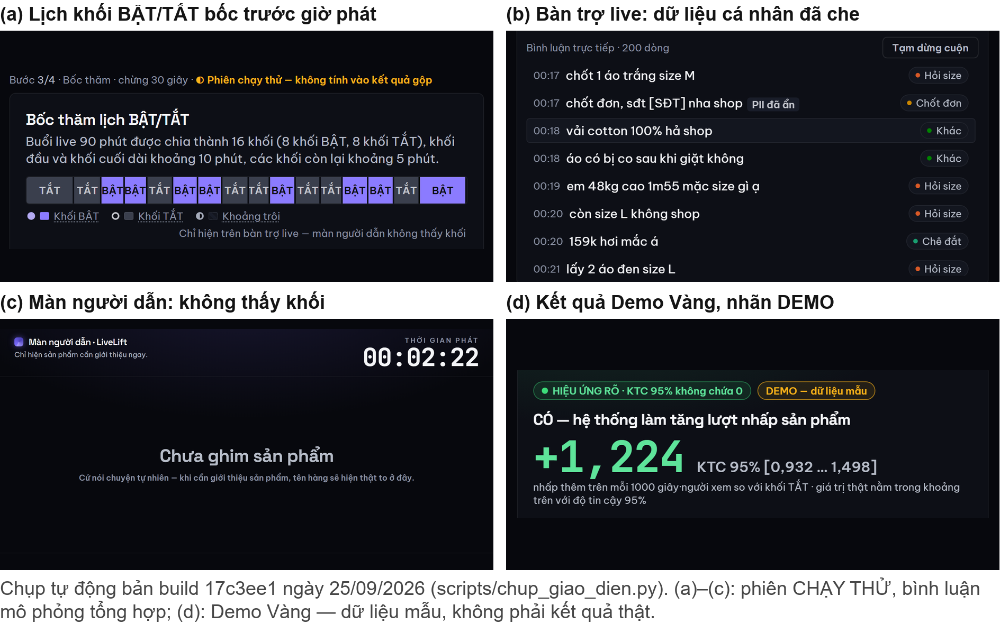

<!-- NGUỒN NỘI DUNG HỒ SƠ DỰ ÁN BẢNG C, Cuộc thi Sáng tạo trẻ Quốc gia về AI 2026 -->
<!--
DỰNG BẢN NỘP CHÍNH THỨC (cần .venv-docx có python-docx và Word để đếm trang):
  .venv-docx/Scripts/python docs/competition/sang-tao-tre-2026/hoan_tat_ho_so.py
  (dựng cả hồ sơ lẫn bản kê khai, quét chữ của PDF, rồi mới chép vào thư mục nộp)
Bản nháp: .venv-docx/Scripts/python docs/competition/sang-tao-tre-2026/dung_ho_so.py \
            --out-dir <thư mục> --cho-phep-o-trong
Giới hạn CỨNG 20 trang, Word đếm; trang cuối không được trống quá nửa. Mọi con số phải khớp
docs/competition/FACT-SHEET.md và nguồn ghi ngay cạnh số. Số test đồng bộ bằng
scripts/dong_bo_so_test.py --xem-truoc. Số NLP lấy từ docs/benchmarks/intent-eval/results.md
(sinh lại 25/09/2026, sau khi lọc lại PII).

VĂN PHONG (trưởng nhóm chốt 27/09/2026): câu ngắn, dễ hiểu với giám khảo; không dùng gạch
ngang dài hay ngắn và các ký hiệu mũi tên, chấm giữa, dấu nhân, dấu lớn hơn hoặc bằng trong
câu văn (tests/test_hoan_tat_ho_so.py kiểm); giải thích thuật ngữ bằng lời thường; KHÔNG nhắc
Google Drive ở đâu cả; tên sản phẩm luôn viết "LiveLift - Nền tảng thí nghiệm vận hành và hỗ
trợ ra quyết định cho livestream thương mại"; câu "Xuất phát từ những lý do trên, …" là đoạn
KẾT của mục 1, nguyên văn. Giữ nguyên mọi con số, nguồn, căn cứ pháp lý và giới hạn tự khai.

CÚ PHÁP MÀ BỘ DỰNG HIỂU:
  # 1. Tiêu đề                 mục cấp 1, phải đủ 1..13 đúng thứ tự MẪU 3
  # Tên không số               mục cấp 1 KHÔNG đánh số: được phép (Tóm tắt, Tài liệu tham khảo)
  ## 1.1 Tiêu đề / ### …       mục cấp 2 / cấp 3; không được trùng số mục
  một dòng văn                 một đoạn văn canh đều
  - nội dung / 1. nội dung     gạch đầu dòng / danh sách số (thụt treo)
  > dòng                       khung nền nhạt một ô (Tóm tắt dự án); "> - " là gạch đầu dòng trong khung
  : Bảng N. Chú thích          đặt NGAY TRÊN một bảng
  | ô | ô |                    bảng; hàng đầu là tiêu đề; |---:| canh phải
  {width=16cm}
  **đậm**, *nghiêng*, `mã`     trong câu, lồng được
  ⬜ hoặc [[TEN]]              chỗ chưa điền: còn thì bộ dựng KHÔNG ra bản nộp
Hình và Bảng đánh số liên tục 1..n theo thứ tự xuất hiện. "mục X.Y", "Hình N", "Bảng N"
phải trỏ tới thứ có thật (bộ dựng kiểm). Muốn nhắc mục của tài liệu KHÁC thì viết "phần".
Tài liệu tham khảo đánh [n] thủ công theo danh mục cuối tệp.
-->

# Tóm tắt dự án

> **LiveLift - Nền tảng thí nghiệm vận hành và hỗ trợ ra quyết định cho livestream thương mại** là phần mềm mã nguồn mở (AGPL-3.0) giúp người bán hàng qua livestream biết một quyết định trong phiên, như ghim sản phẩm hay nhắc mã giảm giá, có thật sự làm khách bấm vào sản phẩm nhiều hơn không. Phiên live được chia thành các khoảng thời gian ngắn gọi là khối. Trước giờ phát, hệ thống bốc thăm khối nào áp dụng quyết định và khóa lịch lại. Sau phiên, hệ thống so hai nhóm khối và báo chênh lệch kèm khoảng tin cậy. Kèm theo là bộ lọc dữ liệu cá nhân và bộ phân loại ý định mua cho bình luận tiếng Việt.
> - Trên mô phỏng đã biết đáp án, khi không có tác động, hệ thống chỉ báo nhầm 3,50% số lần (7/200), dưới mức cho phép 5%. Với tác động biết trước, ước lượng lệch −0,84% và khoảng tin cậy 95% chứa giá trị thật 37/40 lần, tức 92,50% (đo lại ngày 25/09/2026, Bảng 4).
> - Trên 393 bình luận thật, điểm macro-F1 của bộ phân loại ý định tăng từ 0,211 (bản v1, mặc định) lên 0,542 (bản v2, bật bằng biến môi trường) trên thang 11 lớp, và từ 0,370 lên 0,572 nếu chấm cùng thang 6 lớp cũ. Nhãn tham chiếu do tác tử AI gán, chưa có nhãn do người gán.
> - Hệ thống đã nạp 19.126 bình luận quan sát từ 16 buổi phát lại trên YouTube, tải bằng yt-dlp, không qua API chính thức và chưa có sự đồng ý của người bình luận. Nhóm đã dừng thu từ ngày 17/09/2026 (mục 3.3).
> - Bộ mã có **2.116** kiểm thử tự động. Lần chạy đầy đủ ngày 27/09/2026 cho 2.114 đạt, 2 bỏ qua có lý do. Sổ sự cố ghi **121** sự cố, mỗi sự cố có phân tích nguyên nhân gốc.
> **Chưa có:** phiên thí nghiệm ngẫu nhiên thật nào, khóa API nền tảng nào, hay nhà bán nào ngoài nhóm dùng thử.

**Viết tắt.** KTC: khoảng tin cậy. A/A: thí nghiệm có hai nhóm như nhau, để kiểm tra hệ thống có báo nhầm không. MDE: tác động nhỏ nhất phát hiện được. PII: dữ liệu cá nhân. NLP: xử lý ngôn ngữ tự nhiên. LLM: mô hình ngôn ngữ lớn. VOD: bản phát lại. Macro-F1: trung bình điểm F1 các lớp, từ 0 đến 1, càng cao càng tốt. LOSO: lần lượt giữ riêng từng buổi live để kiểm tra. Burn-in: phần đầu mỗi khối bị bỏ khi phân tích.

# 1. Bài toán hoặc vấn đề thực tiễn cần giải quyết

**Tên sản phẩm: LiveLift - Nền tảng thí nghiệm vận hành và hỗ trợ ra quyết định cho livestream thương mại.**

Ở Việt Nam, AccessTrade ước tính có khoảng 2,5 triệu phiên livestream bán hàng mỗi tháng với hơn 50.000 nhà bán [10] (số thứ cấp năm 2024, nhóm chưa truy được báo cáo gốc). Mỗi phiên có hàng chục quyết định: ghim sản phẩm nào, lúc nào, giữ bao lâu, khi nào nhắc mã giảm giá. Phần lớn các quyết định này dựa vào kinh nghiệm. Công cụ của nền tảng như TikTok LIVE Manager trả lời “phiên vừa rồi bán được bao nhiêu”. Theo rà soát công cụ và tài liệu của nhóm (tháng 9/2026), chưa có công cụ nào nhà bán tự dùng được để trả lời “**bao nhiêu trong số đó là do hành động của mình**”.

Ví dụ, ở phút 30 người trợ live ghim sản phẩm B, đến phút 35 lượt nhấp vào B tăng. Có thể vì vừa ghim B, vì nền tảng vừa đẩy thêm người vào phòng, hoặc vì người dẫn vừa kể một câu chuyện hay. Số liệu sau phiên không tách được ba khả năng này. Muốn tách phải so ngay trong buổi live đó, giữa lúc có ghim và lúc không ghim.

## 1.1 Vì sao A/B test thông thường không dùng được

A/B test chia người dùng thành hai nhóm. Trong livestream, cả phòng nhìn **cùng một màn hình** nên không chia được. Thứ chia được là **thời gian**, gọi là thiết kế luân phiên theo thời gian (**switchback**, Hình 1). Phiên 90 phút chia thành 16 khối (khối đầu và cuối 10 phút, 14 khối giữa 5 phút). Mỗi khối được bốc thăm bật hoặc tắt can thiệp, lịch khóa trước giờ phát.

**Mô hình hóa.** Gọi *Y*(1), *Y*(0) là số lượt nhấp hợp lệ trên 1.000 giây xem (tổng số giây mọi người xem có mặt trong phòng) của một khối, sau burn-in, khi khối bật và khi khối tắt. Đại lượng cần ước lượng là τ, tức chênh lệch trung bình giữa *Y*(1) và *Y*(0) trên các khối, với bật hay tắt tính theo lịch gán. Mỗi khối chỉ quan sát được một trong hai giá trị, nên τ được ước lượng bằng hiệu trung bình của nhóm khối bật và nhóm khối tắt. Giá trị p và KTC lấy từ kiểm định ngẫu nhiên hóa (mục 5.1). Giả định then chốt là tác động không kéo sang khối sau quá thời gian burn-in (mục 7.1).

{width=15cm}

## 1.2 Vì sao cấp thiết và ai đang bị bỏ lại

Thí nghiệm ngẫu nhiên trong livestream cho thấy quyết định trong phiên tác động thật tới doanh số. Cho người dẫn xem số bán theo thời gian thực làm doanh số hàng đặt trước tăng khoảng 40% [7]. Trợ lý AI cho người mua làm doanh số tăng 3,00% và trả hàng giảm 12,55% [6]. Nhưng các thí nghiệm đó do **nền tảng** chạy, và công cụ thí nghiệm chuyên nghiệp (Statsig, Eppo, GrowthBook) cũng giả định người dùng sở hữu nơi thí nghiệm diễn ra. Rào cản chính vì vậy là **quyền sở hữu nền tảng**, không phải giá tiền. Nhà bán chỉ kiểm soát được hành động của chính mình theo thời gian. LiveLift lấy đúng điều đó làm đơn vị bốc thăm và mở mã nguồn cho mọi người.

**Nghị quyết 57-NQ/TW ngày 22/12/2024 của Bộ Chính trị** coi khoa học, công nghệ, đổi mới sáng tạo và chuyển đổi số là “đột phá quan trọng hàng đầu” [15]. Không đo được tác động thì không biết thay đổi nào đáng giữ.

## 1.3 Gốc học thuật và khoảng trống

Xie, Sharma và Mehra [5] chỉ ra một **sự đánh đổi**: trình bày một sản phẩm lâu hơn thì doanh thu sản phẩm đó cao hơn, nhưng thời lượng trình bày trung bình tăng thì doanh thu cả phiên giảm. Không có đáp án chung nên mỗi phòng live phải tự đo, trong khi nghiên cứu đó chỉ dùng dữ liệu có sẵn. Trong phạm vi rà soát tài liệu và công cụ của nhóm (tháng 9/2026), **chưa tìm thấy công bố hay công cụ nào cho người bán tự chạy switchback trong phiên livestream của mình**.

Xuất phát từ những lý do trên, nhóm nghiên cứu quyết định lựa chọn và tiến hành nghiên cứu, phát triển giải pháp “LiveLift - Nền tảng thí nghiệm vận hành và hỗ trợ ra quyết định cho livestream thương mại”, hướng tới việc hỗ trợ đội ngũ vận hành đánh giá có hệ thống tác động của các quyết định trong phiên live và từng bước chuyển từ ra quyết định chủ yếu dựa trên kinh nghiệm sang ra quyết định dựa trên bằng chứng.

# 2. Mục tiêu, phạm vi và đối tượng ứng dụng của sản phẩm

## 2.1 Mục tiêu

**Mục tiêu tổng quát:** giúp nhà bán không sở hữu nền tảng phát sóng biến mỗi quyết định trong phiên thành một thí nghiệm có xác suất gán ghi sẵn trước giờ phát, kết quả kèm KTC. Bộ ước lượng phải được kiểm chứng trên mô phỏng có đáp án trước khi dùng cho dữ liệu thật.

: Bảng 1. Mục tiêu cụ thể và trạng thái tại ngày 27/09/2026

| Mục tiêu | Chỉ số nghiệm thu | Trạng thái |
|---|---|---|
| MT1. Bộ ước lượng đạt mức danh nghĩa | A/A 200 lần: bác bỏ 3,50% (7/200), p = 0,4168; thu hồi 40 lần: KTC phủ 92,50% | **Đạt nếu tác động không kéo sang khối sau**; nếu có, độ phủ giảm (Hình 3) |
| MT2. Đo MDE bằng mô phỏng | 16,4% ở khoảng 59 người xem, 8 phiên, tính từ hệ số biến thiên mô phỏng (Hình 4) | **Một phần**: lần quét lực trực tiếp ngày 30/08 không sinh lại được |
| MT3. Ít nhất 18 phiên thí nghiệm thật có gán ngẫu nhiên | **0 phiên** | **Chưa đạt**, khoảng cách lớn nhất (mục 8.5, 12) |
| MT4. Hạ tầng nạp đúng, tái lập được | VOD qua yt-dlp: 19.126 bình luận; chạy lại 1 buổi sau 2 ngày trùng từng con số; API chính thức **chưa chạy với khóa thật** | **Một phần** |
| MT5. Quyền riêng tư, liêm chính thực thi bằng mã | Cổng kiểm tra bộ lọc PII; phiên chưa có lịch gán bị chặn phát sóng (HTTP 409) | **Một phần** (mục 3.2) |
| MT6. Kiểm chứng mô hình AI trên chat thật | 0,870 trên câu mẫu AI soạn, 0,211 trên chat thật, 0,542 sau cải tiến | **Một phần**: nhãn do AI gán |

## 2.2 Phạm vi

**Trong phạm vi:** phiên livestream bán hàng tiếng Việt mà nhà bán là chủ kênh hoặc được ủy quyền, đọc qua API chính thức (YouTube, Facebook, Shopee). Can thiệp thuộc quyền nhà bán: ghim sản phẩm, nhắc mã giảm giá đã công bố cho mọi người xem, đổi kịch bản lời nói. Biến kết quả chính là lượt nhấp hợp lệ qua link đo, biến phụ là đơn hàng nhập từ tệp CSV. **Cố ý để ngoài phạm vi:** đọc bình luận bằng cách giả làm người xem (quyết định ngày 17/09/2026), bình luận TikTok LIVE (không có API chính thức), can thiệp thuật toán phân phối, dự báo doanh thu và phiên đấu giá.

## 2.3 Đối tượng ứng dụng

Phù hợp nhất là **nhà bán tự phát sóng trên Facebook hoặc YouTube, có lượng người xem ổn định**, chốt đơn qua website riêng hoặc tin nhắn. Phiên của họ dài, đều nên đủ khối, link đo trỏ tới trang sản phẩm hoặc `m.me`, `zalo.me` nên ghi được cú nhấp thật. **KOL có người trợ live** cũng phù hợp, vì cách làm cần hai người: một người nắm lịch, người dẫn không biết lịch (mục 5.3). Nhà bán chốt đơn bằng giỏ hàng trong ứng dụng (TikTok Shop, Shopee Live) **chưa dùng được biến kết quả chính**, nên 2,5 triệu phiên ở mục 1 là quy mô ngành, không phải quy mô LiveLift phục vụ được hôm nay.

**Lực thống kê (khả năng phát hiện tác động thật) quyết định ai dùng được.** Với lượt nhấp, MDE tỷ lệ nghịch với căn bậc hai của số người xem nhân số phiên (Hình 4). Theo ước tính của nhóm từ giá quảng cáo (CPM), **chưa đo**, 300.000 đồng quảng cáo chỉ kéo được 5 đến 15 người xem đồng thời. Ở mức đó, với 18 phiên, MDE của lượt nhấp ít nhất khoảng 21% đến 67% (cận dưới Poisson, lực 80%, Hình 4), còn MDE của đơn hàng ở 15 người xem là 179% đến 327%. Vì vậy LiveLift nhắm tới nhà bán có vài chục người xem trở lên, hoặc gộp nhiều phiên cho một câu hỏi. Đây là giả thuyết thiết kế: nhóm **chưa phỏng vấn hay thử với nhà bán nào ngoài đội**.

# 3. Dữ liệu sử dụng, nguồn dữ liệu và tính hợp lệ của dữ liệu

## 3.1 Các loại dữ liệu

: Bảng 2. Các loại dữ liệu, nguồn và cơ sở sử dụng

| Loại dữ liệu | Nguồn, cách thu | Quy mô | Cơ sở sử dụng, giới hạn |
|---|---|---|---|
| Bình luận 16 buổi live đã kết thúc (YouTube, kênh bên thứ ba) | **yt-dlp, không qua API chính thức**, ngày 10/09/2026 | 19.126 bình luận, 7 ngành hàng; 3 buổi chiếm 84,5% | Dữ liệu **quan sát**, chỉ để đánh giá; **không có sự đồng ý** của người bình luận |
| Câu mẫu ý định | Claude (Anthropic) soạn ngày 01/09/2026 theo bộ nhãn của nhóm | 320 câu | Tổng hợp, không chứa dữ liệu cá nhân |
| Nhãn ý định trên bình luận thật | **Tác tử AI (Claude) gán**; nhóm quyết định bộ nhãn | 393 dòng kiểm tra (3 buổi), 1.800 dòng huấn luyện | Chưa có nhãn người (mục 6) |
| Lượt nhấp, đơn hàng | Link đo `/r/{code}`; đơn do nhà bán tự xuất CSV | Chưa có phiên thật | Nhấp: chỉ lưu mã băm có muối theo phiên; đơn: không đọc người mua |
| Dữ liệu tổng hợp | Bộ mô phỏng; 200 bình luận do tác tử AI soạn ngày 17/09 | 38.848 khối (Bảng 4, Hình 2 đến 4) | Chỉ trên phiên chạy thử, phiên mẫu |
| KuaiLive [8] | 21 ngày dữ liệu Kuaishou | 1,16 triệu phòng live | Phi thương mại; chỉ hiệu chỉnh hình dạng mô phỏng |

## 3.2 Bảo vệ dữ liệu cá nhân

Bình luận công khai vẫn chứa dữ liệu cá nhân: người xem hay ghi số điện thoại, địa chỉ để đặt hàng. Để giảm rủi ro theo Luật 91/2025/QH15 [11] và Nghị định 356/2025/NĐ-CP [12], sản phẩm có ba lớp bảo vệ trong mã. Chúng không thay cho căn cứ pháp lý để xử lý (mục 3.3).

1. **Lọc định danh trước khi truyền hoặc lưu.** Bộ thu lọc trước khi gửi đi hay ghi nhật ký, API lọc lần hai trước khi ghi kho. Bộ lọc nhận diện số điện thoại (kể cả số viết bằng chữ, emoji chữ số), email, mã đơn, địa chỉ, tên người, số tài khoản, tài khoản mạng xã hội. **Ngoại lệ:** khi tải bằng yt-dlp, tệp chat thô nằm trong thư mục tạm, đọc xong thì bị xóa.
2. **Cổng kiểm thử.** Bộ lọc phải bắt được ít nhất 95% ở sáu loại và 70% với tên người, trên 95 câu dữ liệu giả do Claude soạn ngày 24/08/2026 (email và số tài khoản mới có 4 mẫu mỗi loại). CI trên GitHub chưa chạy được nên cổng này đang chạy tay.
3. **Không lưu định danh người bình luận, kể cả dạng băm.** Chống trùng bằng mã bình luận của nền tảng. Lượt nhấp chỉ lưu mã băm dấu vân tay thiết bị trộn mã phiên và một chuỗi ngẫu nhiên, nên không nối được một người qua hai phiên.

**Lỗ hổng tự phát hiện.** Bộ lọc từng bỏ sót tên tài khoản YouTube có dấu (thấy ngày 14/09) và tên viết dính liền `chữ@tên`, `@@tên` (vá ngày 25/09, commit `b331076`). Dữ liệu gán nhãn lưu cục bộ đã được lọc lại (`scripts/gan_mu/loc_lai_pii.py`: 57 lượt tên tài khoản, rồi 16 dòng của 8 tên), quét lại còn 0, và mọi số NLP ở mục 8, 9 đã đo lại. Từ vựng tệp mô hình v2 ngày 14/09 có một từ sinh từ tên tài khoản. Tệp đã đóng gói lại (bản cũ còn trong lịch sử git của kho công khai), và bài kiểm thử `tests/test_artifact_khong_pii.py` nay kiểm cả từ vựng.

## 3.3 Tính hợp lệ của nguồn dữ liệu

**Nguồn không chính thức.** YouTube Data API v3 chỉ trả bình luận khi buổi phát đang diễn ra, nên 19.126 bình luận ở Bảng 2 được tải bằng yt-dlp. Đây là cách truy cập tự động mà điều khoản dịch vụ và `robots.txt` của YouTube không cho phép khi chưa được đồng ý. Dữ liệu này không có can thiệp hay bốc thăm nên không sinh con số nhân quả nào.

**Sự đồng ý và vai trò pháp lý.** Điều 5 khoản 8 Thể lệ không cho đội thi thu thập, xử lý dữ liệu cá nhân khi chưa có sự đồng ý hợp lệ [16]. Luật 91/2025/QH15 đòi sự đồng ý trước khi thu thập (Điều 11 khoản 1), không coi im lặng là đồng ý (Điều 9 khoản 4 điểm d), và Điều 19 không có trường hợp miễn đồng ý nào dành riêng cho nghiên cứu. Người bình luận trong 16 buổi không được hỏi ý kiến, nên nhóm **không tự nhận có căn cứ pháp lý để xử lý** tập này. Với tập đó, nhóm là bên kiểm soát và xử lý dữ liệu cá nhân (Điều 2 khoản 9) và chỉ giảm thiểu rủi ro: lọc định danh trước khi lưu, không lưu tên hay mã người bình luận, không công bố nguyên văn, không đưa lên kho mã hay hồ sơ nộp (trừ vài dòng chat đã thay danh tính và lọc, dùng làm dữ liệu kiểm thử, và vài câu ví dụ đã lọc trong `nlp/labels.py`). Khi gán nhãn và rà dữ liệu (từ 09 đến 15/09), bình luận được đưa vào Claude (Anthropic, ngoài Việt Nam) lúc bộ lọc chưa bắt được tên tài khoản có dấu (mục 3.2). Đó là xử lý dữ liệu cá nhân thu tại Việt Nam trên nền tảng ở nước ngoài (Điều 20 khoản 1 điểm c), và nhóm chưa lập hồ sơ đánh giá tác động theo khoản 2. Khi LiveLift chạy cho một nhà bán, nhà bán là **bên kiểm soát** (Điều 2 khoản 7), đơn vị vận hành là **bên xử lý** theo hợp đồng (khoản 8). Mẫu thỏa thuận xử lý dữ liệu (Điều 37 khoản 2 điểm a) và căn cứ xử lý lượt nhấp của người bấm link đo **chưa có**, phải có trước phiên thật đầu tiên (Bảng 10).

**Lưu và xóa tập 16 buổi.** Bản đầy đủ 19.126 bình luận không được lưu thành tệp sau lần chạy ngày 10/09. Chỉ còn giữ cục bộ, đã lọc định danh, 6.586 bình luận của 1 buổi và 393 bình luận của 3 buổi dùng cho mục 8, 9. Kiểm kê ngày 25/09 còn thấy định danh ở ba nơi ngoài kho mã: bản sao lưu dữ liệu gán nhãn trước khi lọc lại (33 tên tài khoản), 16 dòng có tên dính liền (đã lọc, mục 3.2), và bản lưu nhật ký gốc của công cụ AI (có trích bình luận còn tên tài khoản). Prompt Log đã xuất lại; quét bộ lọc và đối chiếu băm độc lập đều ra 0. Chậm nhất ngày 29/09/2026, trước khi nộp, nhóm xóa an toàn bản sao lưu (ghi đè rồi xóa) và che tên tài khoản người bình luận trong bản lưu nhật ký gốc. Nhóm không coi phần còn giữ là đã khử nhận dạng (Luật 91/2025/QH15 Điều 2 khoản 11), vì câu nguyên văn vẫn tra ngược được người viết qua bản phát lại công khai và bộ lọc bằng biểu thức chính quy không bảo đảm bắt hết. Phần này được bảo vệ như dữ liệu cá nhân, chỉ dùng để kiểm lại mục 8, 9, không cung cấp cho ai, và bị xóa khi có tập thay thế qua API chính thức, chậm nhất ngày 22/11/2026, hoặc ngay khi Ban Tổ chức hay cơ quan có thẩm quyền yêu cầu. Bình luận và lượt nhấp trong kho dữ liệu chưa có thời hạn xóa tự động. Bản sao lưu cơ sở dữ liệu tự xóa sau 14 ngày.

**Đường chuyển sang API chính thức.** Từ ngày 17/09/2026, nhóm dừng thu mới từ kênh không thuộc nhóm hay đối tác. Hai đường tải bằng yt-dlp còn trong mã (kể cả tùy chọn đọc cookie trình duyệt để vượt kiểm tra chống robot) và bộ thu TikTok dùng thư viện dịch ngược (`collectors/tiktok_public`, tách khỏi lõi) chỉ giữ tạm tới khi khóa chính thức chạy được. Phiên thí nghiệm và tập đánh giá mới chỉ lấy qua API chính thức, trên kênh của nhóm hoặc nhà bán đối tác có văn bản đồng ý.

# 4. Quy trình tiền xử lý, làm sạch, chuẩn hóa hoặc tổ chức dữ liệu

1. **Chọn dữ liệu.** 17 video được chọn theo quy trình ghi sẵn trong `docs/benchmarks/live-fire-da-nguon.md`, nạp được 16 video. Buổi dưới 30 bình luận không dùng cho kết luận nào. Tập kiểm tra NLP rút từ 3 buổi (có seed): 193 dòng theo lớp mô hình cũ dự đoán (để đo precision, tức tỷ lệ báo đúng) và 200 dòng ngẫu nhiên (để ước tỷ lệ thật).
2. **Lọc định danh** trước mọi bước khác, kể cả ghi nhật ký (mục 3.2). Đặt sau bước lưu thì dữ liệu thô vẫn nằm trên đĩa.
3. **Loại bản trùng:** bình luận theo khóa `(platform, ext_id)`, đơn hàng theo mã đơn. Lô huấn luyện loại thêm 1.246 dòng trùng. Nhờ vậy, chạy lại một buổi sau hai ngày vẫn ra đúng từng con số.
4. **Gắn khối** theo lịch đã khóa (Hình 1): bình luận theo giờ nền tảng, lượt nhấp theo giờ máy chủ, đơn theo thời điểm đặt. Đơn ngoài khung giờ phiên bị từ chối và đếm riêng. Phiên phân tích VOD không có lịch gán nên không vào phân tích nhân quả.
5. **Chuẩn hóa cho mô hình**, chỉ ở nhánh NLP: chuẩn hóa Unicode NFKC, rút gọn chữ kéo dài, tách emoji, viết đầy đủ teencode, không tự thêm dấu. Đo ngày 25/09, bỏ bước này không làm giảm macro-F1 (mục 9.4).
6. **Tổ chức để phân tích:** đơn vị là khối, cụm là phiên. Bảng `assignment_event` (lệnh gán) và `exposure_event` (can thiệp thực tế) đối chiếu “định làm gì” với “đã làm gì”, nền cho ước lượng tác động trên nhóm tuân thủ lịch (LATE).

**Dữ liệu sai lệch** được gắn cờ, không xóa. Lượt nhấp vi phạm một trong 5 quy tắc dựa trên hướng dẫn đo lượt nhấp của IAB và MRC [9] (robot, tải trước, không phải yêu cầu GET, nhấp lại trong 10 giây, quá 5 lượt mỗi thiết bị mỗi khối) vẫn nằm trong chuỗi thô và được báo song song. Bình luận mô phỏng bị chặn khỏi lô gán nhãn.

# 5. Thuật toán, mô hình, phương pháp hoặc công cụ trí tuệ nhân tạo được sử dụng

Phần suy luận nhân quả dùng thống kê, không dùng học máy. Phần AI nằm ở bộ phân loại ý định (học có giám sát), khâu gán nhãn bằng mô hình ngôn ngữ lớn, và công cụ lập trình có AI hỗ trợ (mục 5.4).

## 5.1 Lõi A: thiết kế thí nghiệm và suy luận nhân quả

: Bảng 3. Thành phần của lõi thiết kế và suy luận

| Thành phần | Phương pháp | Trạng thái trong mã |
|---|---|---|
| Thiết kế | Switchback, khối 5 phút, khối đầu và cuối dài gấp đôi (thiết kế tối ưu theo [1]) | Đang chạy |
| Gán ngẫu nhiên | Mỗi khối bật với xác suất 0,5; bốc lại tới khi mỗi nhánh có ít nhất 2 khối trong mỗi phần ba phiên; biên khối xê dịch tối đa 30 giây | Đang chạy (bảo đảm với phiên từ 90 phút) |
| Tác động kéo sang khối sau | Bỏ 60 giây đầu mỗi khối khi phân tích [2]; độ nhạy 0, 2, 3 phút | Đang chạy |
| Kiểm định chính | Kiểm định ngẫu nhiên hóa với thống kê chuẩn hóa, KTC Fisher bằng cách đảo ngược kiểm định [3] | Nguồn duy nhất của ước lượng, p và KTC trong báo cáo |
| Chọn sản phẩm trong khối BẬT | Mô hình Gamma-Poisson cho tỷ lệ nhấp (tối đa 3 sản phẩm); sản phẩm có khoảng chồng lấn với sản phẩm dẫn đầu thì bốc đều, ghi xác suất 1/k | Chạy ở chế độ Tự ghim; xác suất đã lưu, chưa vào báo cáo |

Kiểm định ngẫu nhiên hóa chỉ dựa vào cách gán đã biết, nên với giả thuyết “không khối nào bị tác động” nó chính xác cả khi mẫu nhỏ, không cần giả định phân phối [3]. KTC Fisher cần thêm giả định tác động cộng không đổi ở mọi khối, nên độ phủ phải kiểm bằng mô phỏng (mục 7.1). Phân phối tham chiếu dựng bằng cách bốc lại qua đúng hàm gán đang chạy, kể cả điều kiện bốc lại, với tham số đã lưu của phiên (`design_hash`, mục 5.3). Thẻ ghim có thể giữ chân hoặc đẩy người xem đi, nên báo cáo kiểm định cả mẫu số (giây xem), lệch thì gắn cờ (`PREREGISTRATION.md`, phần 5e).

## 5.2 Lõi B: xử lý ngôn ngữ tự nhiên tiếng Việt

**Lọc PII** dùng quy tắc, từ điển địa danh, chuẩn hóa NFKC và ký tự keycap, chạy ngay khi nạp (mục 3.2). **Phân loại ý định** dùng TF-IDF theo n-gram ký tự và từ, cộng hồi quy logistic. Bản **v1** (mặc định, 6 lớp, học trên 320 câu mẫu do AI soạn) đạt macro-F1 0,211 trên chat thật. Bản **v2** (11 lớp, thêm 9 đặc trưng hình thức như tỷ lệ chữ hoa, ký hiệu giá) đạt 0,542 khi chưa áp ngưỡng (mục 9.3), chỉ bật khi đặt `LIVELIFT_INTENT_MODEL=v2`. Khi xác suất cao nhất dưới 0,45, cả hai trả nhãn “khác”. Nhãn ý định **không đi vào phân tích nhân quả**, chỉ hiện trên bàn trợ live để người trợ live thấy khách đang hỏi gì.

## 5.3 Lõi C: ba cơ chế liêm chính thực thi bằng mã

1. **Cam kết thiết kế trước giờ phát.** Lịch gán được tính hoàn toàn từ tham số thiết kế và seed. Hệ thống băm cặp này thành `design_hash` (SHA-256), lưu cùng lịch trước khi lên sóng, nên ai có tệp thiết kế cũng kiểm được lịch không bị sửa. Phiên chưa có lịch thì API từ chối phát sóng (HTTP 409). Kế hoạch phân tích `PREREGISTRATION.md` **chưa khóa**. Nhóm sẽ khóa bằng một commit trước phiên thí nghiệm khẳng định đầu tiên.
2. **Khóa kết quả theo thời gian.** Khi đặt `RESULTS_FREEZE_UNTIL`, trước mốc đó bản tổng hợp và trang kết quả không trả ước lượng, p, KTC của phiên thật, kể cả cho nhóm. Mặc định biến này để trống, và đường `/sessions/{id}/report` vẫn trả chênh lệch trung bình của phiên thật trong lúc khóa. Đây là lỗi phải đóng trước phiên thật đầu tiên.
3. **Làm mù người dẫn, mới được một phần.** Màn `/host` chỉ nhận 4 trường: thời gian đã phát, sản phẩm đang ghim, giá, tồn kho. Không có lịch, khối hay nhánh (mô hình dữ liệu cấm trường thừa, kiểm thử `test_case_8`). Nhưng người dẫn vẫn thấy sản phẩm đang ghim, mà ở chế độ Tự ghim lệnh ghim chỉ đến trong khối BẬT, nên có thể đoán nhánh. Vì thế phép so là giữa chiến lược ghim của LiveLift và cách làm thường lệ của đội, tính cả phản ứng của người dẫn (`PREREGISTRATION.md`, phần 1).

## 5.4 Công cụ AI dùng trong quá trình phát triển

Nhóm dùng Claude Code (Anthropic) suốt quá trình phát triển. **Gần như toàn bộ mã, kiểm thử, sổ sự cố và bản nháp tài liệu trong kho do Claude viết**. Từ ngày 14/09/2026, thành viên Tiến dùng thêm ChatGPT, OpenAI Codex, ChatGPT Deep Research, Google Antigravity, ChatGPT Image Generation (tự khai; ảnh chỉ để thử bố cục) và GitHub Copilot coding agent (commit `ec56971` trên kho fork). Đội đặt bài toán, ra yêu cầu, chọn phương án, duyệt kết quả, vận hành và chịu trách nhiệm. Phân định chi tiết ở **Bản kê khai**.

# 6. Quy trình huấn luyện, tinh chỉnh, tích hợp hoặc khai thác mô hình (nếu có)

**Chống rò rỉ dữ liệu.** Tập kiểm tra được tách theo buổi live (LOSO). Vì câu chào hay bảng giá có thể lặp ở nhiều buổi, khung đánh giá còn loại mọi dòng huấn luyện trùng khít văn bản với tập kiểm tra (62 dòng).

1. **Dựng khung đánh giá trước khi sửa mô hình:** 4 mô hình cơ sở (Bảng 7), LOSO, KTC bootstrap 2.000 lần, macro-F1 từng buổi.
2. **Xây lại bộ nhãn từ 6 lên 11 lớp:** trên 200 bình luận rút ngẫu nhiên, 40% là lời xã giao, loại không có chỗ trong bộ nhãn cũ (`nlp/labels.py`).
3. **Gán nhãn, cả ba nguồn đều do AI tạo:** 393 dòng kiểm tra do một tác tử Claude gán ngày 09/09 trên bảng đã xáo trộn, 320 câu mẫu do Claude soạn ngày 01/09, và 1.800 nhãn huấn luyện do Claude gán. Nhóm quyết định bộ nhãn và cách rút mẫu (có seed), rà soát quy trình nhưng không duyệt từng nhãn. Vì vậy mọi con số ở mục 8, 9 đo **mức đồng thuận với nhãn tham chiếu do AI gán**, chưa phải độ chính xác so với con người. Việc hai thành viên gán lại độc lập rồi đo độ đồng thuận (hệ số κ) **chưa làm** (mục 12).
4. **Huấn luyện:** TF-IDF n-gram cộng hồi quy logistic, cân bằng lớp, seed 2026. Số công bố đo bằng LOSO. Tệp mô hình v2 (cấu hình chốt ngày 14/09) học trên toàn bộ 2.513 dòng, kể cả 393 dòng kiểm tra, và được đóng gói lại ngày 25/09 trên dữ liệu đã lọc lại (mục 3.2).

**Tích hợp vào sản phẩm.** Bộ phân loại chạy ngay khi nạp dữ liệu, sau bước lọc PII. Mặc định là **v1**, còn **v2** bật bằng biến môi trường (mục 5.2). Khi nạp, mô hình phải trả lời đúng một câu dự đoán thử. Nếu lỗi (tệp hỏng, lệch phiên bản scikit-learn), hệ thống chuyển hẳn sang bộ từ khóa và `/health` báo `keyword_fallback` kèm lý do. Dự án ghim đúng scikit-learn 1.9.0 của tệp mô hình. Với ràng buộc cũ (dưới 1.8), cả 393/393 bình luận từng âm thầm rơi về bộ từ khóa.

**Tái lập.** Lệnh `python -m livelift.nlp.eval_intent --ablation --coverage` sinh các bảng ở mục 9.3, 9.4. Nhãn tham chiếu và dự đoán từng dòng (không kèm văn bản) nằm trong `docs/benchmarks/intent-eval/results.json`, đủ để tính lại Bảng 7 và 8. Văn bản bình luận không nằm trong kho mã vì người bình luận chưa đồng ý (mục 3.3).

# 7. Chỉ số, phương pháp hoặc tiêu chí đánh giá kết quả

**Chỉ số của sản phẩm.** Biến kết quả chính của một phiên thí nghiệm là số lượt nhấp hợp lệ trên 1.000 giây xem của từng khối, sau burn-in (`PREREGISTRATION.md`, phần 4.1). Kết luận rơi vào đúng một trong bốn trạng thái (`analysis/narrate.py`): **dương** (KTC 95% nằm hẳn trên 0), **âm** (nằm hẳn dưới 0), **chưa phát hiện tác động** (KTC chứa 0), **chưa đủ điều kiện** (thiếu khối hoặc đang khóa). Hệ thống được đánh giá ở ba tầng độc lập.

## 7.1 Tầng 1: bộ ước lượng có đúng không

: Bảng 4. Kiểm chứng bộ ước lượng trên mô phỏng có đáp án

| Chỉ số | Tiêu chí đạt (cổng kiểm thử) | Kết quả | Nguồn |
|---|---|---|---|
| Tỷ lệ bác bỏ A/A, 200 lần lặp | Nhị thức hai phía quanh 5%, p từ 0,01 trở lên | 3,50% (7/200), KTC [1,4%; 7,1%], p = 0,4168 | `so-hieu-chuan.json`, đo lại 25/09, khớp |
| Độ phủ KTC 95% (A/A) | Mặt kia của dòng trên (193 là 200 trừ 7), không độc lập | 96,50% (193/200) | như trên |
| Thu hồi tác động biết trước, 40 lần | Lệch dưới 10% tác động; độ phủ qua kiểm định nhị thức | Lệch −0,84%; phủ 92,50% (37/40), KTC [79,6%; 98,4%] | như trên |

Bảng 4 sinh lại bằng `scripts/do_lai_so_hieu_chuan.py --kiem` (báo lỗi khi số đo lại khác số đã ghi). Mỗi lần lặp A/A chạy 6 phiên 60 phút, thu hồi chạy 8 phiên 90 phút. Số lần lặp còn ít nên KTC của chính các tỷ lệ này rộng (Hình 2).

{width=15cm}

Hình 3 là kết quả bất lợi. Khi tác động kéo sang khối sau, với thời gian bán rã (thời gian tác động giảm một nửa) là 0, 120 và 180 giây, độ phủ KTC còn 96%, 76% và 57% (mỗi mức 75 lần lặp), ước lượng bị kéo về 0 khoảng 21% đến 32%. Nghĩa là với kiểu kéo sang cùng chiều đã mô phỏng, hệ thống đánh giá thấp chứ không phóng đại. Kiểu “khách chỉ mua sớm hơn chứ không mua thêm” chưa được mô phỏng và có thể làm ước lượng phóng đại. Ở mức 120 giây, cổng kiểm thử chỉ đòi ước lượng không đổi dấu và độ phủ từ 60% trở lên. Đây là điều kiện sử dụng, và là lý do độ dài khối chỉ chốt sau khi đo thời gian tắt dần trên phiên thăm dò.

{width=15cm}

## 7.2 Tầng 2: mô hình AI

- Macro-F1, F1 từng lớp, ma trận nhầm lẫn, KTC bootstrap theo dòng 2.000 lần. Có số từng buổi và số trên 200 dòng rút ngẫu nhiên, vì bất định thật nằm ở cấp buổi.
- **Precision và recall của nhãn hành động** (hỏi giá, hỏi size, chê đắt, chốt đơn, vận chuyển), KTC Wilson: báo “có khách muốn mua” thì đúng bao nhiêu, và bắt được bao nhiêu khách thật sự muốn mua.
- **Tiêu chí đạt:** vượt cả bốn mô hình cơ sở, KTC không chồng lấn với bản đang chạy, vượt ở từng buổi, số trên câu mẫu luôn đi cùng số trên chat thật.

## 7.3 Tầng 3: hệ thống có chạy được không

: Bảng 5. Chỉ số vận hành

| Chỉ số | Kết quả | Nguồn |
|---|---|---|
| Kiểm thử tự động | 2.116 bài, gồm 2.089 nhanh, 17 bài chậm và 10 trên trình duyệt. Chạy ngày 27/09/2026: 2.114 đạt, 2 bỏ qua, 0 lỗi | `dong_bo_so_test.py` |
| Sự cố có phân tích nguyên nhân gốc | 121 | `docs/incident-log.md` |
| Tốc độ nạp | 835 đến 923 bình luận mỗi giây (một tiến trình, kho trong bộ nhớ, không tính thời gian tải về) | Chạy toàn tuyến ngày 10/09 (mục 8.1) |

# 8. Kết quả thử nghiệm, phân tích ưu điểm, hạn chế và khả năng mở rộng

Mọi kết quả ở đây là **quan sát hoặc mô phỏng**. Chưa có phiên thí nghiệm ngẫu nhiên thật nào (MT3).

## 8.1 Chạy toàn tuyến trên dữ liệu thật

Ngày 10/09/2026, nhóm chạy toàn bộ đường ống trên 19.126 bình luận của 16 buổi phát lại (tải bằng yt-dlp, mục 3.3). Buổi lớn nhất dài 117 phút, 6.586 bình luận, tải 69 giây, xử lý 8 giây. Nạp, lọc PII, loại trùng, cô lập phiên và chạy lại ra đúng số đều đạt.

Từ đợt hoàn thiện ngày 17 và 18/09, một phiên chạy trọn không cần thao tác kỹ thuật: bộ thu chạy nền bật bằng một nút, nguồn mô phỏng để tập dượt (bị từ chối trên phiên thật), đơn nhập từ CSV. Bộ nối Shopee Live, TikTok Shop và công cụ kiểm tra khóa YouTube có kiểm thử nhưng **chưa chạy với khóa thật**. Thử ngày 25/09 trên bản build: phiên chạy thử nhận đủ 200/200 bình luận mô phỏng, che 10/10 câu có dữ liệu cá nhân giả.

## 8.2 Kết quả tự bác bỏ

Cùng đợt đo đó bác bỏ chính tuyên bố của nhóm về mô hình ý định. Macro-F1 là 0,870 trên 320 câu mẫu do AI soạn (kiểm chứng chéo 5 phần) nhưng chỉ 0,211 trên chat thật. Tỷ lệ đúng 0,338 còn thấp hơn cách luôn đoán lớp đa số (0,389). Ba nguyên nhân: bộ nhãn thiếu lớp (40% bình luận là lời xã giao), tiếng Việt đa nghĩa (“đắt” là chê giá hay “bán đắt hàng”), và không phân biệt người nói (bảng giá shop tự dán bị đọc thành khách hỏi giá). Tỷ lệ bình luận có ý định mua mỗi buổi rất khác nhau: 0% (0/72), 6,8% (7/103), 48,0% (12/25), nên không có một con số độ chính xác chung.

## 8.3 Kết quả sau cải tiến

Macro-F1 tăng từ 0,211 lên 0,542, KTC hai bản không chồng lấn, bản mới tốt hơn ở cả ba buổi (Bảng 7, mục 9.3). Precision nhãn hành động tăng từ 23,0% lên 65,5%, nhưng **recall giảm từ 78,3% xuống 55,1%**: bản mới báo “có khách muốn mua” ít hơn nhưng đúng hơn. Tổng cảnh báo giảm từ 235 xuống 58, trong đó cảnh báo sai giảm từ 181 xuống 20. Ở buổi gần như không có ý định mua (1/147 dòng), bản mới vẫn phát 11 cảnh báo và sai cả 11. Bản cũ phát 88, sai 87.

**Hai đính chính.** Con số 0,271 từng ghi trong README **không tái lập được** (tệp nhãn ngày 08/09 không được lưu), nên số “trước cải tiến” chính thức là 0,211. Số 0,565 ngày 14/09 đo **trước** khi lọc lại tên tài khoản; đo lại ngày 25/09 được 0,542, hai KTC chồng lấn gần hết.

## 8.4 Ưu điểm

Số hiệu chuẩn sinh lại được bằng lệnh. Số NLP tính lại được từ dự đoán từng dòng (mục 6). Cam kết liêm chính nằm trong mã (mục 5.3). Cả hệ thống chạy trên một máy cá nhân (chưa triển khai máy chủ, mục 10.2), mô hình ý định dưới 1 MB và không cần GPU.

## 8.5 Hạn chế

- **0 phiên thí nghiệm ngẫu nhiên thật**, mọi bằng chứng nhân quả là mô phỏng. **Chưa có khóa API chính thức nào**, độ trễ trên đường chính thức chưa đo.
- **Lực thống kê** (Hình 4, mục 2.3): MDE lượt nhấp 16,4% ở khoảng 59 người xem, 8 phiên, tính từ hệ số biến thiên mô phỏng, sát sàn Poisson 16,0% nên là mức lạc quan. Với đơn hàng, ở 15 người xem và 18 phiên, MDE là 179% đến 327% (`docs/benchmarks/order-mde.md`), nên đơn hàng chỉ là biến phụ.
- **Mô hình ý định chưa đủ để ra quyết định:** nhãn tham chiếu do AI gán, chỉ có 3 buổi kiểm tra, 2 buổi cùng hệ thống cửa hàng với buổi huấn luyện, 51/69 dòng hành động đến từ một buổi, nên 0,542 nhiều khả năng lạc quan với nhà bán mới.
- **Đơn hàng** chỉ nhập được bằng CSV sau buổi, báo cáo hiện chỉ đếm số đơn. **TikTok Shop** không có bình luận qua API chính thức (mục 8.6). **Phiên đấu giá** có chat toàn chữ số, bộ phân loại không đọc được.

{width=15cm}

## 8.6 Khả năng mở rộng

Thêm một nền tảng chỉ cần thêm một bộ nối, lõi phân tích giữ nguyên. Giới hạn đã biết: hạn mức mặc định của YouTube Data API là 10.000 đơn vị mỗi ngày. Một buổi 90 phút tốn khoảng 2.900 đơn vị nếu mỗi lượt đọc chat tính 1 đơn vị như bảng giá chính thức, nhưng vượt hạn mức nếu tính 5 đơn vị như một dự án nguồn mở ghi nhận (chưa đo). Bộ thu chỉ an toàn với một tiến trình. Hướng mở rộng gần nhất là TikTok Shop. API chính thức chỉ trả số liệu theo phút sau phiên, cho tài khoản chính thức của shop. Bộ nối đã gộp số đó theo khối và có kiểm thử, nhưng chưa nối vào bộ thu, chưa chạy với shop thật, và doanh số (GMV) theo phút là số quy đổi nên chỉ làm biến phụ.

# 9. So sánh với phương án hoặc mô hình cơ sở, phân tích đóng góp của các thành phần trong hệ thống (nếu có)

## 9.1 So với các nhóm giải pháp hiện có

Công cụ phân tích livestream trả lời “bán được bao nhiêu”. Nền tảng thí nghiệm chuyên nghiệp trả lời “bao nhiêu là do bạn” nhưng đòi sở hữu nền tảng (mục 1.2). LiveLift nhắm vào khoảng trống giữa hai nhóm này, và năng lực đó mới được kiểm chứng trên mô phỏng.

## 9.2 So sánh phương án ước lượng

: Bảng 6. Các phương án ước lượng và trạng thái kiểm chứng

| Phương án | Vai trò | Trạng thái kiểm chứng |
|---|---|---|
| Hiệu hai trung bình, kiểm định ngẫu nhiên hóa, KTC Fisher | Chính | Ước lượng điểm là hiệu hai trung bình; đạt mọi cổng A/A và thu hồi ở Bảng 4 |
| Hájek (Horvitz-Thompson chuẩn hóa) | Không dùng riêng | Trùng hiệu hai trung bình khi xác suất gán không đổi; dòng riêng đã gỡ khỏi báo cáo |
| Hồi quy OLS có hiệu ứng cố định theo phiên, hiệu chỉnh Lin, sai số chuẩn cụm | Phụ | Có kiểm thử đúng hướng; **chưa đo độ phủ bằng mô phỏng** |
| Kiểm định ngẫu nhiên hóa cộng CUPED đa biến (giảm phương sai bằng dữ liệu trước can thiệp) | Độ nhạy | Có cổng A/A với ngưỡng lỏng (20%); chưa hiệu chuẩn chính thức |

Nhóm chọn kiểm định ngẫu nhiên hóa làm kết luận chính vì khi có ít phiên, KTC dựa trên sai số chuẩn cụm bị hụt độ phủ. Pankratev [4] (phần 3.2.1) ghi nhận với 10 cụm trở xuống, KTC của cả bốn phương pháp được so chỉ chứa giá trị thật khoảng 82% số lần thay vì 95%.

## 9.3 So sánh với mô hình cơ sở trên chat thật

: Bảng 7. Phân loại ý định trên 393 bình luận thật (LOSO theo buổi, nhãn tham chiếu do tác tử AI gán, đo ngày 25/09/2026)

| Hệ thống | macro-F1 [KTC 95%] | Tỷ lệ đúng | Precision hành động | Recall hành động |
|---|---|---:|---:|---:|
| B0: luôn đoán lớp đa số | 0,056 [0,051; 0,063] | 0,389 | không báo lần nào | 0% (0/69) |
| B1: từ khóa (đăng ký trước) | 0,146 [0,109; 0,180] | 0,387 | 20,9% (18/86) | 26,1% |
| B2: **v1 đang chạy** | **0,211** [0,172; 0,247] | 0,338 | 23,0% (54/235) | 78,3% |
| B3: cùng kiến trúc, học lại trên câu mẫu | 0,199 [0,163; 0,234] | 0,303 | 21,9% (57/260) | 82,6% |
| C1: 11 lớp, thêm nhãn 2 buổi còn lại | 0,563 [0,491; 0,621] | 0,611 | 47,2% (43/91) | 62,3% |
| C2: C1 cộng 1.800 nhãn LLM (**v2**) | **0,542** [0,478; 0,625] | 0,730 | 65,5% (38/58) | 55,1% |

C2 tốt hơn B2 ở cả ba buổi (macro-F1 từng buổi từ 0,064, 0,412, 0,138 lên 0,368, 0,599, 0,525; KTC gộp ở Hình 5b). Nhãn tham chiếu có bốn lớp mới mà B2 không thể đoán (171/393 dòng), nên một phần mức tăng đến từ bộ nhãn mới. Chấm cùng thang 6 lớp cũ, B2 đạt 0,370 [0,306; 0,432], C2 đạt 0,572 [0,471; 0,667], KTC vẫn không chồng lấn (Bảng 8). 193 dòng được rút theo nhãn bản cũ dự đoán nên số trên 393 dòng không phản ánh lúc chạy thật. Trên riêng 200 dòng rút ngẫu nhiên, macro-F1 tăng từ 0,208 lên 0,516, precision hành động tăng từ 21,4% (9/42) lên 66,7% (6/9, KTC 35% đến 88%), recall giảm từ 47,4% (9/19) xuống 31,6% (6/19). B2 được chấm với ngưỡng 0,45 như sản phẩm, còn C2 thì không. Cùng ngưỡng, v2 cho macro-F1 0,523 và precision 73,9%.

{width=15cm}

## 9.4 Ablation: đóng góp của từng thành phần

: Bảng 8. Bỏ lần lượt từng thành phần khỏi bản đầy đủ (C2), đo ngày 25/09/2026

| Cấu hình | macro-F1 [KTC 95%] | Chênh với bản đầy đủ |
|---|---|---:|
| Bản đầy đủ (C2) | **0,542** [0,478; 0,625] | 0 |
| A4: bỏ bộ 320 câu mẫu | 0,362 [0,317; 0,423] | **−0,180** |
| Bỏ 1.800 nhãn LLM | 0,563 [0,491; 0,621] | +0,021 |
| Bỏ bước chuẩn hóa văn bản | 0,559 [0,488; 0,643] | +0,017 |
| Bỏ đặc trưng “ai đang nói” | 0,576 [0,513; 0,682] | +0,034 |
| Bỏ nhãn AI của 2 buổi còn lại | 0,580 [0,504; 0,666] | +0,038 |
| Thêm bước tự chọn ngưỡng từ chối theo tập huấn luyện (C3) | 0,493 [0,441; 0,562] | −0,049 |
| Cùng thang 6 lớp: v1 đang chạy (B2); học lại 6 lớp; C2 gộp về 6 lớp | 0,370; 0,579; 0,572 | Không áp dụng |

**Cách đọc bảng.** Chỉ bộ 320 câu mẫu có đóng góp rõ (−0,180, KTC không chồng lấn): lô nhãn LLM chỉ có 5 dòng nhãn hành động trong 1.800, nên thiếu câu mẫu là thiếu gần hết ví dụ mua hàng. Nhãn LLM nâng precision từ 47,2% lên 65,5%. Nhưng mức chênh macro-F1 +0,021 đổi dấu thành −0,034 khi chỉ chấm 10 lớp có trong nhãn tham chiếu, nên chưa kết luận được. Các dòng còn lại lệch dưới 0,05 và KTC chồng lấn. Với 3 buổi kiểm tra, chưa kết luận được thành phần nào có hại hay có ích.

**Vì sao vẫn giữ bản đầy đủ.** Cấu hình v2 chốt ngày 14/09. Chọn lại theo điểm trên chính tập kiểm tra là khớp quá mức (overfitting). Mô hình cơ sở dạng transformer (ViSoBERT, PhoBERT) chưa chạy, đây là phép so sánh còn thiếu. Claude không dùng làm mô hình cơ sở được vì chính nó gán nhãn tham chiếu. Cũng vì thế, phần precision tăng nhờ 1.800 nhãn LLM có thể một phần do mô hình học theo cách gán của Claude.

# 10. Kiến trúc hệ thống và phương án triển khai

**Thành phần:** API FastAPI (Python 3.11), giao diện Next.js 14, PostgreSQL 16 (9 migration), Redis, Caddy (cổng HTTPS) và tác vụ sao lưu hằng ngày, đóng gói bằng Docker Compose (7 dịch vụ). Giao diện gồm `/chay-phien` (bốc lịch, bật bộ thu), `/desk` (bàn trợ live), `/host` (màn người dẫn), `/ket-qua` và `/bao-cao` (Hình 7).

**Ba cổng chặn** (Hình 6, tô đỏ): không qua bộ lọc PII thì không ghi được xuống kho, chưa có lịch gán thì không phát sóng được (HTTP 409), và khóa kết quả chỉ có hiệu lực khi đặt `RESULTS_FREEZE_UNTIL` (mục 5.3). Biến này, cùng `INGEST_TOKEN`, là điều kiện bắt buộc trước khi mở bản công khai.

{width=15cm}

## 10.1 Phương án triển khai và lý do chọn

Vòng chung kết đòi sản phẩm chạy ổn định ít nhất 48 giờ, nên nhóm loại các gói miễn phí tự tắt khi không có người truy cập. Dự kiến dùng **Oracle Cloud Always Free** (Singapore, 2 OCPU, 12 GB RAM, 0 đồng), dự phòng **Vultr** trả theo thời gian dùng (khoảng 17.000 đồng cho 48 giờ). Tệp `docker-compose.prod.yml` khai báo cả hệ thống cho một lệnh `docker compose up -d` (chưa chạy trọn, mục 10.2), có giới hạn bộ nhớ, kiểm tra tình trạng dịch vụ, sao lưu hằng ngày giữ 14 ngày.

## 10.2 Khả năng duy trì: đã kiểm và chưa kiểm

- **Đã kiểm ngày 14/09:** 5/5 bản sao lưu qua kiểm tra toàn vẹn, khôi phục được sau khi buộc dừng tiến trình, và khi tắt API giữa chừng thì trang vẫn trả HTTP 200, không lộ chi tiết lỗi nội bộ.
- **Đã kiểm ngày 25/09:** quét 84 commit trên mọi nhánh thấy 0 khóa bí mật thật, tệp compose hợp lệ, và luồng người bán dùng lần đầu chạy trọn trên bản build.
- **Chưa kiểm:** `docker compose up` trọn vẹn (hệ thống đang chạy bằng `scripts/chay_local.py`). **Chưa có địa chỉ demo công khai** tại ngày 27/09/2026 (mốc ở mục 12).

{width=15cm}

# 11. Phân tích rủi ro, yêu cầu bảo mật, đạo đức trí tuệ nhân tạo và an toàn dữ liệu

## 11.1 Khuôn khổ pháp lý và đạo đức AI

- **Luật Trí tuệ nhân tạo số 134/2025/QH15** [13] và **Nghị định 142/2026/NĐ-CP** [14]: nhà cung cấp tự phân loại hệ thống và chịu trách nhiệm về kết quả phân loại (Nghị định 142 Điều 6 khoản 1), theo ba mức (Điều 6 khoản 3): **cao** nếu thuộc Danh mục do Thủ tướng ban hành, **trung bình** nếu người dùng có thể nhầm vì không biết mình tương tác với AI hay nội dung do AI tạo (Điều 9 khoản 1), còn lại là **thấp**.
- **LiveLift có tự ra quyết định.** Ở chế độ mặc định **Tự ghim**, trong mỗi khối BẬT của lịch đã khóa, hệ thống tự chọn sản phẩm (tối đa 3 sản phẩm của nhà bán, Bảng 3) và ra lệnh ghim không chờ người bấm. Lệnh đi qua đúng hàm của nút người trợ live, có nhật ký, hiện ngay trên màn người dẫn. Thao tác ghim trên nền tảng vẫn do người làm. Khối TẮT không có lệnh. Người trợ live đã thao tác trong khối thì hệ thống để yên. Chế độ **Chỉ gợi ý** chỉ ra lệnh khi người bấm. Người xem không được báo trước từng khối, nhưng can thiệp chỉ là thao tác nhà bán vốn làm công khai (ghim, nhắc mã đã công bố), không đổi giá theo từng người.
- **Tự đánh giá sơ bộ, chưa có ý kiến chuyên gia pháp lý: mức thấp**, vì người dùng là nhân sự nhà bán, biết mình dùng công cụ (Điều 9 khoản 1 điểm b), và hệ thống không đưa nội dung ra công chúng (Điều 9 khoản 3 điểm c). Chưa đối chiếu được Danh mục rủi ro cao (Điều 7). Cần chuyên gia xem tiêu chí “mức độ tự động” và “khả năng giám sát, can thiệp của con người” (Điều 8 khoản 1 điểm a). Chế độ Chỉ gợi ý cho người xem xét trước khi lệnh có hiệu lực (Điều 8 khoản 2 điểm b), còn Tự ghim chỉ cho can thiệp sau. Nhóm phân loại lại (Điều 11 khoản 1) khi đổi chức năng hoặc Danh mục thay đổi.
- **Luật 91/2025/QH15** [11], **Nghị định 356/2025/NĐ-CP** [12]: vai trò các bên, sự đồng ý, xử lý ở nước ngoài, thời hạn lưu: xem mục 3.3. Điều 30 (xử lý bằng AI phải có xác thực, phân quyền) liên quan các điểm còn mở ở mục 11.4. **Điều 5 Thể lệ** [16]: xem Bản kê khai.

## 11.2 Rủi ro và biện pháp

: Bảng 9. Rủi ro, biện pháp đã có và phần còn thiếu

| Rủi ro | Biện pháp đã có | Còn thiếu |
|---|---|---|
| Lộ dữ liệu cá nhân người xem | Lọc PII trước khi ghi; cổng kiểm tra bộ lọc; không lưu định danh người bình luận | Xóa tự động; đầu mối nhận yêu cầu xem, xóa dữ liệu |
| Ít phiên, ít người xem nên kết luận sai | Kiểm định ngẫu nhiên hóa; luôn trả KTC; trạng thái “chưa đủ điều kiện” | Mô phỏng lực theo số người xem đo thật |
| Nhìn trước kết quả rồi dừng phiên | Khóa kết quả; cấu hình sai thì khóa luôn | Bắt buộc đặt mốc khóa trên máy chạy thật; đóng đường `/report` |
| Nhà bán quyết định theo nhãn ý định sai | Nhãn không vào phân tích nhân quả; công bố cặp số trên câu mẫu và trên chat thật | Nhãn “chưa dùng cho quyết định” trên giao diện |
| Quên bật bảo vệ khi đưa lên Internet | Cổng ở cấp ứng dụng; 6/19 route ghi đòi token | Bắt buộc `INGEST_TOKEN` (mặc định đang tắt) |
| Vi phạm điều khoản nền tảng | Bộ thu mặc định dùng API chính thức; dữ liệu VOD chỉ mang nhãn “quan sát” | Gỡ hai đường yt-dlp (kể cả tùy chọn cookie trình duyệt) và bộ thu TikTok không chính thức |

## 11.3 Phương án kiểm soát đầu ra

Bảy ràng buộc sau đều nằm trong mã và có kiểm thử: (1) không đủ khối hoặc đang khóa thì trang kết quả và báo cáo trả “chưa đủ điều kiện” thay vì con số (trừ đường `/report`, mục 5.3); (2) số dự báo của mô hình không được kèm KTC, để không bị đọc như kết quả thí nghiệm (API từ chối); (3) buổi live của người khác (VOD) không có lịch gán nên chỉ mang nhãn “quan sát”; (4) thiếu tín hiệu (tim, quà, đơn hàng) thì ghi rõ “thiếu”, không lặng lẽ đưa ra con số yếu; (5) nhãn mẫu hay thật do máy chủ quyết định, phiên chạy thử và phiên mẫu không vào kết quả gộp thật; (6) dưới ngưỡng xác suất 0,45, bộ phân loại trả nhãn “khác”; (7) Tự ghim chỉ ra lệnh trong khối BẬT của lịch đã khóa.

## 11.4 An toàn thông tin

Rà soát ngày 14/09 thấy 12/15 route ghi không có xác thực. Nay **một cổng ở cấp ứng dụng** bắt mọi route ghi khai báo mức bảo vệ, quên thì kiểm thử báo lỗi. Trong 19 route ghi, 6 bắt buộc token, 13 khách dùng được **nhưng chỉ trên dữ liệu mẫu**. Khóa bí mật đọc từ biến môi trường. Có HTTPS, header bảo mật, trang lỗi không lộ chi tiết lỗi nội bộ.

**Còn mở:** xác thực chỉ bật khi đặt `INGEST_TOKEN`, WebSocket chưa kiểm nguồn gọi, chưa tách dữ liệu theo nhà bán. `npm audit` (25/09) báo Next.js 14.2.32 có 2 lỗ hổng nghiêm trọng (thực thi mã từ xa), vá từ bản 15.5.24, cần nâng trước phiên thật (Bảng 10).

# 12. Hướng phát triển, hoàn thiện và khả năng ứng dụng trong thực tiễn

: Bảng 10. Lộ trình gắn với các vòng thi

| Mốc | Việc | Tiêu chí xong |
|---|---|---|
| Trước vòng Khu vực (10 và 11/10/2026) | Khóa API YouTube, Page token; phát thử trên kênh nhóm; hai thành viên gán nhãn lại 393 dòng | Đo hạn mức thật; báo hệ số κ, đo lại mục 9.3 |
| Tháng 10 và 11/2026 | Tìm nhà bán đối tác (chưa có); đủ điều kiện trước phiên thật; phiên thăm dò, chốt độ dài khối, khóa `PREREGISTRATION.md`, rồi phiên ngẫu nhiên thật | `kiem_tra_truoc_demo.py` xanh; tiến tới ít nhất 18 phiên (MT3); công bố cả khi kết quả âm |
| Trước vòng Chung kết (20 đến 22/11/2026) | Địa chỉ công khai chạy liên tục ít nhất 48 giờ trên bản đã vá | Truy cập được suốt 48 giờ trước giờ kiểm tra |
| Sau cuộc thi | Đăng nhập, tách dữ liệu theo nhà bán; kết nối nền tảng bằng OAuth | Nhiều nhà bán dùng chung máy chủ mà dữ liệu không lẫn |

**Trước phiên thật đầu tiên** phải có: thỏa thuận xử lý dữ liệu và căn cứ xử lý lượt nhấp, máy chủ tại Việt Nam hoặc hồ sơ theo Luật 91 Điều 20, Next.js đã nâng cấp, `INGEST_TOKEN` và `RESULTS_FREEZE_UNTIL` bắt buộc (`kiem_tra_truoc_demo.py` kiểm cả hai), và đường `/report` đã đóng.

**Khả năng ứng dụng.** Để dùng thật, nhà bán cần khóa API chính thức của kênh, hai người (người trợ live nắm lịch, người dẫn không biết trước lịch), lượng người xem đủ cho mức tác động muốn phát hiện, và chấp nhận chạy nhiều phiên cho một câu hỏi (mô phỏng: 8 phiên 90 phút ở khoảng 59 người xem cho MDE 16,4%). Họ nhận câu trả lời kèm KTC cho đúng hành động của mình, kể cả “chưa phát hiện tác động”. LiveLift không hứa tăng doanh số. **Duy trì:** mã nguồn mở AGPL-3.0, máy chủ từ 0 đồng, nhưng hiện cần kỹ sư cài đặt. Thu phí bản cài sẵn trên máy chủ vẫn là **giả thuyết**, chưa hỏi nhà bán.

# 13. Lịch sử câu lệnh và hình ảnh minh chứng quá trình phát triển sản phẩm từ bản nháp đến khi hoàn thiện

Minh chứng quá trình phát triển nằm trong kho mã công khai (nhánh `main`): **https://github.com/bminhnemhoi/AISC2026_LIVEFIT**. Lịch sử commit từ ngày 24/08/2026 ghi lại từng bước từ bản nháp tới bản hoàn thiện. Commit có AI hỗ trợ mang dòng khai báo đồng tác giả. Kho còn có tài liệu nghiên cứu (`docs/`), sổ sự cố (`docs/incident-log.md`), ảnh giao diện bản nháp ngày 11/09/2026 (`docs/img/`) và bản hoàn thiện ngày 25/09/2026 (`docs/img/v2/`, Hình 7), cùng bộ kiểm thử (`tests/`).

**Lịch sử câu lệnh:** nhật ký làm việc với Claude Code (83 câu lệnh người gõ trong 5 phiên, 598 nhật ký tác tử con) đã xuất và che dữ liệu cá nhân. Chi tiết, cùng nhật ký của các công cụ AI khác, nằm ở **Bản kê khai** nộp kèm.

# Tài liệu tham khảo

1. Bojinov, I., Simchi-Levi, D., Zhao, J. (2023). Design and Analysis of Switchback Experiments. *Management Science* 69(7), 3759-3777. doi:10.1287/mnsc.2022.4583.
2. Hu, Y., Wager, S. (2022). Switchback Experiments under Geometric Mixing. arXiv:2209.00197.
3. Liu, J., Zhong, L. (2026). Randomization Tests in Switchback Experiments. arXiv:2602.23257.
4. Pankratev, S. (2026). Design-Aware Variance Reduction for Switchback Experiments: A Comparative Study. arXiv:2606.27662.
5. Xie, Sharma, Mehra (2025). Designing E-commerce Livestreams: How Product Presentation Duration Affects Sales? *Production and Operations Management* 34(12). doi:10.1177/10591478251314455.
6. Wang và cs. (2025). Artificial Intelligence (AI) Assistant in Online Shopping: A Randomized Field Experiment on a Livestream Selling Platform. *Information Systems Research* 36(4). doi:10.1287/isre.2023.0103.
7. He, Y., Huang, N., Wang, L., Sun, Y. (2025). Real-Time Sales Data, Streamer Improvisation, and Sales Performance: Evidence From Live Stream Selling. *MIS Quarterly* 49(4), 1567-1594.
8. Qu và cs. (2026). KuaiLive: A Real-time Interactive Dataset for Live Streaming Recommendation. SIGIR 2026. arXiv:2508.05633.
9. Interactive Advertising Bureau, Media Rating Council (2009). Click Measurement Guidelines v1.0.
10. VnEconomy (18/11/2024), dẫn AccessTrade: vneconomy.vn/bung-no-xu-huong-tieu-dung-livestream.htm.
11. Quốc hội (2025). Luật Bảo vệ dữ liệu cá nhân số 91/2025/QH15, thông qua 26/6/2025, hiệu lực 01/01/2026 (Công báo số 971+972 ngày 24/7/2025).
12. Chính phủ (2025). Nghị định số 356/2025/NĐ-CP ngày 31/12/2025 hướng dẫn Luật Bảo vệ dữ liệu cá nhân.
13. Quốc hội (2025). Luật Trí tuệ nhân tạo số 134/2025/QH15, thông qua 10/12/2025, hiệu lực 01/3/2026.
14. Chính phủ (2026). Nghị định số 142/2026/NĐ-CP ngày 30/4/2026 quy định chi tiết một số điều và biện pháp thi hành Luật Trí tuệ nhân tạo, hiệu lực 01/5/2026 (Công báo số 278 ngày 18/5/2026).
15. Bộ Chính trị (2024). Nghị quyết số 57-NQ/TW ngày 22/12/2024 về đột phá phát triển khoa học, công nghệ, đổi mới sáng tạo và chuyển đổi số quốc gia.
16. Ban Bí thư TW Đoàn. Thể lệ Cuộc thi Sáng tạo trẻ Quốc gia trong lĩnh vực Trí tuệ nhân tạo năm 2026.
