# Ảnh giao diện v2 — chụp tự động 25/09/2026

*Sinh bằng* `python scripts/chup_giao_dien.py chup` *— không sửa tay; chụp lại bằng lệnh.* Số đo đầy đủ: `chup.json`.

- Bản build: nhánh `hoan-thien/ho-so-2509`, HEAD `fa64589`; tệp chưa commit lúc chụp: không có.
- Chụp lúc 2026-09-25 19:27:22 +0700 → 2026-09-25 19:30:52 +0700; Chromium headless (Playwright), khung 1366×768, device scale 2 (ảnh cắt `h7-*` ghi khung riêng ở cột Nội dung); ảnh > 400 KB được ép bằng bảng màu Pillow (không dither).
- Kho API: `memory+snapshot` (bộ nhớ, không bền) — dữ liệu chỉ gồm bộ Demo Vàng (`is_demo`, dữ liệu MẪU) và một phiên CHẠY THỬ (`dry_run`) tạo qua wizard; bình luận là kịch bản Mô phỏng tổng hợp ×10 (số điện thoại, địa chỉ, email đều GIẢ), bật SAU khi bấm "Bắt đầu phát sóng".
- Feed bình luận trên desk (1366×768): `clientHeight` 295 px, thấy trọn 8 dòng (ngưỡng 8).
- Chuỗi PII giả còn nguyên trên desk: 0; trong `GET /sessions/{id}/comments`: 0. Payload `state?role=host` chỉ có khoá elapsed_s, pinned_product, price, stock.
- `/experiment/summary?env=real` sau phiên chạy thử: `n_sessions=0` — dự án có 0 phiên thí nghiệm ngẫu nhiên thật.

| Ảnh | Nội dung |
|---|---|
| 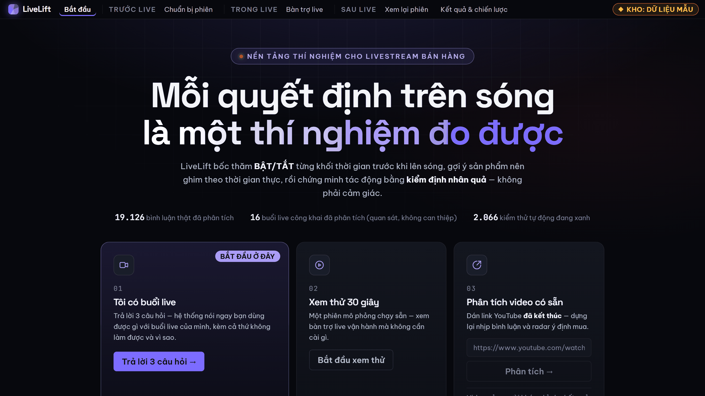 | `01-trang-chu.png` — Trang chủ: ba lối vào và chip KHO nói rõ dữ liệu mẫu hay thật |
| 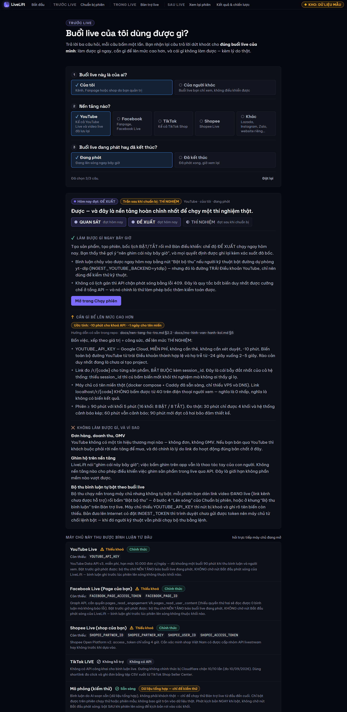 | `02-bat-dau-ket-qua.png` — /bat-dau sau 3 câu (Của tôi · YouTube · Đang phát): làm được gì ngay, thiếu khoá gì |
| 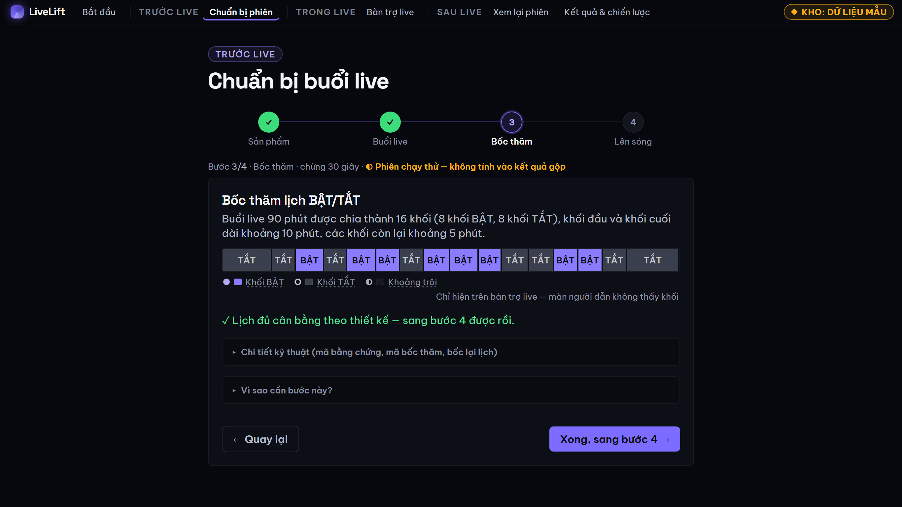 | `03-chay-phien-buoc3-lich-khoi.png` — Wizard bước 3: lịch 16 khối BẬT/TẮT đã bốc |
| 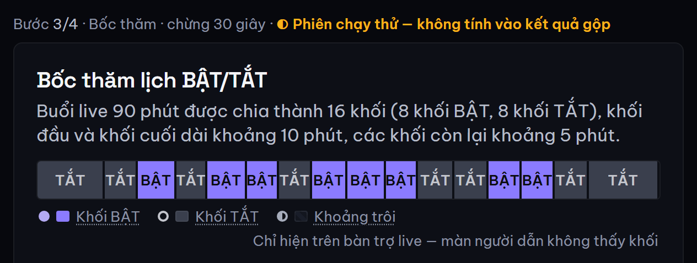 | `h7-a-lich-khoi.png` — Hình 7a: lịch khối của phiên chạy thử (khung hẹp 640 px) |
| 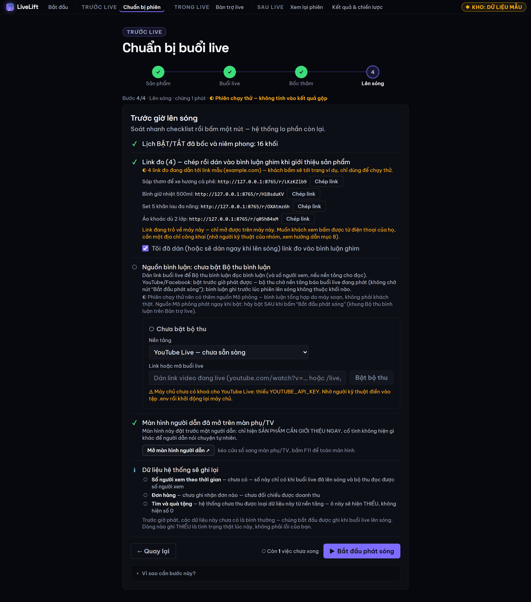 | `04-chay-phien-buoc4-checklist.png` — Wizard bước 4: checklist trước giờ G |
| 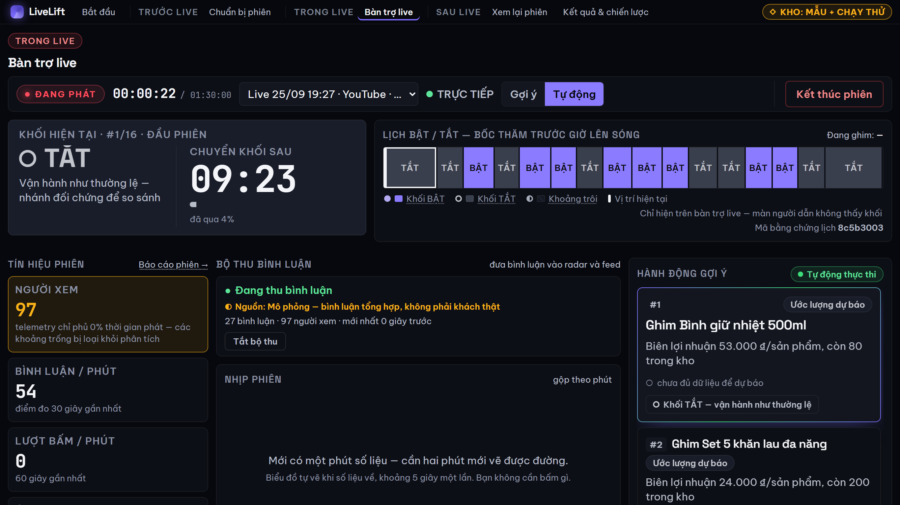 | `05-desk-dang-live.png` — Bàn trợ live đang phát: khối hiện tại, đồng hồ khối, lịch |
| 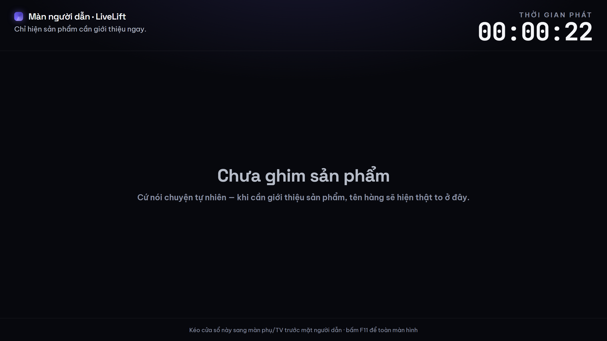 | `06-host-lam-mu.png` — Màn người dẫn cùng phiên: chỉ thời gian, sản phẩm, giá, tồn kho |
| ![Feed bình luận trên desk: câu có SĐT giả đã thành [SĐT]](05b-desk-binh-luan-da-che.png) | `05b-desk-binh-luan-da-che.png` — Feed bình luận trên desk: câu có SĐT giả đã thành [SĐT] |
| 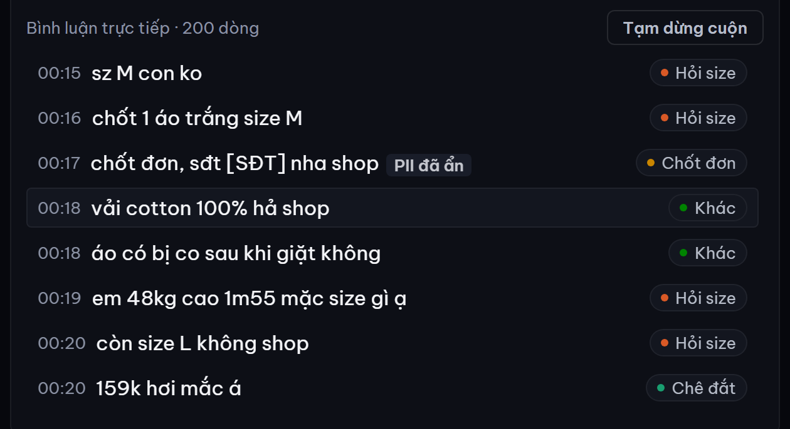 | `h7-b-desk-pii-da-che.png` — Hình 7b: feed bình luận desk (1366×768), dòng có dữ liệu cá nhân giả đã che |
| 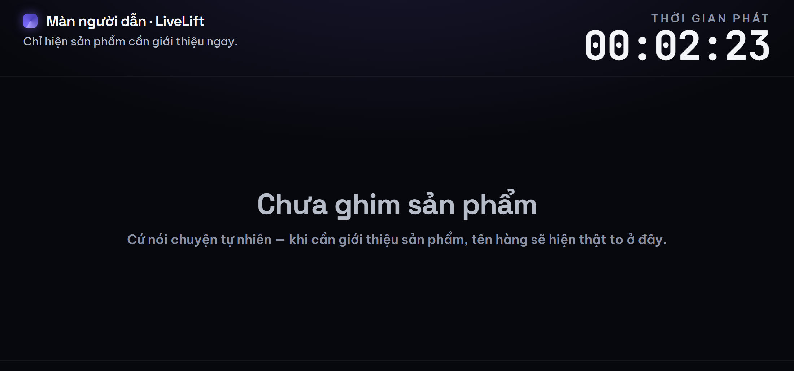 | `h7-c-host-lam-mu.png` — Hình 7c: màn người dẫn cùng phiên (khung 1100×560) |
| 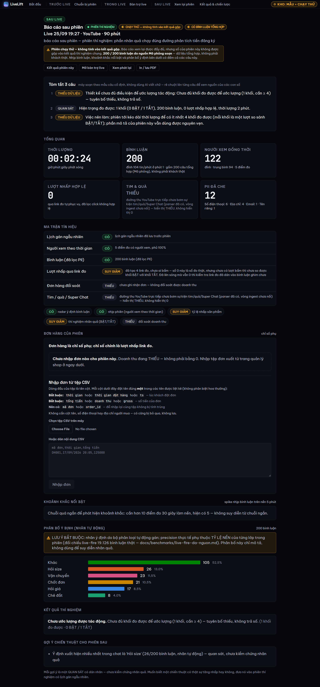 | `10-bao-cao-chay-thu.png` — Báo cáo sau phiên chạy thử: nhãn CHẠY THỬ, THIẾU trung thực |
| 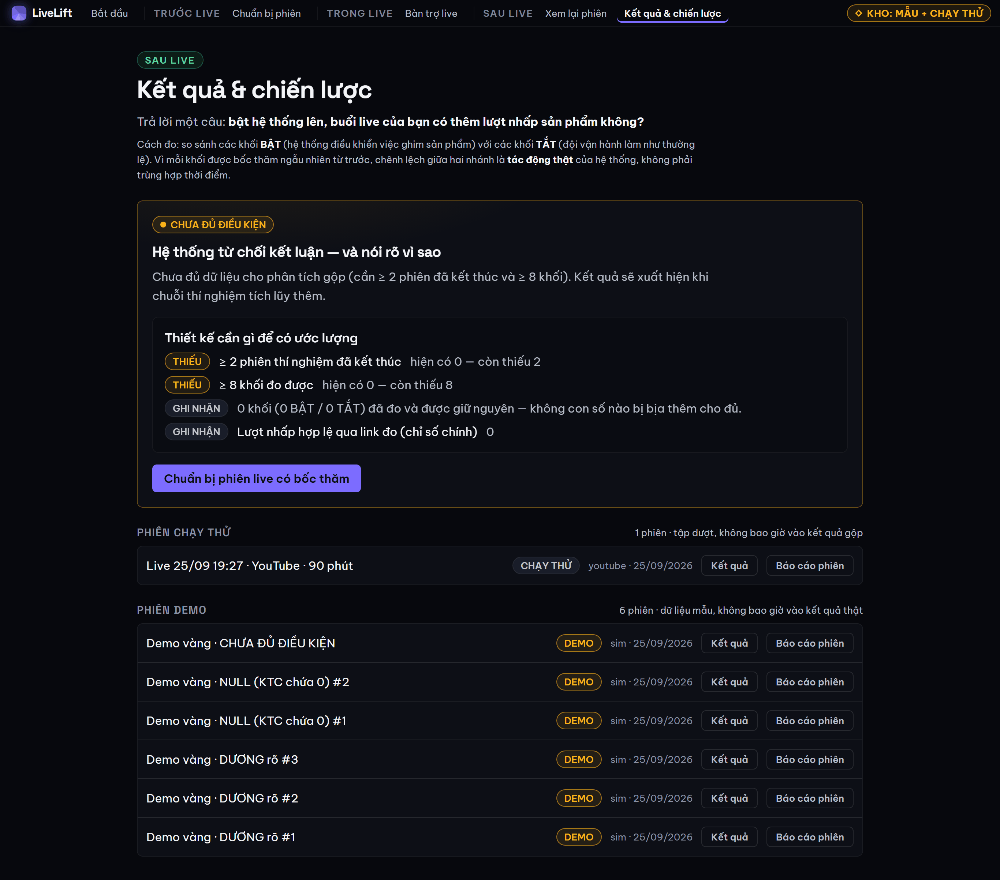 | `07-ket-qua-mac-dinh-that-chua-du.png` — /ket-qua mặc định = dữ liệu thật: 0 phiên thật, CHƯA ĐỦ ĐIỀU KIỆN |
| 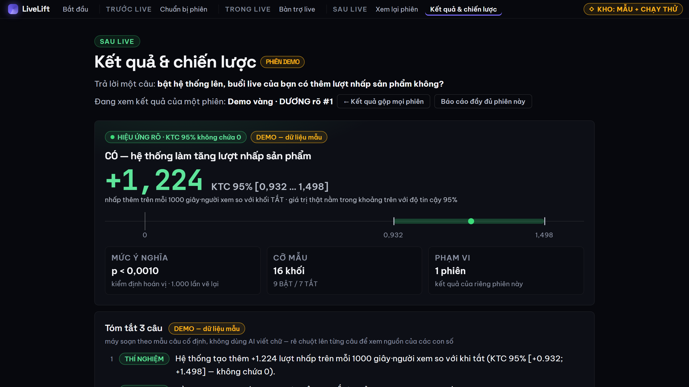 | `08-ket-qua-demo-vang-duong.png` — Kết quả một phiên Demo Vàng DƯƠNG (dữ liệu mẫu) |
| 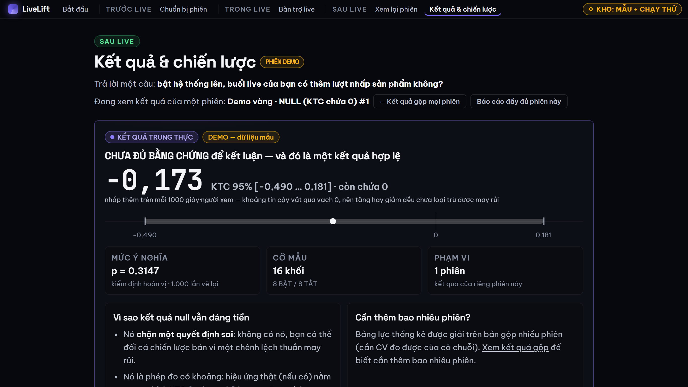 | `08b-ket-qua-demo-vang-null.png` — Demo Vàng NULL: KTC chứa 0, hệ thống nói không rõ |
| 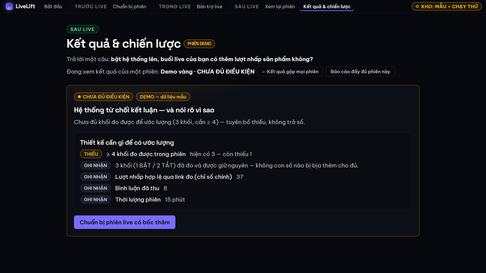 | `08c-ket-qua-demo-vang-chua-du.png` — Demo Vàng CHƯA ĐỦ: 3 khối, không trả số |
| 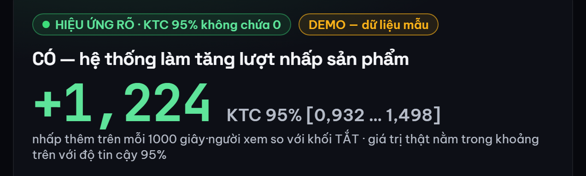 | `h7-d-ket-qua-demo-vang.png` — Hình 7d: kết quả phiên Demo Vàng DƯƠNG #1 (khung hẹp 640 px) |
| 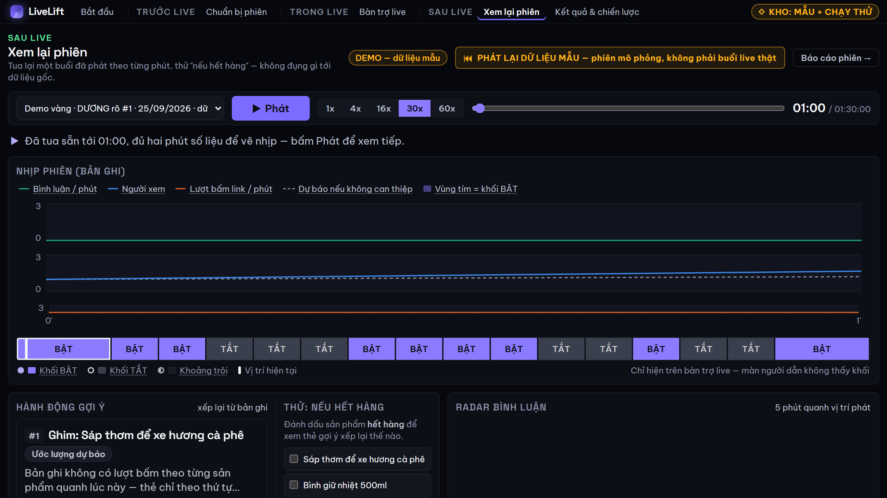 | `09-replay.png` — Xem lại phiên Demo Vàng: tua, radar theo vị trí phát (DỮ LIỆU MẪU) |

Ảnh `h7-*` là ảnh cắt đầu vào của Hình 7 hồ sơ (`docs/competition/sang-tao-tre-2026/hinh/h7-giao-dien.png`, dựng bằng `python scripts/chup_giao_dien.py ghep`).
